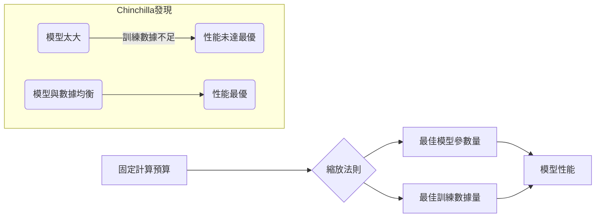
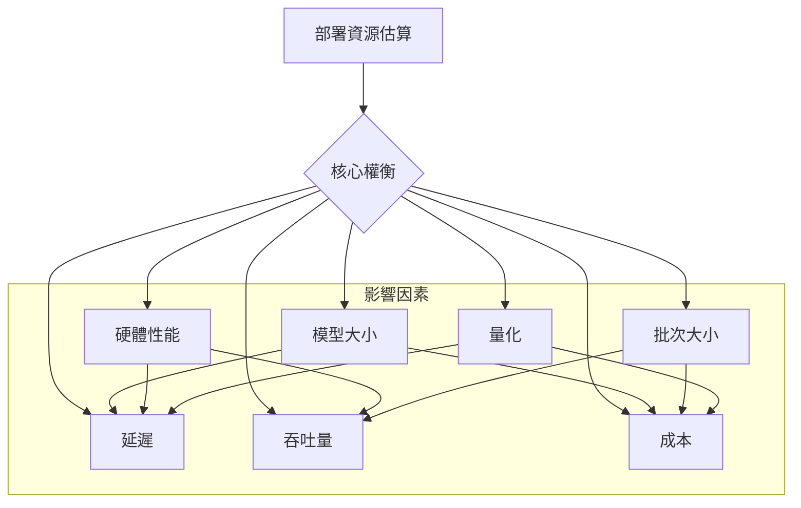
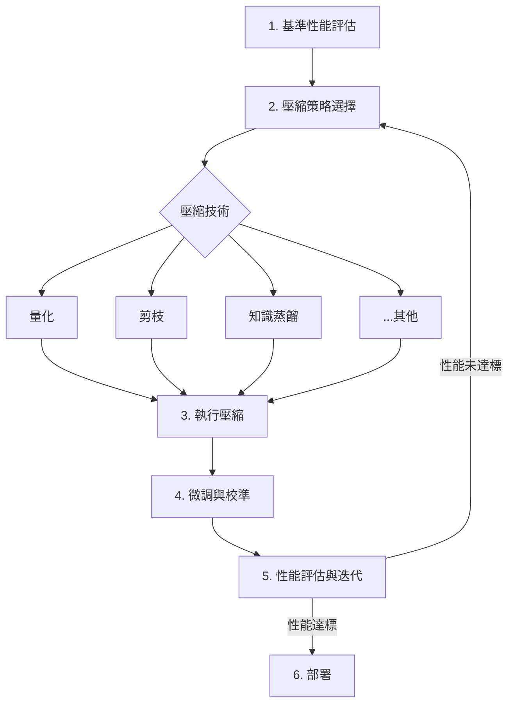

# 0.5 模型參數量與計算複雜度估算

## 專論概述

精確的資源估算是LLM工程化項目成功的關鍵前提。本專論建立系統化的參數量計算和資源需求估算框架，為模型設計、訓練規劃和部署決策提供量化依據。

## 學習目標

- 掌握Transformer架構的精確參數量計算方法
- 建立訓練和推理的計算複雜度分析能力
- 能夠準確估算記憶體、存儲和通訊資源需求
- 理解縮放法則，能夠預測不同規模模型的性能

## 核心內容架構

### 資源估算學習路徑總結

為了精確掌握LLM專案的資源規劃，本專論圍繞以下核心問題展開，構成一套完整的估算體系：

*   **1. 模型有多大？ (`0.5.1`)**
    *   **目標**：學會精確計算一個LLM的參數量。
    *   **一句話心法**：把模型拆成一個個零件（詞向量、注意力、前饋網路），分別計算大小再加總，就像算樂高積木的總數量。
    *   **內容**：深入Transformer的每個組件，提供精確的參數量計算公式。

*   **2. 訓練要多久？ (`0.5.2` & `0.5.3`)**
    *   **目標**：學會估算訓練所需的計算力和記憶體。
    *   **一句話心法**：訓練就像蓋房子，計算量是「總工時」，記憶體是「施工場地大小」。需要仔細計算才能知道要請多少工人、租多大的地。
    *   **內容**：分析訓練過程中的計算複雜度（FLOPs）和記憶體組成（模型、梯度、優化器）。

*   **3. 模型能多好？ (`0.5.4`)**
    *   **目標**：了解模型大小、數據量與性能的關係。
    *   **一句話心法**：模型的聰明程度，取決於「讀了多少書」（數據量）和「腦容量有多大」（參數量），兩者需要平衡成長才能達到最佳CP值，這就是縮放法則的核心。
    *   **內容**：介紹Kaplan和Chinchilla等關鍵縮放法則，幫助預測模型性能。

*   **4. 部署要多少錢？ (`0.5.5`)**
    *   **目標**：學會估算模型上線服務的資源成本。
    *   **一句話心法**：把模型部署上線，就像開一家店。要計算「店租」（GPU記憶體）和「營運成本」（處理每個客人的請求所需算力），才能知道怎麼開店最划算。
    *   **內容**：提供一個框架，用於評估不同硬體（GPU）和工作負載下的推理成本和吞吐量。

*   **5. 硬體怎麼選？ (`0.5.6`)**
    *   **目標**：學會根據模型大小和預算選擇最合適的硬體。
    *   **一句話心法**：選硬體就像挑背包，要根據「行李」（模型大小）和「旅程」（訓練或推理）來選擇，確保背包夠大、夠堅固，且不會太貴。
    *   **內容**：建立模型參數與硬體規格（記憶體、算力）的匹配決策框架。

*   **6. 如何讓模型變小？ (`0.5.7`)**
    *   **目標**：了解模型壓縮的工程流程。
    *   **一句話心法**：模型壓縮就像是把一本厚重的百科全書，變成一本輕便的口袋指南。雖然內容有些簡化，但核心知識都在，而且更方便使用。
    *   **內容**：系統性介紹從分析、策略制定到實施部署的完整模型壓縮工作流。

### 0.5.1 Transformer架構參數量精確計算

#### 一句話心法：把模型拆成一個個零件（詞向量、注意力、前饋網路），分別計算大小再加總，就像算樂高積木的總數量。

#### 標準Transformer組件分解
```
Transformer架構參數分解
├── Embedding層參數
│   ├── Token Embedding
│   │   ├── 參數量：vocab_size × d_model
│   │   ├── 典型值：50K-500K詞表，1K-8K維度
│   │   ├── 計算示例：GPT-3 (50,257 × 12,288 ≈ 618M)
│   │   └── 優化方法：詞表壓縮、子詞切分、共享權重
│   ├── Position Embedding
│   │   ├── 絕對位置編碼：max_seq_len × d_model
│   │   ├── 相對位置編碼：通常參數量更小
│   │   ├── 旋轉位置編碼（RoPE）：無額外參數
│   │   └── ALiBi：無額外參數，基於注意力偏置
│   └── Embedding總參數
│       ├── 標準方案：(vocab_size + max_seq_len) × d_model
│       ├── 權重共享：輸入輸出Embedding共享權重
│       ├── 相對佔比：大模型中通常<5%
│       └── 內存影響：影響首次載入和詞表操作
├── Attention機制參數
│   ├── Multi-Head Self-Attention (MHSA)
│   │   ├── Query變換：d_model × d_model
│   │   ├── Key變換：d_model × d_model
│   │   ├── Value變換：d_model × d_model
│   │   ├── Output變換：d_model × d_model
│   │   ├── 總計：4 × d_model² 每個注意力層
│   │   └── 多頭實現：參數量不變，計算並行化
│   ├── Attention變體參數量
│   │   ├── Multi-Query Attention (MQA)
│   │   │   ├── Q變換：d_model × d_model
│   │   │   ├── K變換：d_model × d_head (單頭)
│   │   │   ├── V變換：d_model × d_head (單頭)
│   │   │   ├── O變換：d_model × d_model
│   │   │   └── 總計：2 × d_model² + 2 × d_model × d_head
│   │   ├── Grouped-Query Attention (GQA)
│   │   │   ├── Q變換：d_model × d_model
│   │   │   ├── K變換：d_model × (n_kv_heads × d_head)
│   │   │   ├── V變換：d_model × (n_kv_heads × d_head)
│   │   │   ├── O變換：d_model × d_model
│   │   │   └── 參數量介於MHA和MQA之間
│   │   └── Sparse Attention
│   │       ├── 參數量：與標準注意力相同
│   │       ├── 稀疏模式：影響計算複雜度，不影響參數量
│   │       ├── 學習化稀疏：可能增加稀疏模式參數
│   │       └── 硬件實現：稀疏計算的硬件需求
│   ├── Layer Normalization參數
│   │   ├── Scale參數：d_model
│   │   ├── Shift參數：d_model
│   │   ├── 每層兩個LayerNorm：2 × 2 × d_model
│   │   └── 相對佔比：通常<1%，但對數值穩定性重要
│   └── Attention層總參數
│       ├── 標準配置：4 × d_model² + 4 × d_model
│       ├── 優化配置：根據注意力變體調整
│       ├── 層數影響：參數量與層數線性相關
│       └── 頭數影響：頭數不影響參數總量
├── Feed-Forward Network (FFN)參數
│   ├── 標準FFN結構
│   │   ├── 第一層線性變換：d_model × d_ff
│   │   ├── 第二層線性變換：d_ff × d_model
│   │   ├── 偏置項：d_ff + d_model (通常省略)
│   │   ├── 總計：2 × d_model × d_ff
│   │   └── 典型比例：d_ff = 4 × d_model
│   ├── FFN變體參數量
│   │   ├── Gated FFN (SwiGLU/GeGLU)
│   │   │   ├── 門控機制：增加一個線性變換
│   │   │   ├── 參數量：3 × d_model × d_ff
│   │   │   ├── 實際維度：通常調整d_ff保持總參數量
│   │   │   └── 性能權衡：參數量vs表現力的權衡
│   │   ├── Mixture of Experts (MoE)
│   │   │   ├── 專家數量：n_experts個FFN
│   │   │   ├── 參數量：n_experts × 2 × d_model × d_ff
│   │   │   ├── 路由網路：額外的路由參數
│   │   │   └── 激活專家：計算時只激活部分專家
│   │   └── Sparse FFN
│   │       ├── 結構化稀疏：N:M稀疏模式
│   │       ├── 非結構化稀疏：基於權重重要性
│   │       ├── 參數量：稀疏率決定實際參數量
│   │       └── 計算複雜度：稀疏計算的複雜度
│   ├── 激活函數選擇
│   │   ├── ReLU：無額外參數
│   │   ├── GELU：無額外參數
│   │   ├── Swish/SiLU：無額外參數
│   │   └── 學習化激活：可能增加少量參數
│   └── FFN在總參數量中的佔比
│       ├── 典型佔比：~67%（在4倍放大係數下）
│       ├── 主要貢獻者：FFN是參數量的主要來源
│       ├── 優化潛力：FFN壓縮的重要性
│       └── 計算特性：計算密集但並行友好
├── 輸出層參數
│   ├── 語言建模頭
│   │   ├── 分類層：d_model × vocab_size
│   │   ├── 權重共享：與輸入embedding共享
│   │   ├── 偏置項：vocab_size (通常省略)
│   │   └── Softmax：無額外參數
│   ├── 多任務頭
│   │   ├── 任務特定層：每個任務的分類頭
│   │   ├── 共享表示：共享主幹參數
│   │   ├── 任務適配器：輕量級任務適配層
│   │   └── 參數效率：平衡共享與特化
│   └── 生成相關參數
│       ├── 溫度參數：可學習的生成溫度
│       ├── Top-p/Top-k：通常為固定超參數
│       ├── 重複懲罰：可能包含可學習參數
│       └── 停止條件：特殊token的處理
└── 架構變體的參數量差異
    ├── Encoder-Only (BERT系列)
    │   ├── 無自回歸掩碼：雙向注意力
    │   ├── 分類任務頭：根據任務需求
    │   ├── NSP/MLM頭：預訓練特定的輸出層
    │   └── 參數計算：與標準Transformer類似
    ├── Decoder-Only (GPT系列)
    │   ├── 因果掩碼：單向注意力，參數量相同
    │   ├── 位置編碼：通常使用學習化位置編碼
    │   ├── 語言建模：單一的語言建模頭
    │   └── 縮放特性：易於擴展到大規模
    ├── Encoder-Decoder (T5系列)
    │   ├── 雙組件：編碼器+解碼器架構
    │   ├── 交叉注意力：解碼器中的額外注意力層
    │   ├── 參數量：約為相同規模decoder-only的1.5倍
    │   └── 任務適應：seq2seq任務的天然優勢
    └── 混合架構
        ├── PaLM-2混合精度：不同組件使用不同精度
        ├── GLaM稀疏架構：MoE與密集層的混合
        ├── Switch Transformer：每個token路由到不同專家
        └── Universal Transformer：權重共享的循環結構
```

#### 精確參數量計算公式
```python
def calculate_transformer_parameters(config):
    """
    精確計算Transformer模型參數量

    Args:
        config: 模型配置字典，包含以下參數
        - vocab_size: 詞表大小
        - max_seq_len: 最大序列長度
        - d_model: 模型維度
        - n_layers: 層數
        - n_heads: 注意力頭數
        - d_ff: FFN中間維度
        - use_bias: 是否使用偏置
        - tie_embeddings: 是否共享輸入輸出embedding
        - attention_type: 注意力類型 ('mha', 'mqa', 'gqa')
        - ffn_type: FFN類型 ('standard', 'gated', 'moe')
    """

    # 基礎參數
    vocab_size = config['vocab_size']
    max_seq_len = config.get('max_seq_len', 2048)
    d_model = config['d_model']
    n_layers = config['n_layers']
    n_heads = config['n_heads']
    d_ff = config.get('d_ff', 4 * d_model)
    use_bias = config.get('use_bias', False)
    tie_embeddings = config.get('tie_embeddings', True)
    attention_type = config.get('attention_type', 'mha')
    ffn_type = config.get('ffn_type', 'standard')

    # 1. Embedding層參數
    token_embedding = vocab_size * d_model
    position_embedding = max_seq_len * d_model  # 可選

    if tie_embeddings:
        embedding_params = token_embedding + position_embedding
        output_params = 0  # 輸出層與輸入embedding共享
    else:
        embedding_params = token_embedding + position_embedding
        output_params = vocab_size * d_model

    # 2. 注意力層參數
    def attention_params(attention_type, d_model, n_heads):
        d_head = d_model // n_heads

        if attention_type == 'mha':  # Multi-Head Attention
            # Q, K, V, O 四個變換矩陣
            return 4 * d_model * d_model

        elif attention_type == 'mqa':  # Multi-Query Attention
            # Q: d_model x d_model, K,V: d_model x d_head, O: d_model x d_model
            return 3 * d_model * d_model + 2 * d_model * d_head

        elif attention_type == 'gqa':  # Grouped-Query Attention
            n_kv_heads = config.get('n_kv_heads', n_heads // 4)
            # Q: d_model x d_model, K,V: d_model x (n_kv_heads * d_head), O: d_model x d_model
            return 3 * d_model * d_model + 2 * d_model * n_kv_heads * d_head

        else:
            raise ValueError(f"Unsupported attention type: {attention_type}")

    attention_layer_params = attention_params(attention_type, d_model, n_heads)

    # Layer Normalization參數 (每層兩個LayerNorm)
    layernorm_params = 2 * 2 * d_model  # scale + shift for each LayerNorm

    # 偏置項 (如果使用)
    attention_bias = 4 * d_model if use_bias else 0

    # 3. FFN層參數
    def ffn_params(ffn_type, d_model, d_ff):
        if ffn_type == 'standard':
            # 標準FFN: d_model -> d_ff -> d_model
            return 2 * d_model * d_ff

        elif ffn_type == 'gated':
            # 門控FFN: 增加門控變換
            return 3 * d_model * d_ff

        elif ffn_type == 'moe':
            n_experts = config.get('n_experts', 8)
            # 路由網路參數
            routing_params = d_model * n_experts
            # 專家參數
            expert_params = n_experts * 2 * d_model * d_ff
            return routing_params + expert_params

        else:
            raise ValueError(f"Unsupported FFN type: {ffn_type}")

    ffn_layer_params = ffn_params(ffn_type, d_model, d_ff)
    ffn_bias = 2 * d_ff if use_bias else 0

    # 4. 每層總參數
    per_layer_params = (
        attention_layer_params +
        layernorm_params +
        attention_bias +
        ffn_layer_params +
        ffn_bias
    )

    # 5. 總參數統計
    total_params = (
        embedding_params +           # 輸入embedding
        n_layers * per_layer_params +  # 所有Transformer層
        output_params +              # 輸出層
        2 * d_model                  # 最終LayerNorm
    )

    # 詳細分解
    param_breakdown = {
        'embedding_params': embedding_params,
        'attention_params_per_layer': attention_layer_params,
        'ffn_params_per_layer': ffn_layer_params,
        'layernorm_params_per_layer': layernorm_params,
        'per_layer_params': per_layer_params,
        'all_layers_params': n_layers * per_layer_params,
        'output_params': output_params,
        'total_params': total_params
    }

    # 百分比分解
    param_percentages = {
        'embedding_ratio': embedding_params / total_params * 100,
        'attention_ratio': (n_layers * attention_layer_params) / total_params * 100,
        'ffn_ratio': (n_layers * ffn_layer_params) / total_params * 100,
        'layernorm_ratio': (n_layers * layernorm_params + 2 * d_model) / total_params * 100,
        'output_ratio': output_params / total_params * 100
    }

    return {
        'total_parameters': total_params,
        'parameter_breakdown': param_breakdown,
        'parameter_percentages': param_percentages,
        'model_config': config
    }

# 使用示例：計算不同規模模型的參數量
def compare_model_sizes():
    """比較不同規模LLM的參數量"""

    models = {
        'GPT-2 Small': {
            'vocab_size': 50257,
            'd_model': 768,
            'n_layers': 12,
            'n_heads': 12,
            'd_ff': 3072
        },
        'GPT-2 Medium': {
            'vocab_size': 50257,
            'd_model': 1024,
            'n_layers': 24,
            'n_heads': 16,
            'd_ff': 4096
        },
        'GPT-2 Large': {
            'vocab_size': 50257,
            'd_model': 1280,
            'n_layers': 36,
            'n_heads': 20,
            'd_ff': 5120
        },
        'GPT-2 XL': {
            'vocab_size': 50257,
            'd_model': 1600,
            'n_layers': 48,
            'n_heads': 25,
            'd_ff': 6400
        },
        'LLaMA-7B': {
            'vocab_size': 32000,
            'd_model': 4096,
            'n_layers': 32,
            'n_heads': 32,
            'd_ff': 11008,
            'attention_type': 'mha'  # 可以測試不同注意力機制
        },
        'LLaMA-13B': {
            'vocab_size': 32000,
            'd_model': 5120,
            'n_layers': 40,
            'n_heads': 40,
            'd_ff': 13824
        }
    }

    results = {}
    for model_name, config in models.items():
        result = calculate_transformer_parameters(config)
        results[model_name] = result

        print(f"\n{model_name}:")
        print(f"  總參數量: {result['total_parameters']:,}")
        print(f"  Attention佔比: {result['parameter_percentages']['attention_ratio']:.1f}%")
        print(f"  FFN佔比: {result['parameter_percentages']['ffn_ratio']:.1f}%")
        print(f"  Embedding佔比: {result['parameter_percentages']['embedding_ratio']:.1f}%")

    return results

### 0.5.2 計算複雜度分析

#### 一句話心法：訓練模型就像蓋大樓，計算量是「總工時」，記憶體是「施工場地大小」。需要仔細計算才能知道要請多少工人、租多大的地，才不會蓋到一半沒錢或沒地方放材料。

#### 訓練階段計算複雜度
```
訓練計算複雜度分解
├── 前向傳播FLOPs計算
│   ├── Embedding層
│   │   ├── Token lookup：O(1) per token
│   │   ├── Position加法：batch_size × seq_len × d_model
│   │   └── 總計：相對較小，可忽略
│   ├── Self-Attention層
│   │   ├── QKV變換：3 × batch_size × seq_len × d_model²
│   │   ├── 注意力計算：
│   │   │   ├── QK^T：batch_size × n_heads × seq_len² × d_head
│   │   │   ├── Softmax：batch_size × n_heads × seq_len²
│   │   │   ├── AV：batch_size × n_heads × seq_len² × d_head
│   │   │   └── 總計：2 × batch_size × n_heads × seq_len² × d_head
│   │   ├── Output變換：batch_size × seq_len × d_model²
│   │   └── 層總計：4 × batch_size × seq_len × d_model² + 2 × batch_size × seq_len² × d_model
│   ├── Feed-Forward層
│   │   ├── 第一層變換：batch_size × seq_len × d_model × d_ff
│   │   ├── 激活函數：batch_size × seq_len × d_ff (通常忽略)
│   │   ├── 第二層變換：batch_size × seq_len × d_ff × d_model
│   │   └── 總計：2 × batch_size × seq_len × d_model × d_ff
│   ├── Layer Normalization
│   │   ├── 均值方差計算：batch_size × seq_len × d_model
│   │   ├── 標準化變換：batch_size × seq_len × d_model
│   │   └── 總計：2 × batch_size × seq_len × d_model (通常忽略)
│   └── 前向總FLOPs
│       ├── 每層FLOPs：
│       │   ├── Attention: 4 × seq_len × d_model² + 2 × seq_len² × d_model
│       │   ├── FFN: 2 × seq_len × d_model × d_ff
│       │   └── 層總計: 6 × seq_len × d_model² + 2 × seq_len² × d_model (假設d_ff=4×d_model)
│       ├── 全模型FLOPs：
│       │   ├── 所有層：n_layers × (6 × seq_len × d_model² + 2 × seq_len² × d_model)
│       │   ├── 簡化公式：batch_size × n_layers × seq_len × d_model × (6 × d_model + 2 × seq_len)
│       │   └── 主導項：當seq_len << d_model時，主要是6 × batch_size × n_layers × seq_len × d_model²
├── 反向傳播FLOPs計算
│   ├── 梯度計算複雜度：與前向傳播相同
│   ├── 參數梯度計算：需要額外的矩陣運算
│   ├── 梯度累積：線性複雜度
│   └── 總體複雜度：約為前向傳播的2倍
├── 優化器更新FLOPs
│   ├── SGD：O(P) P為參數總數
│   ├── Adam：O(3P) 需要計算momentum和方差
│   ├── AdaFactor：O(P) 分解近似的Adam
│   └── 相對佔比：通常遠小於前向反向傳播
├── 總訓練FLOPs估算
│   ├── 單步訓練：約3倍前向傳播FLOPs
│   ├── 公式：FLOPs_train ≈ 3 × 6 × B × L × S × D² = 18 × B × L × S × D²
│   │   (B: batch_size, L: n_layers, S: seq_len, D: d_model)
│   ├── 完整訓練：FLOPs_train × training_steps
│   └── 實際考量：包括數據載入、梯度同步等額外開銷
└── 不同架構的複雜度差異
    ├── Multi-Query Attention (MQA)
    │   ├── 參數量減少：KV頭數減少
    │   ├── 計算複雜度：注意力計算略有減少
    │   ├── 內存訪問優化：KV cache更小
    │   └── 整體影響：訓練FLOPs變化不大，推理顯著優化
    ├── Mixture of Experts (MoE)
    │   ├── 參數量增加：專家數倍增
    │   ├── 計算複雜度：實際激活的專家數決定
    │   ├── 通訊開銷：專家分佈式部署的通訊成本
    │   └── 效率權衡：參數增加但計算可控制
    ├── Sparse Attention
    │   ├── 注意力複雜度：從O(seq_len²)降到O(seq_len×sparsity)
    │   ├── 實現複雜度：稀疏計算的額外開銷
    │   ├── 硬體適配：需要稀疏計算支持
    │   └── 長序列優勢：在長序列上優勢明顯
    └── Flash Attention
        ├── 計算複雜度：與標準attention相同
        ├── 記憶體複雜度：從O(seq_len²)降到O(seq_len)
        ├── I/O效率：減少HBM訪問次數
        └── 實際加速：記憶體頻寬限制場景下顯著加速
```

#### 推理階段計算複雜度

```python
def calculate_inference_flops(config, sequence_length, generation_length=1):
    """
    計算推理階段的FLOPs（簡化版）

    Args:
        config: 模型配置
        sequence_length: 輸入序列長度
        generation_length: 生成序列長度
    """
    # 估算總參數量 (簡化公式，實際應使用詳細計算)
    total_params = (
        config['vocab_size'] * config['d_model'] + 
        config['n_layers'] * (
            4 * config['d_model']**2 + 
            2 * config['d_model'] * config.get('d_ff', 4 * config['d_model'])
        )
    )

    # 預填充階段 (Prefill Phase) - 處理輸入長序列
    # FLOPs約為 2 * 參數量 * 輸入token數
    prefill_flops = 2 * total_params * sequence_length

    # 生成階段 (Decode Phase) - 逐一生成token
    # 每個token的FLOPs約為 2 * 參數量
    decode_flops_per_token = 2 * total_params
    generation_flops = generation_length * decode_flops_per_token

    total_flops = prefill_flops + generation_flops

        return {
        'prefill_flops': prefill_flops,
        'generation_flops': generation_flops,
        'total_flops': total_flops
    }

# 使用示例
    llama_7b_config = {
        'vocab_size': 32000,
        'd_model': 4096,
        'n_layers': 32,
        'n_heads': 32,
        'd_ff': 11008
    }

flops = calculate_inference_flops(llama_7b_config, sequence_length=1024, generation_length=128)
print(f"LLaMA-7B 推理 (1024 -> 128) FLOPs: {flops['total_flops']:.2e}")
```

### 0.5.3 記憶體需求估算

#### 一句話心法：買電腦要看記憶體和硬碟，訓練模型也一樣。記憶體（VRAM）決定了能跑多大的模型，而優化器、梯度等就像是暫存檔，也需要空間。

#### 記憶體組成分析

LLM的記憶體消耗主要分為靜態和動態兩部分。靜態部分是模型參數本身，動態部分則根據運行模式（訓練或推理）和輸入尺寸變化。

```mermaid
graph TD
    A[總記憶體需求] --> B(訓練模式);
    A --> C(推理模式);

    B --> B1[模型參數];
    B --> B2[梯度];
    B --> B3[優化器狀態];
    B --> B4[激活值];

    C --> C1[模型參數];
    C --> C2[KV Cache];
    C --> C3[激活值(較小)];
    
    subgraph 靜態
        B1; C1;
    end
    
    subgraph 動態
        B2; B3; B4;
        C2; C3;
    end
```

-   **模型參數 (Model Parameters)**: 模型的權重，大小為 `參數量 × 每個參數的字節數`。
-   **梯度 (Gradients)**: 訓練時計算的梯度，大小與模型參數相同。
-   **優化器狀態 (Optimizer States)**: 如Adam優化器需要保存動量和方差，通常是模型參數大小的2倍（FP32存儲）。
-   **激活值 (Activations)**: 中間層的輸出。訓練時需要保存以計算梯度，推理時可以優化。
-   **KV Cache**: 推理時為了加速生成，需要快取每個token的Key和Value，是影響長序列推理記憶體的關鍵。

#### 記憶體需求計算公式

```python
def calculate_memory_requirements(config, sequence_length, batch_size=1, precision='fp16', mode='inference'):
    """
    計算記憶體需求（簡化版）

    Args:
        config: 模型配置
        sequence_length: 序列長度
        batch_size: 批次大小
        precision: 計算精度 ('fp32', 'fp16', 'int8')
        mode: 'inference' or 'training'
    """
    bytes_per_param = {'fp32': 4, 'fp16': 2, 'int8': 1}.get(precision, 2)
    
    # 估算總參數量 (簡化公式)
    total_params = (
        config['vocab_size'] * config['d_model'] + 
        config['n_layers'] * (
            4 * config['d_model']**2 + 
            2 * config['d_model'] * config.get('d_ff', 4 * config['d_model'])
        )
    )

        # 1. 模型參數記憶體
        model_memory = total_params * bytes_per_param

    if mode == 'training':
        # 2. 梯度記憶體 (與模型參數相同)
        gradient_memory = total_params * bytes_per_param

        # 3. 優化器狀態記憶體 (Adam通常需要2倍模型參數，且為fp32)
        optimizer_memory = total_params * 4 * 2 
        
        # 4. 激活值記憶體 (粗略估算)
        activation_memory = config['n_layers'] * batch_size * sequence_length * config['d_model'] * bytes_per_param

        total_memory = model_memory + gradient_memory + optimizer_memory + activation_memory

        return {
                'model_memory_gb': model_memory / (1024**3),
                'gradient_memory_gb': gradient_memory / (1024**3),
            'optimizer_memory_gb': optimizer_memory / (1024**3),
                'activation_memory_gb': activation_memory / (1024**3),
            'total_training_memory_gb': total_memory / (1024**3)
        }

    else: # Inference
        # 2. KV Cache記憶體
        kv_cache_memory = 2 * config['n_layers'] * batch_size * sequence_length * config['d_model'] * bytes_per_param
        
        # 3. 激活值記憶體 (推理時較小)
        activation_memory = batch_size * sequence_length * config['d_model'] * bytes_per_param * 2 # 粗略估算

        total_memory = model_memory + kv_cache_memory + activation_memory

        return {
                'model_memory_gb': model_memory / (1024**3),
                'kv_cache_memory_gb': kv_cache_memory / (1024**3),
                'activation_memory_gb': activation_memory / (1024**3),
            'total_inference_memory_gb': total_memory / (1024**3)
        }

# 使用示例
    llama_7b_config = {
        'vocab_size': 32000,
        'd_model': 4096,
        'n_layers': 32,
        'n_heads': 32,
        'd_ff': 11008
    }

mem_inference = calculate_memory_requirements(llama_7b_config, sequence_length=1024, precision='fp16', mode='inference')
print(f"LLaMA-7B 推理記憶體需求 (fp16): {mem_inference['total_inference_memory_gb']:.2f} GB")

mem_training = calculate_memory_requirements(llama_7b_config, sequence_length=1024, batch_size=1, precision='fp16', mode='training')
print(f"LLaMA-7B 訓練記憶體需求 (fp16 Adam, batch_size=1): {mem_training['total_training_memory_gb']:.2f} GB")
```

### 0.5.4 縮放法則與性能預測

#### 一句話心法：模型的聰明程度，取決於「讀了多少書」（數據量）和「腦容量有多大」（參數量），兩者需要平衡成長才能達到最佳CP值，這就是縮放法則的核心。

#### 縮放法則核心思想

縮放法則（Scaling Laws）研究的是計算資源（Compute）、模型大小（Parameters）和數據量（Data Size）與模型性能（Performance/Loss）之間的關係。DeepMind的Chinchilla論文是這一領域的里程碑，它指出許多大型模型（如GPT-3）在訓練時數據量不足（under-trained），並提出了在固定計算預算下，模型和數據量的最佳縮放比例。



-   **計算預算**: 通常用總訓練FLOPs來衡量。
-   **Chinchilla法則**: 簡而言之，模型參數量每翻一倍，訓練數據量也應該大約翻一倍，而不是像過去那樣主要增加模型大小。

#### 應用縮放法則預測最優配置

我們可以利用Chinchilla的公式來估算在給定的計算預算下，最優的模型參數量和數據量應該是多少。

```python
def apply_chinchilla_scaling_law(compute_budget_flops):
    """
    應用Chinchilla縮放法則估算最優配置（簡化版）

        Args:
        compute_budget_flops: 總計算預算 (FLOPs)
    """
    # Chinchilla論文中的擬合常數
    alpha = 0.34
    beta = 0.28
    
    # 計算公式: Optimal_Params ∝ C^a, Optimal_Tokens ∝ C^b
    # 其中 a ≈ alpha / (alpha + beta), b ≈ beta / (alpha + beta)
    a = alpha / (alpha + beta)
    b = beta / (alpha + beta)

    # 估算最優參數量和數據量
    # 6 * N * D (N=參數量, D=數據量) 是訓練FLOPs的近似
    # C ≈ 6 * N * D. 結合 N/D 比例，可以解出 N 和 D
    
    # 根據論文簡化結論，數據量 D ≈ 20 * 參數量 N
    # C ≈ 6 * N * (20 * N) = 120 * N^2 => N = sqrt(C / 120)
    
    optimal_params = (compute_budget_flops / 120)**0.5
    optimal_tokens = 20 * optimal_params

            return {
        'compute_budget_flops': f"{compute_budget_flops:.2e}",
                'optimal_parameters': optimal_params,
                'optimal_tokens': optimal_tokens,
    }

# 使用示例：假設有 1e24 FLOPs 的計算預算
budget = 1e24
optimal_config = apply_chinchilla_scaling_law(budget)

print(f"計算預算: {optimal_config['compute_budget_flops']} FLOPs")
print(f"  -> 建議模型大小: {optimal_config['optimal_parameters'] / 1e9:.2f}B 參數")
print(f"  -> 建議數據量: {optimal_config['optimal_tokens'] / 1e9:.2f}B Tokens")
```

### 0.5.5 實際部署的資源估算

#### 一句話心法：把模型部署上線，就像開一家店。要計算「店租」（GPU記憶體）和「營運成本」（處理每個客人的請求所需算力），才能知道怎麼開店最划算。

#### 部署成本的核心指標

模型部署上線後，我們關心的不再是訓練時間，而是服務的效率與成本。核心指標包括：

-   **延遲 (Latency)**: 處理單一請求所需的時間，影響用戶體驗。
-   **吞吐量 (Throughput)**: 單位時間內能處理的請求數（如 QPS, Queries Per Second）或Token數（Tokens Per Second），代表服務能力。
-   **成本 (Cost)**: 維持服務所需的硬體和電力成本，通常以「每百萬Token成本」來衡量。



#### 部署成本估算示例

估算部署成本需要綜合考慮計算需求（FLOPs）和記憶體需求（主要是KV Cache），並將其映射到具體的硬體上。

```python
def estimate_deployment_cost(config, hardware_spec, requests_per_sec, avg_in_len=512, avg_out_len=128):
    """
    估算實際部署的資源成本（簡化版）

        Args:
            config: 模型配置
        hardware_spec: 硬體規格 (tflops, memory_gb, cost_per_hour)
        requests_per_sec: 目標QPS
        avg_in_len: 平均輸入長度
        avg_out_len: 平均輸出長度
    """
    # 1. 計算單一請求的FLOPs (極度簡化)
    total_params = config['n_layers'] * (4 * config['d_model']**2) # 簡化參數量
    flops_per_request = 2 * total_params * (avg_in_len + avg_out_len)

    # 2. 計算總QPS需求的FLOPs
    total_flops_per_sec = flops_per_request * requests_per_sec

    # 3. 計算所需GPU數量 (基於計算)
    effective_tflops = hardware_spec['tflops'] * 1e12 * 0.5 # 50%有效利用率
    gpus_needed_for_compute = total_flops_per_sec / effective_tflops

    # 4. 計算所需GPU數量 (基於記憶體)
    model_memory_gb = total_params * 2 / 1024**3 # FP16
    # 簡化估算KV Cache, 假設每個請求需要2GB
    kv_cache_gb = requests_per_sec * 2 
    required_memory_gb = model_memory_gb + kv_cache_gb
    gpus_needed_for_memory = required_memory_gb / hardware_spec['memory_gb']

    num_gpus = max(1, round(max(gpus_needed_for_compute, gpus_needed_for_memory)))

    # 5. 估算成本
    total_cost_per_hour = num_gpus * hardware_spec['cost_per_hour']
    total_tokens_per_sec = requests_per_sec * (avg_in_len + avg_out_len)
    cost_per_million_tokens = (total_cost_per_hour / 3600 / total_tokens_per_sec) * 1_000_000

        return {
        'gpus_needed': int(num_gpus),
        'total_cost_per_hour': f"${total_cost_per_hour:.2f}",
        'cost_per_million_tokens': f"${cost_per_million_tokens:.4f}"
    }

# 使用示例
llama_7b_config = { 'n_layers': 32, 'd_model': 4096 }
a100_spec = { 'tflops': 312, 'memory_gb': 80, 'cost_per_hour': 2.5 }

deployment_cost = estimate_deployment_cost(llama_7b_config, a100_spec, requests_per_sec=5)
print(f"部署 LLaMA-7B (QPS=5) 在 A100 上:")
print(f"  -> 所需GPU數量: {deployment_cost['gpus_needed']}")
print(f"  -> 每小時成本: {deployment_cost['total_cost_per_hour']}")
print(f"  -> 每百萬Token成本: {deployment_cost['cost_per_million_tokens']}")
```

### 0.5.6 模型參數與硬體匹配計算

#### 一句話心法：選硬體就像挑背包，要根據「行李」（模型大小）和「旅程」（訓練或推理）來選擇，確保背包夠大、夠堅固，且不會太貴。

#### 硬體選型的核心考量

為LLM選擇合適的硬體是一個多維度的決策問題，主要需要在記憶體容量、計算能力和成本之間找到平衡點。

-   **記憶體容量 (VRAM)**: 必須足以容納模型參數以及所有動態記憶體（如KV Cache、激活值等）。這是硬體選型的第一道門檻。
-   **計算能力 (FLOPs)**: 決定了模型的運行速度（延遲和吞吐量）。更高的計算能力意味著更快的響應和更高的吞吐量。
-   **通訊頻寬 (Bandwidth)**: 在多GPU或多節點部署中，GPU之間的數據傳輸速度（如NVLink）是關鍵瓶頸。
-   **成本 (Cost)**: 包括硬體採購成本和長期運維成本。

```mermaid
graph TD
    A[硬體選型決策] --> B{核心約束};
    B --> C[記憶體容量];
    B --> D[計算能力];
    B --> E[通訊頻寬];
    B --> F[預算成本];
    B --> G[硬體性能];
    B --> H[批次大小];
    B --> I[量化];

    subgraph 模型需求
        G[模型大小] --> C;
        H[工作負載] --> D & E;
    end

    subgraph 硬體方案
        I[GPU A (高VRAM, 中FLOPs)];
        J[GPU B (中VRAM, 高FLOPs)];
        K[GPU C (高VRAM, 高FLOPs, 貴)];
    end
    
    A --> L((找到性價比最高的匹配方案));
```

#### 硬體匹配計算示例

我們可以建立一個簡單的計算器，根據模型記憶體需求，從給定的GPU選項中篩選出最經濟的配置。

```python
def hardware_matching_calculator(model_memory_gb, gpu_options):
    """
    計算最適合的硬體配置（簡化版）

        Args:
        model_memory_gb: 模型所需的總記憶體 (GB)
        gpu_options: GPU選項字典 {name: {memory_gb: X, cost: Y}}
    """
    results = []
    
    print(f"模型記憶體需求: {model_memory_gb:.2f} GB\n")
    
    for name, specs in gpu_options.items():
        # 考慮20%的記憶體餘裕
        usable_memory = specs['memory_gb'] * 0.8
        
        # 計算所需GPU數量 (向上取整)
        num_gpus = -(-model_memory_gb // usable_memory) if usable_memory > 0 else float('inf')
        num_gpus = max(1, num_gpus)
        
        # 計算總成本
        total_cost = num_gpus * specs['cost']
        
        results.append({
            'gpu_name': name,
            'num_gpus': int(num_gpus),
            'total_cost': total_cost
        })
        
    # 按成本排序
    sorted_results = sorted(results, key=lambda x: x['total_cost'])
    
    print("硬體匹配方案 (由低成本到高):")
    for res in sorted_results:
        print(f"  - {res['gpu_name']}:")
        print(f"    - 所需數量: {res['num_gpus']}")
        print(f"    - 估算成本: ${res['total_cost']:,.2f}")
        
    return sorted_results

# 使用示例
# 假設經過計算，LLaMA-13B FP16推理需要約35GB記憶體
required_memory = 35 

gpu_specs = {
    'RTX 4090': {'memory_gb': 24, 'cost': 1600},
    'A100 40GB': {'memory_gb': 40, 'cost': 10000},
    'H100 80GB': {'memory_gb': 80, 'cost': 30000}
}

best_options = hardware_matching_calculator(required_memory, gpu_specs)
```

### 0.5.7 工程化模型壓縮流程

#### 一句話心法：模型壓縮就像是把一本厚重的百科全書，變成一本輕便的口袋指南。雖然內容有些簡化，但核心知識都在，而且更方便使用。

#### 模型壓縮的動機與目標

隨著LLM變得越來越大，直接部署它們變得昂貴且低效。模型壓縮旨在創建一個更小、更快、更節能的模型，同時盡可能保持原始模型的性能。

-   **目標**: 降低延遲、減少記憶體佔用、降低計算成本、使其能在邊緣設備上運行。
-   **核心權衡**: 在模型大小（壓縮率）和模型性能（如準確度）之間找到最佳平衡點。

#### 標準模型壓縮工作流

一個結構化的模型壓縮流程通常包括以下步驟：



1.  **基準性能評估 (Profiling & Benchmarking)**: 首先，需要對原始（FP32）模型在目標任務和硬體上進行全面的性能評估，建立一個比較的基準。
2.  **壓縮策略選擇 (Strategy Selection)**: 根據延遲、記憶體、性能等約束，選擇最合適的壓縮技術組合。例如，追求極致加速可以選擇量化+剪枝，追求保留性能可以選擇知識蒸餾。
3.  **執行壓縮 (Compression Execution)**: 應用選擇的壓縮演算法。例如，使用GPTQ對模型進行4-bit量化。
4.  **微調與校準 (Fine-tuning & Calibration)**: 壓縮後的模型通常會有一些性能損失。可以通過在少量代表性數據上進行短時間的微調或校準來恢復部分性能。
5.  **評估與迭代 (Evaluation & Iteration)**: 再次評估壓縮後模型的性能，並與基準進行比較。如果未達到預期，可能需要調整壓縮參數或策略，重新迭代。
6.  **部署 (Deployment)**: 性能達標後，將壓縮後的模型部署到目標環境。

#### 選擇壓縮技術的考量因素

-   **硬體支持**: 某些硬體（如NVIDIA GPU的Tensor Core）對特定精度（如INT8, INT4）有原生加速支持。
-   **性能容忍度**: 某些任務對性能下降非常敏感，可能不適合高壓縮率的方法。
-   **投入成本**: 知識蒸餾等方法需要額外的訓練資源和時間。
-   **模型架構**: 某些架構（如MoE）可能需要特殊的壓縮策略。