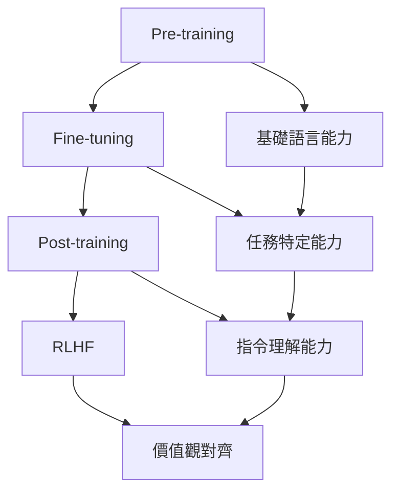

# 0.1 LLM 生命週期全景

## 專論概述

本專論深入剖析大型語言模型從誕生到部署的完整生命週期，重點解析每個階段的技術原理、實現方法和資源要求。這是理解LLM工程化的核心基礎。

## 學習目標

- 掌握LLM訓練的四個關鍵階段及其技術特點
- 理解各階段間的遞進關係和技術依賴
- 能夠評估不同階段的資源需求和技術難點
- 建立對LLM整體開發流程的全局認知

## 核心內容架構

### 0.1.1 Pre-training（預訓練）階段

#### 技術原理
- **自監督學習範式**：下一個token預測的核心機制
- **大規模並行訓練**：數據並行、模型並行、流水線並行的協同
- **訓練穩定性**：梯度爆炸/消失、數值不穩定的解決方案

#### 關鍵技術組件
```
預訓練技術棧
├── 數據處理管線
│   ├── 大規模文本爬取與清洗
│   ├── 去重與質量過濾
│   └── Tokenization與詞表構建
├── 模型架構設計
│   ├── Transformer變體選擇
│   ├── 位置編碼策略
│   └── 注意力機制優化
├── 訓練基礎設施
│   ├── 分散式訓練框架
│   ├── 混合精度訓練
│   └── 檢查點與容錯機制
└── 訓練監控與調優
    ├── Loss曲線分析
    ├── 學習率調度策略
    └── 硬體資源監控
```

#### 資源估算公式
- **參數量估算**：P = L × (d_model² × 4 + d_model × vocab_size)
- **記憶體需求**：Memory = P × (4 + 8 + 16) bytes（模型+梯度+優化器狀態）
- **計算量估算**：FLOPs ≈ 6 × P × N（N為訓練token數）

#### 代表性案例
- **GPT系列**：GPT-1→GPT-2→GPT-3→GPT-4的演進路徑
- **LLaMA系列**：高效架構設計與訓練策略
- **中文模型**：ChatGLM、Baichuan、Qwen的本地化實踐

### 0.1.2 Fine-tuning（微調）階段

#### 技術分類
```
Fine-tuning技術譜系
├── 全參數微調（Full Fine-tuning）
│   ├── 監督微調（SFT）
│   ├── 多任務學習（MTL）
│   └── 持續學習（Continual Learning）
├── 參數高效微調（PEFT）
│   ├── 重參數化方法：LoRA、AdaLoRA
│   ├── 附加式方法：Adapter、Prefix Tuning
│   └── 選擇式方法：BitFit、IA3
└── 混合微調策略
    ├── 分層微調（Layer-wise Fine-tuning）
    ├── 漸進式微調（Progressive Fine-tuning）
    └── 多階段微調（Multi-stage Fine-tuning）
```

#### 核心挑戰與解決方案
- **災難性遺忘**：正則化技術、經驗重放、彈性權重合併
- **過擬合控制**：Dropout、權重衰減、早停策略
- **領域適應**：領域特定預訓練、對比學習、Meta-learning

#### 評估指標體系
- **任務特定指標**：BLEU（翻譯）、ROUGE（摘要）、F1-score（分類）
- **通用能力指標**：困惑度（Perplexity）、零樣本/少樣本性能
- **效率指標**：參數效率比、訓練時間、收斂速度

### 0.1.3 Post-training（後訓練）階段

#### 指令跟隨訓練（Instruction Tuning）
- **數據構建策略**
  - Self-Instruct：自動生成指令數據的方法
  - Multi-task Instruction：跨任務指令泛化
  - Template Engineering：提示模板的設計原則

- **訓練技術細節**
  - 混合指令數據集的平衡策略
  - 指令複雜度的漸進式增加
  - 長文本處理的技術方案

#### 對話能力訓練
- **對話數據特性**
  - 多輪對話的上下文建模
  - 人格一致性（Persona Consistency）
  - 情感表達與語調控制

- **訓練策略優化**
  - 對話歷史的高效編碼
  - 回應質量的自動評估
  - 安全性過濾機制

### 0.1.4 RLHF（人類反饋強化學習）階段

#### 三階段RLHF管線
```
RLHF完整流程
├── 階段一：監督微調（SFT）
│   ├── 高質量演示數據收集
│   ├── 行為克隆訓練
│   └── 初始策略建立
├── 階段二：獎勵模型訓練（RM）
│   ├── 人類偏好數據標注
│   ├── 成對比較數據構建
│   └── 偏好排序模型訓練
└── 階段三：策略優化（PPO）
    ├── 近端策略優化演算法
    ├── KL散度約束機制
    └── 迭代式策略改進
```

#### 技術挑戰與創新
- **獎勵模型的泛化性**：分佈外樣本的獎勵準確性
- **策略優化的穩定性**：PPO超參數調優、Trust Region方法
- **人類偏好的一致性**：標注者間協議度、偏好聚合方法

#### 替代技術路線
- **DPO（Direct Preference Optimization）**：無需訓練獎勵模型的直接優化
- **ORPO（Odds Ratio Preference Optimization）**：基於幾率比的偏好學習
- **Constitutional AI**：基於原則的自我修正機制

## 階段間的技術依賴關係



## 資源需求對比分析

| 訓練階段 | 計算資源 | 數據規模 | 訓練時間 | 技術難度 |
|----------|----------|----------|----------|----------|
| Pre-training | 極高 | TB-PB級 | 月-年 | 極高 |
| Fine-tuning | 中等 | GB級 | 小時-天 | 中等 |
| Post-training | 中等 | GB級 | 小時-天 | 中等 |
| RLHF | 高 | 人工標注 | 天-週 | 高 |

## 實踐案例分析

### GPT-3.5/GPT-4開發歷程
- **Pre-training**：1750億/未知參數，數千億tokens訓練
- **Fine-tuning**：多任務能力增強
- **Post-training**：指令跟隨和對話能力
- **RLHF**：安全性和有用性對齊

### 開源模型最佳實踐
- **LLaMA系列**：高效預訓練架構
- **Alpaca**：低成本指令微調
- **Vicuna**：對話能力的高效獲得

## 延伸閱讀與參考資料

### 核心論文
1. **Attention Is All You Need** - Transformer原理
2. **Language Models are Few-Shot Learners** - GPT-3預訓練
3. **Training language models to follow instructions with human feedback** - RLHF方法論
4. **LoRA: Low-Rank Adaptation of Large Language Models** - 高效微調

### 開源實現
1. **Transformers Library** - HuggingFace生態系統
2. **DeepSpeed** - 大規模分散式訓練
3. **Megatron-LM** - NVIDIA訓練框架
4. **TRLX** - RLHF訓練框架

### 最新發展
- **Constitutional AI**：基於原則的對齊方法
- **InstructGPT**：指令微調的標準範式
- **Chain-of-Thought**：推理能力的涌現機制