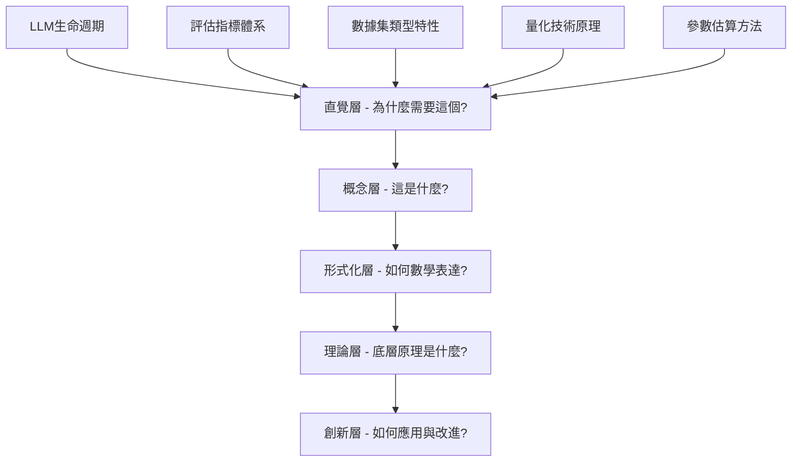
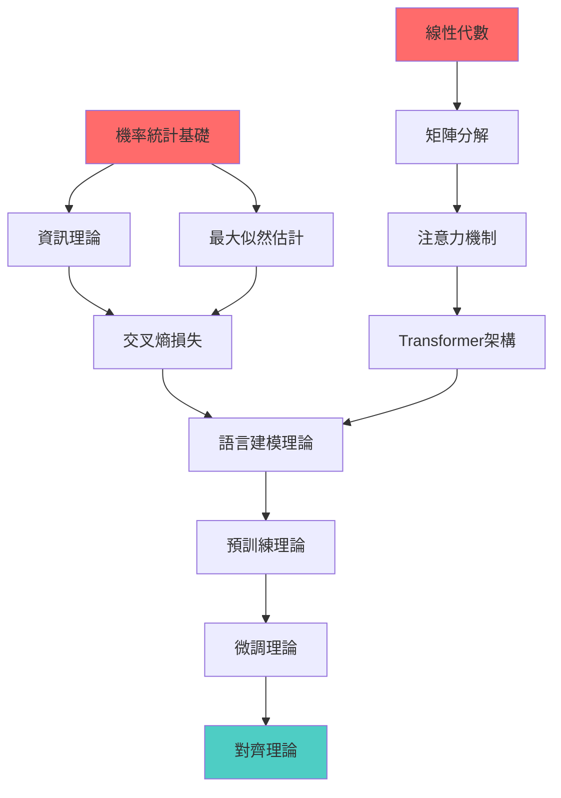

# LLM基礎理論認知建構學習路徑

## 路徑設計哲學

基於認知建構理論設計的LLM基礎學習路徑，遵循「螺旋式上升」的理論學習原則，從**直覺理解**→**概念掌握**→**形式化表達**→**理論深度**→**創新應用**的認知層次遞進。

## 核心學習架構

### 🧠 認知建構層次 (Cognitive Construction Levels)



### 📚 知識節點結構

每個理論知識節點按照以下五層次遞進構建：

#### 節點元資料範例
```json
{
  "id": "llm-lifecycle",
  "title": "LLM生命週期理論",
  "cognitive_levels": {
    "intuitive": "為什麼需要多階段訓練?",
    "conceptual": "四階段訓練的核心機制",
    "formalization": "數學建模與資源估算",
    "theoretical": "訓練理論的底層原理",
    "innovative": "前沿方法與創新方向"
  },
  "estimated_time": {
    "reading": "45min",
    "practice": "120min",
    "mastery": "6hours"
  }
}
```

## 🎯 理論學習路徑設計

### 第一維度：深度遞進（Depth Progression）

#### 0.1 LLM生命週期認知建構路徑

##### Level 1: 直覺層 (Intuitive Understanding)
**核心問題**：為什麼LLM需要多階段訓練？

**直覺建構**：
```
想像教育一個天才兒童成為專業人士的過程：

1. 嬰幼兒期（預訓練）：讓孩子大量閱讀，建立對世界的基本認知
2. 學齡期（微調）：針對特定學科進行專門學習
3. 實習期（後訓練）：學會與人溝通，理解指令
4. 職業期（RLHF）：在導師指導下調整行為，符合職業道德

每個階段都是必需的，不可跳躍。
```

**驗證問題**：
- 你能用自己的話解釋為什麼不能直接訓練一個完美的模型？
- 想像一個場景，說明多階段訓練的必要性

##### Level 2: 概念層 (Conceptual Framework)
**關鍵概念掌握**：

```python
# 概念性代碼（追求理解，不追求效率）
class LLMLifecycle:
    def __init__(self):
        self.stages = {
            "pretraining": {
                "objective": "學習語言的統計規律",
                "data": "大規模無標註文本",
                "method": "下一個token預測",
                "output": "基礎語言模型"
            },
            "finetuning": {
                "objective": "適應特定任務",
                "data": "任務特定的標註數據",
                "method": "監督學習",
                "output": "任務特化模型"
            },
            "instruction_tuning": {
                "objective": "學習遵循指令",
                "data": "指令-回答對",
                "method": "監督微調",
                "output": "指令跟隨模型"
            },
            "rlhf": {
                "objective": "與人類價值觀對齊",
                "data": "人類偏好數據",
                "method": "強化學習",
                "output": "對齊模型"
            }
        }

    def why_staged_training(self):
        """為什麼要分階段訓練？"""
        return {
            "complexity_decomposition": "將複雜目標分解為可管理的子目標",
            "data_efficiency": "不同階段需要不同類型和規模的數據",
            "computational_optimization": "分階段可以優化計算資源分配",
            "risk_control": "漸進式訓練降低失敗風險"
        }
```

##### Level 3: 形式化層 (Mathematical Formalization)
**數學模型與公式**：

**預訓練損失函數**：
$$\mathcal{L}_{pretrain} = -\mathbb{E}_{x \sim D} \sum_{i=1}^{|x|} \log P(x_i | x_{<i}; \theta)$$

**微調損失函數**：
$$\mathcal{L}_{finetune} = -\mathbb{E}_{(x,y) \sim D_{task}} \log P(y | x; \theta)$$

**RLHF獎勵優化**：
$$\mathcal{L}_{RLHF} = \mathbb{E}_{x \sim D} \left[ r_\phi(x, \pi_\theta(x)) - \beta \cdot D_{KL}(\pi_\theta(x) || \pi_{ref}(x)) \right]$$

**資源估算模型**：
- 參數量：$P = L \times (12 \times d_{model}^2) + (V \times d_{model})$
- 記憶體需求：$M = P \times 16 \text{ bytes}$ (FP32 + Adam)
- 計算量：$C = 6 \times P \times N$ FLOPs

##### Level 4: 理論層 (Theoretical Foundations)
**底層原理分析**：

1. **Information Theory視角**：
   - 預訓練：學習數據的潛在分佈 $P(X)$
   - 微調：學習條件分佈 $P(Y|X)$
   - RLHF：優化期望獎勵 $\mathbb{E}[R(X,Y)]$

2. **Optimization Theory視角**：
   - 多階段訓練作為分層優化問題
   - 每階段的損失函數landscape不同
   - 梯度flow和收斂性分析

3. **Learning Theory視角**：
   - PAC學習框架下的泛化誤差分析
   - 不同階段的樣本複雜度要求
   - Transfer Learning的理論基礎

##### Level 5: 創新層 (Innovation & Research)
**前沿發展與開放問題**：

1. **新興訓練範式**：
   - Constitutional AI：基於原則的自我改進
   - RLAIF：AI反饋替代人類反饋
   - Multi-agent Training：多智能體協同訓練

2. **開放研究問題**：
   - 能否設計更高效的訓練順序？
   - 如何量化不同階段的貢獻？
   - 分階段訓練的理論極限在哪裡？

#### 0.2 評估指標體系認知建構路徑

##### Level 1: 直覺層
**核心問題**：如何知道一個LLM是"好"的？

**直覺建構**：
```
評估LLM就像評估一個學生：

1. 基礎能力（困惑度）：能否流暢表達？
2. 專業能力（任務指標）：數學題答對了嗎？
3. 綜合能力（多任務評估）：各科都會嗎？
4. 安全品德（安全性評估）：會說有害的話嗎？

不同場景需要不同的評估標準。
```

##### Level 2: 概念層
**評估維度框架**：

```python
class EvaluationFramework:
    def __init__(self):
        self.dimensions = {
            "fluency": {
                "metrics": ["perplexity", "BLEU", "ROUGE"],
                "purpose": "語言流暢性評估"
            },
            "accuracy": {
                "metrics": ["exact_match", "F1", "accuracy"],
                "purpose": "任務正確性評估"
            },
            "capability": {
                "metrics": ["MMLU", "HumanEval", "GSM8K"],
                "purpose": "綜合能力評估"
            },
            "safety": {
                "metrics": ["toxicity_score", "bias_detection"],
                "purpose": "安全性評估"
            },
            "efficiency": {
                "metrics": ["inference_speed", "memory_usage"],
                "purpose": "效率評估"
            }
        }
```

##### Level 3: 形式化層
**數學定義**：

**困惑度 (Perplexity)**：
$$PPL = \exp\left(-\frac{1}{N}\sum_{i=1}^{N} \log P(w_i | w_{<i})\right)$$

**BLEU分數**：
$$BLEU = BP \cdot \exp\left(\sum_{n=1}^{N} w_n \log p_n\right)$$

**F1分數**：
$$F1 = \frac{2 \cdot Precision \cdot Recall}{Precision + Recall}$$

#### 0.3 數據集類型認知建構路徑

##### Level 1: 直覺層
**核心問題**：為什麼數據質量決定模型質量？

**直覺建構**：
```
數據就像食物，模型就像人：

1. 垃圾數據 = 垃圾食品：吃多了會"營養不良"
2. 偏見數據 = 偏食：會導致模型"偏科"
3. 高質量數據 = 營養均衡：模型才能"健康成長"
4. 多樣性數據 = 多樣飲食：增強模型"免疫力"

「Garbage in, garbage out」是永恆真理。
```

##### Level 2: 概念層
**數據分類體系**：

```python
class DatasetTaxonomy:
    def __init__(self):
        self.categories = {
            "by_task": {
                "language_modeling": "無標註文本，用於預訓練",
                "classification": "文本-標籤對",
                "generation": "輸入-輸出對",
                "instruction": "指令-回答對"
            },
            "by_quality": {
                "high_quality": "人工標註，高準確性",
                "medium_quality": "半自動標註",
                "low_quality": "自動生成，噪聲較多"
            },
            "by_domain": {
                "general": "通用領域文本",
                "scientific": "學術論文、教科書",
                "conversational": "對話數據",
                "code": "程式碼數據"
            }
        }
```

#### 0.4 量化技術認知建構路徑

##### Level 1: 直覺層
**核心問題**：為什麼需要量化技術？

**直覺建構**：
```
量化技術就像圖片壓縮：

1. 原圖太大（FP32精度）：需要更多空間和時間
2. 壓縮後（INT8）：空間小了，但質量會下降
3. 智能壓縮（量化算法）：盡量保持質量同時減少空間
4. 動態調整：重要部分用高精度，不重要部分用低精度

核心目標：平衡精度與效率
```

##### Level 2: 概念層
**量化技術框架**：

```python
class QuantizationFramework:
    def __init__(self):
        self.methods = {
            "post_training_quantization": {
                "description": "訓練後量化，快速但精度損失較大",
                "precision": ["INT8", "INT4"],
                "use_case": "快速部署"
            },
            "quantization_aware_training": {
                "description": "量化感知訓練，精度更好但計算成本高",
                "precision": ["INT8", "混合精度"],
                "use_case": "生產環境"
            },
            "dynamic_quantization": {
                "description": "動態量化，運行時決定精度",
                "precision": ["自適應"],
                "use_case": "推理優化"
            }
        }
```

#### 0.5 參數估算認知建構路徑

##### Level 1: 直覺層
**核心問題**：如何估算LLM的資源需求？

**直覺建構**：
```
就像蓋房子前要估算材料：

1. 房子設計圖（模型架構）→ 計算需要多少磚塊（參數量）
2. 磚塊數量 → 估算需要多少卡車（記憶體需求）
3. 施工難度 → 估算需要多少工人多少天（計算量和時間）
4. 預算控制 → 資源合理分配（成本優化）

準確估算避免資源浪費或不足
```

## 🔄 螺旋式學習實施

### 學習循環設計
```
第一輪：建立直覺（What & Why）
    ↓
第二輪：掌握概念（How it works）
    ↓
第三輪：形式化表達（Mathematical formulation）
    ↓
第四輪：理論深度（Why it works）
    ↓
第五輪：創新應用（How to improve）
```

### 知識依賴網絡



## 📊 理解驗證體系

### 多層次驗證量表

#### Level 1: 記憶驗證 (Recall)
- [ ] 能背誦關鍵公式和概念
- [ ] 能列出主要組件和步驟

#### Level 2: 理解驗證 (Comprehension)
- [ ] 能用自己的話解釋核心概念
- [ ] 能舉例說明應用場景

#### Level 3: 應用驗證 (Application)
- [ ] 能在新場景中應用知識
- [ ] 能根據場景選擇合適方法

#### Level 4: 分析驗證 (Analysis)
- [ ] 能比較不同方法的優劣
- [ ] 能分析技術選擇的trade-off

#### Level 5: 綜合驗證 (Synthesis)
- [ ] 能設計新的解決方案
- [ ] 能提出改進建議

#### Level 6: 評價驗證 (Evaluation)
- [ ] 能批判性評價現有方法
- [ ] 能評判適用範圍和限制

## 🎯 認知建構路徑詳細規劃

### 第1-2天：生命週期理論建構
```
理論建構路徑：
├── 直覺建構（1小時）
│   ├── 思考：為什麼需要多階段？
│   ├── 類比：教育孩子的過程
│   └── 討論：單階段訓練的問題
├── 概念建構（2小時）
│   ├── 學習：四階段的具體內容
│   ├── 理解：每階段的輸入輸出
│   └── 掌握：階段間的依賴關係
├── 形式化建構（1.5小時）
│   ├── 推導：各階段的損失函數
│   ├── 計算：資源需求估算公式
│   └── 分析：數學模型的含義
├── 理論建構（2小時）
│   ├── 探索：資訊理論解釋
│   ├── 研究：優化理論視角
│   └── 思考：學習理論基礎
├── 創新建構（1小時）
│   ├── 調研：最新訓練範式
│   ├── 思考：改進方向
│   └── 設計：創新想法
└── 實踐驗證（4小時）
    ├── Lab 0.1：生命週期演示
    ├── 觀察：各階段效果差異
    └── 分析：實驗結果與理論對照
```

### 第3-4天：評估理論建構
```
理論建構路徑：
├── 直覺建構（45min）
│   ├── 思考：什麼是"好"模型？
│   ├── 類比：學生評估體系
│   └── 討論：單一指標的局限
├── 概念建構（1.5小時）
│   ├── 學習：多維評估框架
│   ├── 理解：不同指標的用途
│   └── 掌握：評估設計原則
├── 形式化建構（1小時）
│   ├── 推導：困惑度公式
│   ├── 計算：BLEU/ROUGE算法
│   └── 分析：指標的數學含義
├── 理論建構（1.5小時）
│   ├── 探索：評估的統計學基礎
│   ├── 研究：可靠性與有效性
│   └── 思考：評估偏見來源
├── 創新建構（45min）
│   ├── 調研：新興評估方法
│   ├── 思考：評估的未來
│   └── 設計：改進方案
└── 實踐驗證（3小時）
    ├── Lab 0.2：評估實踐
    ├── 體驗：多種評估工具
    └── 分析：評估結果解讀
```

### 第5-6天：數據工程理論建構
```
理論建構路徑：
├── 直覺建構（45min）
│   ├── 思考：數據質量如何影響模型？
│   ├── 類比：食物與健康的關係
│   └── 討論：垃圾數據的危害
├── 概念建構（2小時）
│   ├── 學習：數據分類體系
│   ├── 理解：不同數據類型特性
│   └── 掌握：數據處理流程
├── 形式化建構（1小時）
│   ├── 分析：數據分佈的數學特性
│   ├── 計算：數據質量指標
│   └── 建模：數據處理算法
├── 理論建構（1.5小時）
│   ├── 探索：信息論視角的數據質量
│   ├── 研究：統計學習理論中的數據要求
│   └── 思考：數據偏見的理論根源
└── 實踐驗證（3小時）
    ├── Lab 0.3：數據集分析
    ├── 實踐：數據質量評估
    └── 探索：數據處理技術
```

### 第7-9天：量化技術理論建構
```
理論建構路徑：
├── 直覺建構（1小時）
│   ├── 思考：為什麼需要壓縮模型？
│   ├── 類比：圖片/音頻壓縮
│   └── 討論：精度與效率的權衡
├── 概念建構（2小時）
│   ├── 學習：量化技術分類
│   ├── 理解：不同量化方法原理
│   └── 掌握：量化流程設計
├── 形式化建構（2小時）
│   ├── 推導：量化誤差的數學分析
│   ├── 計算：量化前後的精度變化
│   └── 建模：量化算法的形式化表達
├── 理論建構（2小時）
│   ├── 探索：信息論中的量化理論
│   ├── 研究：數值計算中的精度理論
│   └── 思考：量化對模型表達能力的影響
├── 創新建構（1小時）
│   ├── 調研：前沿量化技術
│   ├── 思考：量化技術的發展方向
│   └── 設計：改進方案
└── 實踐驗證（4小時）
    ├── Lab 0.4：量化對比實驗
    ├── 實踐：不同量化方法比較
    └── 分析：量化效果評估
```

### 第10-12天：參數估算理論建構
```
理論建構路徑：
├── 直覺建構（45min）
│   ├── 思考：如何預估資源需求？
│   ├── 類比：工程項目的資源估算
│   └── 討論：估算錯誤的後果
├── 概念建構（1.5小時）
│   ├── 學習：模型複雜度理論
│   ├── 理解：計算複雜度分析
│   └── 掌握：資源估算方法
├── 形式化建構（2小時）
│   ├── 推導：參數量計算公式
│   ├── 計算：記憶體需求估算
│   └── 分析：計算複雜度建模
├── 理論建構（2小時）
│   ├── 探索：複雜度理論基礎
│   ├── 研究：縮放法則的理論解釋
│   └── 思考：資源效率優化理論
├── 創新建構（1小時）
│   ├── 調研：新興估算方法
│   ├── 思考：估算精度改進
│   └── 設計：動態資源配置
└── 實踐驗證（4小時）
    ├── Lab 0.5：資源計算器開發
    ├── 實踐：實際模型資源測量
    └── 驗證：估算公式的準確性
```

## 💡 理論學習最佳實踐

### 認知負荷管理
1. **分層學習**：每次只專注一個認知層次
2. **及時鞏固**：每層學習後立即驗證理解
3. **概念連結**：主動建立新舊知識間的聯繫
4. **反思總結**：定期回顧學習過程和心得

### 深度思考方法
1. **蘇格拉底式提問**：
   - 這個概念的本質是什麼？
   - 為什麼會是這樣設計？
   - 如果改變會發生什麼？
   - 這與其他概念有什麼關聯？

2. **費曼學習法**：
   - 能否用簡單語言解釋給非專業人士？
   - 哪些部分解釋起來有困難？
   - 困難部分反映了什麼理解缺陷？

3. **類比推理**：
   - 能找到什麼生活中的類比？
   - 類比在哪些方面成立？
   - 類比在哪些方面失效？

## 🏗️ 知識建構工具

### 概念圖構建
使用思維導圖工具建立個人的LLM知識圖譜：

```
LLM理論知識圖譜
├── 數學基礎
│   ├── 機率統計 → 資訊理論 → 交叉熵
│   ├── 線性代數 → 矩陣分解 → 注意力
│   └── 優化理論 → 梯度下降 → 強化學習
├── 核心原理
│   ├── 語言建模 → 預訓練 → 基礎能力
│   ├── 監督學習 → 微調 → 任務適應
│   └── 偏好學習 → RLHF → 價值對齊
└── 工程實踐
    ├── 數據工程 → 質量控制 → 倫理合規
    ├── 模型評估 → 多維指標 → 安全性
    └── 系統優化 → 量化技術 → 部署策略
```

### 理解追蹤系統
```python
class TheoreticalProgress:
    def __init__(self, topic):
        self.topic = topic
        self.levels = {
            "intuitive": 0.0,      # 直覺理解 (0-1)
            "conceptual": 0.0,     # 概念掌握 (0-1)
            "formalization": 0.0,  # 形式化 (0-1)
            "theoretical": 0.0,    # 理論深度 (0-1)
            "innovative": 0.0      # 創新應用 (0-1)
        }

        self.verification = {
            "can_explain": False,     # 能解釋
            "can_derive": False,      # 能推導
            "can_compare": False,     # 能比較
            "can_apply": False,       # 能應用
            "can_innovate": False     # 能創新
        }
```

## 🎪 與實踐的螺旋結合

### 理論-實踐螺旋
```
理論學習 → 實踐驗證 → 反思改進 → 深化理論 → 高階實踐
    ↑                                                    ↓
    ←──────────── 螺旋式上升 ───────────────→
```

### 具體實施策略
1. **理論先行**：每個Lab前先完成對應理論建構
2. **實踐驗證**：通過Lab驗證理論理解的正確性
3. **對比分析**：實驗結果與理論預期的差異分析
4. **反思深化**：基於實踐經驗深化理論理解
5. **創新探索**：提出改進理論或方法的想法

## 🚀 進階學習銜接

### 與後續章節的知識遷移
完成基礎理論建構後，將具備以下能力：

1. **深度理解能力**：
   - 理解LLM技術的底層原理
   - 具備理論分析和數學建模能力
   - 能夠進行批判性思考和創新

2. **實踐指導能力**：
   - 理論指導實踐選擇
   - 問題分析和解決能力
   - 技術評估和優化能力

3. **持續學習能力**：
   - 建立了有效的學習方法論
   - 具備自主學習和研究能力
   - 能夠跟上技術發展前沿

### 學習成果驗證

#### 理論掌握檢驗
- [ ] 能夠用五個認知層次解釋每個核心概念
- [ ] 能夠建立完整的知識依賴圖
- [ ] 能夠進行深度的理論分析

#### 應用能力檢驗
- [ ] 能夠設計適合特定場景的技術方案
- [ ] 能夠評估不同技術選擇的優劣
- [ ] 能夠提出創新的改進想法

#### 學習方法檢驗
- [ ] 掌握了有效的理論學習方法
- [ ] 建立了個人的知識管理系統
- [ ] 具備了持續學習的能力

---

這個學習路徑將幫助你構建對LLM基礎理論的深度理解，為後續的進階學習打下堅實的認知基礎。記住：理論學習不是記憶，而是理解；不是知道，而是洞察。