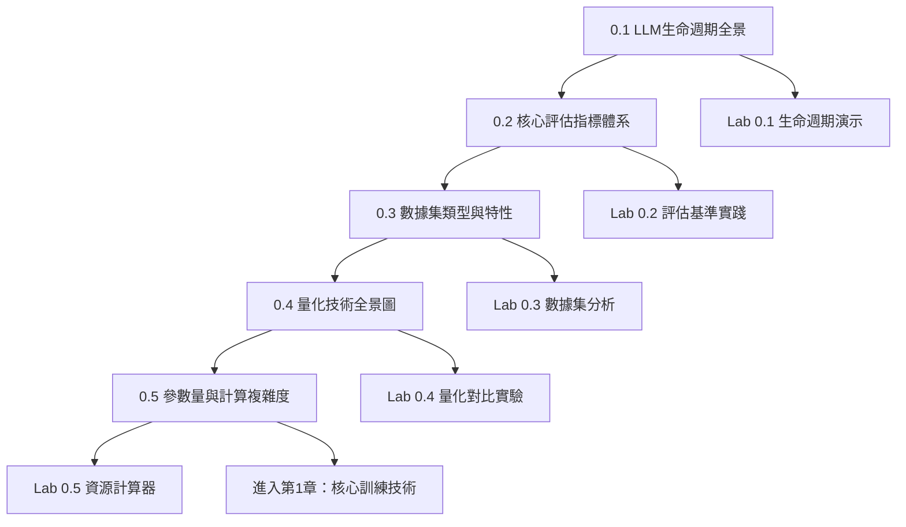

# LLM基礎知識體系學習路徑指導

## 學習路徑概覽

第0章作為整個LLM工程化課程的基礎，建議按照以下順序進行系統性學習，每個專論都為後續內容提供必要的理論基礎和實踐經驗。



## 詳細學習計劃

### 🎯 學習目標設定

在開始學習前，請明確您的學習目標：

**🔰 初學者路徑**（建議學習時間：2-3週）
- 目標：建立LLM基本概念，為後續學習打基礎
- 重點：理解概念、掌握評估方法、熟悉工具使用
- 實踐比重：30%理論 + 70%實踐

**🚀 進階路徑**（建議學習時間：1-2週）
- 目標：深度掌握技術細節，具備實際應用能力
- 重點：技術原理、優化策略、工程實踐
- 實踐比重：40%理論 + 60%實踐

**🎓 專家路徑**（建議學習時間：1週）
- 目標：全面掌握前沿技術，具備創新研究能力
- 重點：前沿技術、研究方向、創新應用
- 實踐比重：50%理論 + 50%實踐

### 📅 階段性學習計劃

#### 第1-2天：建立全局認知
```
專論0.1：LLM生命週期全景
├── 理論學習（3小時）
│   ├── 閱讀理論框架文件
│   ├── 理解四大訓練階段
│   └── 掌握技術路線圖
├── 實踐操作（4小時）
│   ├── 運行Lab 0.1生命週期演示
│   ├── 體驗各階段訓練過程
│   └── 分析資源消耗差異
└── 總結複習（1小時）
    ├── 整理學習筆記
    ├── 完成實驗報告
    └── 規劃下一階段學習
```

**學習要點**：
- 重點理解：預訓練→微調→後訓練→RLHF的遞進關係
- 實踐重點：體驗完整訓練流程，理解各階段資源需求
- 輸出成果：完整的生命週期實驗報告

#### 第3-4天：建立評估思維
```
專論0.2：核心評估指標體系
├── 理論學習（4小時）
│   ├── 掌握多維度評估框架
│   ├── 學習主流評估基準
│   └── 理解安全性評估
├── 實踐操作（5小時）
│   ├── 運行Lab 0.2評估基準實踐
│   ├── 對比不同模型性能
│   └── 分析評估結果含義
└── 總結應用（1小時）
    ├── 建立個人評估方法論
    ├── 整理評估工具清單
    └── 設計評估實施方案
```

**學習要點**：
- 重點理解：不同指標的適用場景和計算方法
- 實踐重點：使用主流評估工具，解讀評估結果
- 輸出成果：個人化的評估方法論和工具清單

#### 第5-6天：掌握數據工程
```
專論0.3：數據集類型與特性分析
├── 理論學習（3小時）
│   ├── 學習數據集分類體系
│   ├── 理解數據質量標準
│   └── 掌握倫理合規要求
├── 實踐操作（5小時）
│   ├── 運行Lab 0.3數據集分析
│   ├── 分析不同類型數據特性
│   └── 實施數據質量控制
└── 應用設計（2小時）
    ├── 設計數據處理流程
    ├── 建立質量控制體系
    └── 制定合規檢查清單
```

**學習要點**：
- 重點理解：數據質量對模型性能的決定性影響
- 實踐重點：數據分析技能，質量控制方法
- 輸出成果：數據處理標準化流程設計

#### 第7-9天：精通量化技術
```
專論0.4：量化技術全景圖
├── 理論學習（5小時）
│   ├── 深入理解量化數學原理
│   ├── 掌握PTQ和QAT技術
│   └── 學習前沿量化方法
├── 實踐操作（6小時）
│   ├── 運行Lab 0.4量化對比實驗
│   ├── 對比不同量化方案效果
│   └── 分析性能與精度權衡
└── 策略制定（1小時）
    ├── 制定量化技術選擇策略
    ├── 設計部署量化方案
    └── 建立量化效果評估標準
```

**學習要點**：
- 重點理解：量化技術的理論基礎和實現細節
- 實踐重點：量化技術對比，部署策略選擇
- 輸出成果：完整的量化技術應用指南

#### 第10-12天：掌握資源估算
```
專論0.5：參數量與計算複雜度估算
├── 理論學習（4小時）
│   ├── 掌握參數量精確計算
│   ├── 理解FLOPs和記憶體估算
│   └── 學習縮放法則應用
├── 實踐操作（6小時）
│   ├── 運行Lab 0.5資源計算器
│   ├── 開發資源估算工具
│   └── 進行成本效益分析
└── 應用實踐（2小時）
    ├── 制定資源規劃方案
    ├── 進行投入產出分析
    └── 建立成本控制體系
```

**學習要點**：
- 重點理解：精確的資源估算方法和縮放法則
- 實踐重點：開發實用的估算工具，進行成本分析
- 輸出成果：資源規劃工具和成本分析模型

## 🛠️ 實踐學習方法

### 理論學習策略
1. **結構化閱讀**
   - 先整體瀏覽，理解章節結構
   - 重點標記關鍵概念和公式
   - 建立概念間的邏輯關係

2. **筆記整理方法**
   - 使用思維導圖整理知識點
   - 建立個人的知識卡片庫
   - 定期回顧和更新筆記

3. **知識內化技巧**
   - 用自己的話解釋複雜概念
   - 尋找實際應用案例
   - 與同行討論和交流

### 實踐學習策略
1. **動手實踐原則**
   - 每學完一個理論專論立即做對應Lab
   - 不要只是運行代碼，要理解每行代碼的作用
   - 嘗試修改參數，觀察結果變化

2. **問題驅動學習**
   - 在實踐中主動發現問題
   - 嘗試解決遇到的技術難點
   - 總結解決問題的方法和經驗

3. **項目應用導向**
   - 結合實際項目需求學習
   - 將學到的知識應用到實際場景
   - 建立個人的技術工具箱

## 🔧 學習環境配置

### 基礎環境檢查
```bash
# 確認Python版本
python --version

# 激活虛擬環境
cd 00-Course_Setup
source .venv/bin/activate

# 檢查關鍵依賴
python -c "import torch; print(f'PyTorch: {torch.__version__}')"
python -c "import transformers; print(f'Transformers: {transformers.__version__}')"

# 檢查GPU（如果有）
python 01-PyTorch_Basics/check_gpu.py
```

### Lab環境準備
```bash
# 安裝Lab額外依賴
pip install streamlit langdetect wordcloud jieba seaborn scikit-learn textstat

# 創建結果目錄
mkdir -p 00-LLM_Fundamentals/results/{lab-0.1,lab-0.2,lab-0.3,lab-0.4,lab-0.5}
```

### 學習資源組織
```
個人學習目錄建議結構：
├── notes/                    # 學習筆記
│   ├── 0.1-lifecycle.md
│   ├── 0.2-evaluation.md
│   ├── 0.3-datasets.md
│   ├── 0.4-quantization.md
│   └── 0.5-estimation.md
├── lab_results/              # 實驗結果
│   ├── lab-0.1/
│   ├── lab-0.2/
│   ├── lab-0.3/
│   ├── lab-0.4/
│   └── lab-0.5/
├── tools/                    # 個人工具
│   ├── resource_calculator.py
│   ├── evaluation_toolkit.py
│   └── data_analysis_utils.py
└── projects/                 # 應用項目
    ├── model_selection_project/
    └── deployment_planning_project/
```

## 📈 學習進度檢查

### 階段性評估標準

#### 專論0.1完成標準 ✅
- [ ] 能夠清楚解釋LLM四個訓練階段的技術特點
- [ ] 理解各階段的資源需求差異
- [ ] 能夠根據應用需求選擇合適的訓練策略
- [ ] 完成生命週期演示實驗並提交報告

#### 專論0.2完成標準 ✅
- [ ] 熟悉主流LLM評估基準和指標
- [ ] 能夠設計多維度評估方案
- [ ] 掌握評估工具的使用方法
- [ ] 能夠客觀解讀評估結果

#### 專論0.3完成標準 ✅
- [ ] 理解不同類型數據集的特性和適用場景
- [ ] 掌握數據質量評估和處理方法
- [ ] 具備數據倫理和合規意識
- [ ] 能夠進行數據集的深度分析

#### 專論0.4完成標準 ✅
- [ ] 深入理解量化技術的數學原理
- [ ] 能夠根據部署需求選擇量化策略
- [ ] 熟悉主流量化工具和框架
- [ ] 能夠評估量化效果和優化策略

#### 專論0.5完成標準 ✅
- [ ] 能夠精確計算模型參數量和資源需求
- [ ] 理解並能應用縮放法則
- [ ] 具備訓練和部署的成本分析能力
- [ ] 能夠進行資源規劃和優化

### 綜合能力檢驗

#### 理論知識檢驗
1. **概念理解測試**：關鍵概念的準確理解和解釋能力
2. **技術關聯分析**：不同技術間關係的理解和分析
3. **應用場景判斷**：能夠為具體場景選擇合適技術方案

#### 實踐技能檢驗
1. **工具使用熟練度**：熟練使用各種評估和分析工具
2. **問題解決能力**：遇到技術問題時的調試和解決能力
3. **創新應用能力**：將學到的知識應用到新場景的能力

#### 綜合項目考核
設計一個綜合性項目，要求學員：
1. **需求分析**：分析具體的LLM應用需求
2. **技術選型**：選擇合適的模型、數據、量化策略
3. **資源規劃**：估算資源需求和成本
4. **方案設計**：設計完整的實施方案
5. **風險評估**：識別潛在風險和緩解措施

## 🚀 學習效率提升技巧

### 主動學習策略
1. **提問驅動學習**
   - 在每個專論開始前列出5個關鍵問題
   - 在學習過程中尋找問題的答案
   - 學習結束後檢驗問題是否得到解答

2. **案例分析方法**
   - 尋找每個技術的實際應用案例
   - 分析案例中的技術選擇和權衡
   - 思考如何改進或優化現有方案

3. **對比學習法**
   - 比較不同技術的優缺點
   - 分析技術演進的歷史脈絡
   - 預測未來技術發展趨勢

### 實踐技能提升
1. **漸進式複雜度**
   - 從簡單例子開始實踐
   - 逐步增加問題複雜度
   - 最終解決實際工程問題

2. **錯誤驅動學習**
   - 不怕犯錯，從錯誤中學習
   - 分析錯誤原因和解決方法
   - 建立個人的錯誤知識庫

3. **工具整合能力**
   - 學會組合使用不同工具
   - 開發個人化的工具集
   - 建立高效的工作流程

### 知識管理系統
1. **建立知識圖譜**
   - 繪製LLM技術知識圖譜
   - 標記知識點間的關聯關係
   - 定期更新和完善圖譜

2. **維護學習日誌**
   - 記錄每日學習進度和心得
   - 總結重要發現和洞察
   - 規劃下一步學習重點

3. **建立資源庫**
   - 收集有價值的論文和資料
   - 整理實用的代碼和工具
   - 建立個人的技術博客或筆記

## 🎯 與後續章節的銜接

### 第1章銜接準備
完成第0章學習後，您應該具備以下能力進入第1章：
- ✅ 深刻理解LLM訓練的完整流程
- ✅ 掌握科學的模型評估方法
- ✅ 具備數據工程的基礎技能
- ✅ 熟悉量化技術和資源估算

### 知識遷移重點
1. **生命週期知識**→**PEFT實踐**：將訓練階段理論應用到具體PEFT技術
2. **評估指標體系**→**訓練監控**：將評估方法應用到訓練過程監控
3. **數據集分析**→**數據預處理**：將數據分析技能應用到實際數據處理
4. **量化技術**→**模型優化**：將量化知識應用到模型壓縮實踐
5. **資源估算**→**分散式訓練**：將估算能力應用到大規模訓練規劃

### 技能提升路線
```
基礎知識 → 專業技能 → 工程實踐 → 創新應用
    ↓           ↓           ↓           ↓
第0章       第1-2章     第3-4章      綜合項目
基礎理論    核心技術    優化部署    創新解決方案
```

## 💡 學習建議與最佳實踐

### 時間管理建議
1. **集中學習**：每次專注學習1個專論，避免多線程學習
2. **定時復習**：每週末復習本週學習內容
3. **及時實踐**：理論學習後24小時內進行實踐操作
4. **週期總結**：每完成一個專論進行一次全面總結

### 學習效果評估
1. **自測機制**：定期進行知識點自測
2. **同伴討論**：與同學或同事討論學習心得
3. **實際應用**：嘗試將學到的知識應用到工作項目中
4. **持續改進**：根據實際應用效果調整學習策略

### 常見學習陷阱與避免方法
1. **理論與實踐脫節**
   - 陷阱：只學理論不做實踐，或只做實踐不理解原理
   - 避免：確保理論學習與實踐操作的時間比例適當

2. **追求完美主義**
   - 陷阱：過度糾結細節，影響學習進度
   - 避免：先建立整體認知，後逐步深入細節

3. **工具依賴症**
   - 陷阱：過度依賴工具，不理解底層原理
   - 避免：在使用工具的同時理解實現原理

4. **知識孤島化**
   - 陷阱：各專論知識獨立，缺乏關聯
   - 避免：主動建立知識點間的關聯，形成知識網絡

## 🏆 學習成果展示

### 階段性成果
- **專論筆記**：每個專論的詳細學習筆記
- **實驗報告**：每個Lab的完整實驗報告
- **工具開發**：基於學習內容開發的實用工具
- **案例分析**：針對實際場景的技術分析報告

### 最終成果
- **知識圖譜**：完整的LLM基礎知識圖譜
- **工具集合**：個人化的LLM工程化工具集
- **方法論文檔**：基於學習和實踐的個人方法論
- **綜合項目**：展示綜合應用能力的完整項目

## 📚 學習資源推薦

### 必讀資料
- 各專論的理論框架文件
- 對應Lab的實踐指導
- 推薦論文和技術文檔

### 補充資源
- **在線課程**：相關的MOOC課程
- **技術博客**：知名研究機構和工程師的技術博客
- **開源項目**：優秀的開源LLM項目
- **學術會議**：NeurIPS、ICML、ACL等頂級會議論文

### 社群資源
- **GitHub社群**：相關開源項目的討論
- **技術論壇**：知乎、Reddit、Stack Overflow
- **學術交流**：研究組會議、技術沙龍
- **工業實踐**：企業技術分享和案例討論

---

🎯 **準備好開始您的LLM基礎知識學習之旅了嗎？**

建議先花10分鐘瀏覽各專論的README文件，了解整體內容結構，然後按照建議的學習路徑開始系統性學習。記住：紮實的基礎是後續高效學習的關鍵！