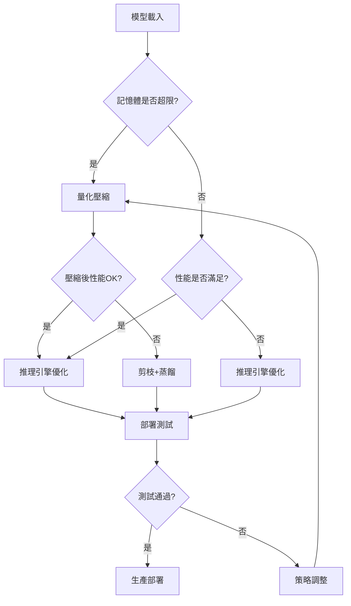

# LLM模型壓縮工程化實踐指南

## 📋 總覽

本指南提供從模型載入到推理部署的完整工程化壓縮流程，包括精確的硬體匹配計算公式和實用的壓縮實施策略。

## 🔧 硬體匹配核心計算公式

### 基礎記憶體需求計算

```python
# 核心記憶體計算公式
class MemoryCalculationFormulas:
    """記憶體計算核心公式集合"""

    @staticmethod
    def training_memory_formula(params: int, batch_size: int, seq_len: int,
                               d_model: int, n_layers: int, precision: str = 'fp16') -> dict:
        """
        訓練記憶體精確計算公式

        Memory_train = P×(W + O + G) + A×L + B

        其中：
        P = 模型參數量
        W = 權重存儲係數 (fp16=2, fp32=4 bytes)
        O = 優化器係數 (Adam=8, SGD=0 bytes per param)
        G = 梯度存儲係數 (與權重相同精度)
        A = 單層激活記憶體 = B×S×D×precision_bytes
        L = 層數 (訓練時需要保存所有層激活值)
        B = 緩衝區記憶體 ≈ 模型記憶體的20%
        """

        precision_bytes = {'fp16': 2, 'fp32': 4, 'bf16': 2, 'int8': 1}
        weight_coefficient = precision_bytes[precision]
        optimizer_coefficient = 8  # Adam: momentum(4) + variance(4) bytes
        gradient_coefficient = precision_bytes[precision]

        # 模型相關記憶體 (參數、優化器、梯度)
        model_memory = params * (weight_coefficient + optimizer_coefficient + gradient_coefficient)

        # 激活值記憶體 (訓練時需要保存所有層)
        single_layer_activation = batch_size * seq_len * d_model * precision_bytes[precision]
        total_activation_memory = single_layer_activation * n_layers

        # 緩衝區記憶體
        buffer_memory = model_memory * 0.2

        total_memory = model_memory + total_activation_memory + buffer_memory

        return {
            'total_memory_gb': total_memory / (1024**3),
            'model_memory_gb': model_memory / (1024**3),
            'activation_memory_gb': total_activation_memory / (1024**3),
            'buffer_memory_gb': buffer_memory / (1024**3),
            'breakdown': {
                'weights_gb': (params * weight_coefficient) / (1024**3),
                'optimizer_gb': (params * optimizer_coefficient) / (1024**3),
                'gradients_gb': (params * gradient_coefficient) / (1024**3),
                'activations_gb': total_activation_memory / (1024**3)
            }
        }

    @staticmethod
    def inference_memory_formula(params: int, batch_size: int, seq_len: int,
                                d_model: int, n_layers: int, n_heads: int,
                                precision: str = 'fp16') -> dict:
        """
        推理記憶體精確計算公式

        Memory_infer = P×W + KV + A + B

        其中：
        P = 模型參數量
        W = 權重存儲係數
        KV = KV Cache記憶體 = 2×L×B×H×S×(D/H)×precision_bytes
        A = 當前激活記憶體 = B×S×D×precision_bytes (只需要當前層)
        B = 緩衝區記憶體 ≈ 10%
        """

        precision_bytes = {'fp16': 2, 'fp32': 4, 'bf16': 2, 'int8': 1}
        weight_coefficient = precision_bytes[precision]

        # 模型參數記憶體
        model_memory = params * weight_coefficient

        # KV Cache記憶體: 2(K+V) × layers × batch × heads × seq_len × head_dim
        d_head = d_model // n_heads
        kv_cache_memory = 2 * n_layers * batch_size * n_heads * seq_len * d_head * precision_bytes[precision]

        # 當前激活記憶體 (推理時只需要當前層)
        current_activation_memory = batch_size * seq_len * d_model * precision_bytes[precision]

        # 緩衝區記憶體
        buffer_memory = model_memory * 0.1  # 推理時緩衝需求較小

        total_memory = model_memory + kv_cache_memory + current_activation_memory + buffer_memory

        return {
            'total_memory_gb': total_memory / (1024**3),
            'model_memory_gb': model_memory / (1024**3),
            'kv_cache_memory_gb': kv_cache_memory / (1024**3),
            'activation_memory_gb': current_activation_memory / (1024**3),
            'buffer_memory_gb': buffer_memory / (1024**3),
            'kv_cache_per_token_mb': (kv_cache_memory / seq_len) / (1024**2)
        }

    @staticmethod
    def gpu_matching_formula(memory_required_gb: float, target_gpus: dict,
                           safety_margin: float = 0.2) -> dict:
        """
        GPU匹配計算公式

        最小GPU數 = ceil(Memory_required / (GPU_memory × (1 - safety_margin)))
        記憶體利用率 = Memory_required / (min_GPUs × GPU_memory)
        成本效益 = Performance_gain / Total_cost
        """

        matching_results = {}

        for gpu_name, gpu_specs in target_gpus.items():
            available_memory = gpu_specs['memory_gb'] * (1 - safety_margin)
            min_gpus = max(1, np.ceil(memory_required_gb / available_memory))

            actual_utilization = memory_required_gb / (min_gpus * gpu_specs['memory_gb']) * 100
            total_cost = min_gpus * gpu_specs['price_usd']
            cost_per_gb = total_cost / memory_required_gb

            matching_results[gpu_name] = {
                'min_gpus': int(min_gpus),
                'memory_utilization_percent': actual_utilization,
                'total_cost_usd': total_cost,
                'cost_per_gb': cost_per_gb,
                'cost_efficiency_score': gpu_specs['memory_gb'] / gpu_specs['price_usd']  # GB per USD
            }

        return matching_results

    @staticmethod
    def communication_bandwidth_formula(model_size_gb: float, training_time_per_step: float,
                                      parallelism_type: str, num_gpus: int) -> dict:
        """
        通訊頻寬需求計算公式

        數據並行: BW = 2×(P-1)/P × model_size / step_time
        模型並行: BW = 2 × shard_size × layers / step_time
        流水線並行: BW = activation_size × micro_batches / step_time
        """

        if parallelism_type == 'data_parallel':
            # AllReduce通訊模式
            allreduce_efficiency = (num_gpus - 1) / num_gpus
            bandwidth_gbps = 2 * allreduce_efficiency * model_size_gb / training_time_per_step

        elif parallelism_type == 'tensor_parallel':
            # AllGather + ReduceScatter
            shard_size_gb = model_size_gb / num_gpus
            bandwidth_gbps = 2 * shard_size_gb / training_time_per_step

        elif parallelism_type == 'pipeline_parallel':
            # 點對點通訊
            activation_size_gb = 0.1  # 估算值，實際取決於批次大小和序列長度
            micro_batches = 4  # 典型微批次數
            bandwidth_gbps = activation_size_gb * micro_batches / training_time_per_step

        else:
            raise ValueError(f"Unsupported parallelism type: {parallelism_type}")

        return {
            'required_bandwidth_gbps': bandwidth_gbps,
            'parallelism_type': parallelism_type,
            'num_gpus': num_gpus,
            'communication_efficiency': bandwidth_gbps / (model_size_gb / training_time_per_step)
        }
```

### 壓縮效果預測公式

```python
class CompressionEffectCalculator:
    """壓縮效果預測計算器"""

    @staticmethod
    def quantization_effect_formula(original_precision: str, target_precision: str,
                                  model_params: int, model_type: str = 'transformer') -> dict:
        """
        量化效果預測公式

        壓縮比 = original_bits / target_bits
        記憶體節省 = (1 - target_bytes/original_bytes) × 100%
        性能影響 = f(模型類型, 量化方法, 精度降低幅度)
        """

        precision_bits = {'fp32': 32, 'fp16': 16, 'bf16': 16, 'int8': 8, 'int4': 4, 'nf4': 4}
        precision_bytes = {'fp32': 4, 'fp16': 2, 'bf16': 2, 'int8': 1, 'int4': 0.5, 'nf4': 0.5}

        compression_ratio = precision_bits[original_precision] / precision_bits[target_precision]
        memory_saving = (1 - precision_bytes[target_precision] / precision_bytes[original_precision]) * 100

        # 性能影響預測（基於經驗公式）
        accuracy_degradation_map = {
            ('fp32', 'fp16'): {'transformer': 0.5, 'cnn': 0.2, 'rnn': 1.0},
            ('fp16', 'int8'): {'transformer': 2.0, 'cnn': 1.0, 'rnn': 3.0},
            ('fp16', 'int4'): {'transformer': 5.0, 'cnn': 3.0, 'rnn': 8.0},
            ('int8', 'int4'): {'transformer': 3.0, 'cnn': 2.0, 'rnn': 5.0}
        }

        accuracy_impact = accuracy_degradation_map.get(
            (original_precision, target_precision), {}
        ).get(model_type, 2.0)  # 默認2%性能下降

        # 推理加速預測
        theoretical_speedup = compression_ratio * 0.7  # 考慮實際硬體效率
        memory_bandwidth_speedup = min(compression_ratio, 2.0)  # 記憶體頻寬限制

        return {
            'compression_ratio': compression_ratio,
            'memory_saving_percent': memory_saving,
            'model_size_reduction_mb': model_params * (precision_bytes[original_precision] - precision_bytes[target_precision]) / (1024**2),
            'estimated_accuracy_degradation_percent': accuracy_impact,
            'theoretical_speedup': theoretical_speedup,
            'memory_bandwidth_speedup': memory_bandwidth_speedup,
            'recommended_for_deployment': accuracy_impact < 5.0 and compression_ratio > 1.5
        }

    @staticmethod
    def pruning_effect_formula(sparsity_ratio: float, pruning_type: str,
                             model_params: int) -> dict:
        """
        剪枝效果預測公式

        實際壓縮比 = structured_efficiency × sparsity_ratio
        性能影響 = sparsity_penalty × sparsity_ratio^2
        加速效果 = hardware_support × compression_ratio
        """

        # 不同剪枝類型的效率係數
        efficiency_map = {
            'unstructured': 0.3,    # 非結構化稀疏的硬體效率較低
            'n_m_structured': 0.8,  # N:M結構化稀疏硬體支持好
            'channel_pruning': 0.9, # 通道剪枝效率最高
            'layer_pruning': 0.95   # 層剪枝效率極高但影響較大
        }

        # 性能影響係數
        performance_penalty_map = {
            'unstructured': 0.5,
            'n_m_structured': 0.3,
            'channel_pruning': 0.8,
            'layer_pruning': 1.2
        }

        efficiency = efficiency_map.get(pruning_type, 0.5)
        penalty = performance_penalty_map.get(pruning_type, 0.5)

        # 實際壓縮效果
        effective_compression = efficiency * sparsity_ratio
        theoretical_speedup = 1 / (1 - effective_compression)

        # 性能影響預測
        accuracy_degradation = penalty * (sparsity_ratio ** 1.5) * 100

        # 記憶體節省
        memory_saving_mb = model_params * 2 * effective_compression / (1024**2)  # 假設fp16

        return {
            'sparsity_ratio': sparsity_ratio,
            'effective_compression_ratio': effective_compression,
            'theoretical_speedup': theoretical_speedup,
            'memory_saving_mb': memory_saving_mb,
            'estimated_accuracy_degradation_percent': accuracy_degradation,
            'hardware_efficiency': efficiency,
            'recommended_max_sparsity': min(0.9, 5.0 / penalty)  # 保持<5%性能損失的最大稀疏度
        }
```

## 🏭 工程化壓縮實施流程

### 完整工程化Pipeline

```python
class ModelCompressionPipeline:
    """模型壓縮工程化管線"""

    def __init__(self, config: dict):
        self.config = config
        self.compression_history = []
        self.performance_baselines = {}

    def stage_1_model_analysis(self, model_path: str) -> dict:
        """階段1: 模型載入與全面分析"""

        print("=== 階段1: 模型分析與基線建立 ===")

        # 1.1 載入模型並分析結構
        model_info = self._load_and_analyze_model(model_path)

        # 1.2 建立性能基線
        baseline_metrics = self._establish_performance_baseline(model_path)

        # 1.3 硬體適配分析
        hardware_analysis = self._analyze_hardware_compatibility(model_info)

        # 1.4 壓縮潛力評估
        compression_potential = self._assess_compression_potential(model_info, baseline_metrics)

        analysis_result = {
            'model_info': model_info,
            'baseline_metrics': baseline_metrics,
            'hardware_analysis': hardware_analysis,
            'compression_potential': compression_potential,
            'recommendations': self._generate_compression_recommendations(compression_potential)
        }

        # 保存分析結果
        self._save_analysis_result(analysis_result, 'stage1_analysis.json')

        return analysis_result

    def stage_2_compression_strategy(self, analysis_result: dict,
                                   target_constraints: dict) -> dict:
        """階段2: 壓縮策略制定"""

        print("=== 階段2: 壓縮策略制定 ===")

        # 2.1 解析目標約束
        constraints = self._parse_target_constraints(target_constraints)

        # 2.2 生成壓縮方案
        compression_strategies = self._generate_compression_strategies(
            analysis_result, constraints
        )

        # 2.3 方案評估和排序
        ranked_strategies = self._evaluate_and_rank_strategies(
            compression_strategies, constraints
        )

        # 2.4 風險評估
        risk_assessment = self._assess_compression_risks(ranked_strategies)

        strategy_result = {
            'target_constraints': constraints,
            'compression_strategies': ranked_strategies,
            'risk_assessment': risk_assessment,
            'recommended_strategy': ranked_strategies[0] if ranked_strategies else None
        }

        self._save_analysis_result(strategy_result, 'stage2_strategy.json')

        return strategy_result

    def stage_3_compression_implementation(self, strategy: dict, model_path: str) -> dict:
        """階段3: 壓縮實施"""

        print("=== 階段3: 壓縮實施 ===")

        implementation_steps = [
            self._implement_quantization,
            self._implement_pruning,
            self._implement_knowledge_distillation,
            self._optimize_inference_engine,
            self._validate_compression_effects
        ]

        compressed_model_info = {}

        for step_func in implementation_steps:
            if self._should_execute_step(step_func.__name__, strategy):
                print(f"執行: {step_func.__name__}")

                step_result = step_func(model_path, strategy, compressed_model_info)
                compressed_model_info.update(step_result)

                # 記錄壓縮歷史
                self.compression_history.append({
                    'step': step_func.__name__,
                    'timestamp': datetime.now(),
                    'result': step_result,
                    'performance_impact': self._measure_performance_impact(step_result)
                })

                print(f"完成: {step_func.__name__}")

        return {
            'compressed_model_path': compressed_model_info.get('final_model_path'),
            'compression_summary': self._generate_compression_summary(compressed_model_info),
            'compression_history': self.compression_history
        }

    def stage_4_deployment_optimization(self, compressed_model_path: str,
                                      deployment_target: dict) -> dict:
        """階段4: 部署優化"""

        print("=== 階段4: 部署優化 ===")

        # 4.1 推理引擎適配
        inference_optimization = self._optimize_for_inference_engine(
            compressed_model_path, deployment_target
        )

        # 4.2 服務架構優化
        service_optimization = self._optimize_service_architecture(
            inference_optimization, deployment_target
        )

        # 4.3 性能基準測試
        deployment_benchmarks = self._run_deployment_benchmarks(
            service_optimization, deployment_target
        )

        # 4.4 生產部署準備
        production_readiness = self._prepare_production_deployment(
            deployment_benchmarks, deployment_target
        )

        return {
            'inference_optimization': inference_optimization,
            'service_optimization': service_optimization,
            'deployment_benchmarks': deployment_benchmarks,
            'production_readiness': production_readiness
        }

    def _implement_quantization(self, model_path: str, strategy: dict, context: dict) -> dict:
        """實施量化壓縮"""

        quantization_config = strategy.get('quantization', {})

        if not quantization_config.get('enabled', False):
            return {'quantization_skipped': True}

        print(f"實施 {quantization_config['method']} 量化...")

        # 根據量化方法選擇實施策略
        if quantization_config['method'] == 'ptq':
            result = self._implement_ptq_quantization(model_path, quantization_config)
        elif quantization_config['method'] == 'qat':
            result = self._implement_qat_quantization(model_path, quantization_config)
        elif quantization_config['method'] == 'gptq':
            result = self._implement_gptq_quantization(model_path, quantization_config)
        elif quantization_config['method'] == 'awq':
            result = self._implement_awq_quantization(model_path, quantization_config)
        else:
            raise ValueError(f"Unsupported quantization method: {quantization_config['method']}")

        # 量化效果驗證
        validation_result = self._validate_quantization_effect(result, quantization_config)

        return {
            'quantization_result': result,
            'validation_result': validation_result,
            'quantized_model_path': result['output_model_path']
        }

    def _implement_ptq_quantization(self, model_path: str, config: dict) -> dict:
        """實施PTQ量化"""

        from transformers import AutoTokenizer, AutoModelForCausalLM
        import torch

        # 載入模型
        tokenizer = AutoTokenizer.from_pretrained(model_path)
        model = AutoModelForCausalLM.from_pretrained(model_path, torch_dtype=torch.float16)

        # 準備校準數據
        calibration_data = self._prepare_calibration_data(config.get('calibration_samples', 128))

        # 執行量化
        if config['target_precision'] == 'int8':
            # INT8 PTQ
            quantized_model = self._apply_int8_ptq(model, calibration_data, config)
        elif config['target_precision'] == 'int4':
            # INT4 PTQ (使用BitsAndBytesConfig)
            from transformers import BitsAndBytesConfig

            bnb_config = BitsAndBytesConfig(
                load_in_4bit=True,
                bnb_4bit_quant_type="nf4",
                bnb_4bit_compute_dtype=torch.float16,
                bnb_4bit_use_double_quant=False
            )

            quantized_model = AutoModelForCausalLM.from_pretrained(
                model_path,
                quantization_config=bnb_config,
                device_map="auto"
            )
        else:
            raise ValueError(f"Unsupported target precision: {config['target_precision']}")

        # 保存量化後模型
        output_path = f"{model_path}_quantized_{config['target_precision']}"
        quantized_model.save_pretrained(output_path)
        tokenizer.save_pretrained(output_path)

        return {
            'method': 'ptq',
            'target_precision': config['target_precision'],
            'output_model_path': output_path,
            'calibration_samples': len(calibration_data),
            'quantization_config': config
        }

    def _prepare_calibration_data(self, num_samples: int = 128) -> list:
        """準備校準數據"""

        # 這裡使用簡單的文本樣本作為校準數據
        calibration_texts = [
            "人工智能技術正在改變我們的生活方式，從智能手機到自動駕駛汽車。",
            "機器學習算法能夠從大量數據中學習模式，並做出預測和決策。",
            "深度神經網路通過多層結構模擬人腦的信息處理方式。",
            "自然語言處理技術使計算機能夠理解和生成人類語言。",
            "計算機視覺技術讓機器能夠識別和理解圖像內容。"
        ] * (num_samples // 5 + 1)

        return calibration_texts[:num_samples]

    def _validate_quantization_effect(self, quantization_result: dict, config: dict) -> dict:
        """驗證量化效果"""

        print("驗證量化效果...")

        # 載入量化後的模型
        quantized_model_path = quantization_result['output_model_path']

        try:
            from transformers import AutoTokenizer, AutoModelForCausalLM
            tokenizer = AutoTokenizer.from_pretrained(quantized_model_path)
            quantized_model = AutoModelForCausalLM.from_pretrained(quantized_model_path)

            # 簡單的功能測試
            test_prompt = "人工智能的未來發展"
            inputs = tokenizer(test_prompt, return_tensors="pt")

            with torch.no_grad():
                outputs = quantized_model.generate(
                    **inputs,
                    max_length=inputs['input_ids'].shape[1] + 20,
                    temperature=0.7,
                    do_sample=True,
                    pad_token_id=tokenizer.eos_token_id
                )

            generated_text = tokenizer.decode(outputs[0], skip_special_tokens=True)

            return {
                'functional_test_passed': True,
                'test_prompt': test_prompt,
                'generated_response': generated_text[len(test_prompt):],
                'quantization_successful': True
            }

        except Exception as e:
            return {
                'functional_test_passed': False,
                'error': str(e),
                'quantization_successful': False
            }

    def generate_compression_report(self, pipeline_results: dict) -> str:
        """生成壓縮報告"""

        report = f"""# 模型壓縮工程化報告

## 壓縮總結
- 原始模型: {pipeline_results.get('original_model_path', 'Unknown')}
- 壓縮後模型: {pipeline_results.get('compressed_model_path', 'Unknown')}
- 壓縮完成時間: {datetime.now().strftime('%Y-%m-%d %H:%M:%S')}

## 壓縮效果
"""

        if 'compression_summary' in pipeline_results:
            summary = pipeline_results['compression_summary']

            report += f"""
### 模型大小變化
- 原始大小: {summary.get('original_size_mb', 0):.1f} MB
- 壓縮後大小: {summary.get('compressed_size_mb', 0):.1f} MB
- 壓縮比: {summary.get('compression_ratio', 1):.2f}x
- 存儲節省: {summary.get('storage_saving_percent', 0):.1f}%

### 性能影響
- 推理速度變化: {summary.get('inference_speedup', 1):.2f}x
- 準確性變化: {summary.get('accuracy_change_percent', 0):+.2f}%
- 記憶體使用變化: {summary.get('memory_change_percent', 0):+.1f}%
"""

        report += """
## 壓縮步驟詳情
"""

        if 'compression_history' in pipeline_results:
            for i, step in enumerate(pipeline_results['compression_history']):
                report += f"""
### 步驟 {i+1}: {step['step']}
- 執行時間: {step.get('timestamp', 'Unknown')}
- 性能影響: {step.get('performance_impact', {})}
"""

        report += f"""
## 部署建議
{self._generate_deployment_recommendations(pipeline_results)}

## 監控要點
{self._generate_monitoring_recommendations(pipeline_results)}

## 風險評估
{self._generate_risk_assessment(pipeline_results)}
"""

        return report

def _generate_deployment_recommendations(self, results: dict) -> str:
        """生成部署建議"""

        recommendations = []

        # 基於壓縮效果的建議
        if results.get('compression_summary', {}).get('compression_ratio', 1) > 2:
            recommendations.append("- ✅ 壓縮效果顯著，建議在生產環境部署")
        else:
            recommendations.append("- ⚠️ 壓縮效果有限，建議進一步優化")

        # 基於準確性的建議
        accuracy_change = results.get('compression_summary', {}).get('accuracy_change_percent', 0)
        if accuracy_change > -2:
            recommendations.append("- ✅ 準確性損失可接受，可直接部署")
        elif accuracy_change > -5:
            recommendations.append("- ⚠️ 準確性有所下降，建議進行A/B測試")
        else:
            recommendations.append("- ❌ 準確性損失過大，需要重新優化壓縮策略")

        # 基於硬體匹配的建議
        if results.get('hardware_analysis', {}).get('compatibility_score', 0) > 0.8:
            recommendations.append("- ✅ 硬體兼容性良好，無需額外適配")
        else:
            recommendations.append("- ⚠️ 需要針對目標硬體進行專門優化")

        return "\\n".join(recommendations)
```

### 實際壓縮工程化實例

```python
# 完整的工程化壓縮實例
class LLaMACompressionExample:
    """LLaMA模型壓縮工程化實例"""

    def __init__(self):
        self.model_name = "NousResearch/Llama-2-7b-hf"
        self.target_deployment = "cloud_inference"

    def run_complete_compression_pipeline(self):
        """運行完整壓縮流程"""

        # 1. 模型分析
        print("步驟1: 分析LLaMA-7B模型...")
        analysis = self.analyze_llama_model()

        # 2. 硬體匹配計算
        print("步驟2: 硬體需求計算...")
        hardware_matching = self.calculate_hardware_requirements(analysis)

        # 3. 壓縮策略選擇
        print("步驟3: 選擇壓縮策略...")
        compression_strategy = self.select_compression_strategy(analysis, hardware_matching)

        # 4. 執行壓縮
        print("步驟4: 執行模型壓縮...")
        compression_result = self.execute_compression(compression_strategy)

        # 5. 部署優化
        print("步驟5: 部署優化...")
        deployment_result = self.optimize_for_deployment(compression_result)

        # 6. 最終驗證
        print("步驟6: 最終效果驗證...")
        final_validation = self.validate_final_model(deployment_result)

        return {
            'analysis': analysis,
            'hardware_matching': hardware_matching,
            'compression_strategy': compression_strategy,
            'compression_result': compression_result,
            'deployment_result': deployment_result,
            'final_validation': final_validation
        }

    def analyze_llama_model(self) -> dict:
        """分析LLaMA模型"""

        # LLaMA-7B模型配置
        model_config = {
            'name': 'LLaMA-7B',
            'parameters': 6.7e9,  # 實際參數量
            'vocab_size': 32000,
            'd_model': 4096,
            'n_layers': 32,
            'n_heads': 32,
            'd_ff': 11008,
            'max_seq_len': 2048
        }

        # 使用之前定義的計算公式
        memory_calc = MemoryCalculationFormulas()

        # 訓練記憶體需求
        training_memory = memory_calc.training_memory_formula(
            params=int(model_config['parameters']),
            batch_size=4,
            seq_len=2048,
            d_model=4096,
            n_layers=32,
            precision='fp16'
        )

        # 推理記憶體需求
        inference_memory = memory_calc.inference_memory_formula(
            params=int(model_config['parameters']),
            batch_size=8,
            seq_len=2048,
            d_model=4096,
            n_layers=32,
            n_heads=32,
            precision='fp16'
        )

        return {
            'model_config': model_config,
            'training_memory_analysis': training_memory,
            'inference_memory_analysis': inference_memory,
            'compression_opportunities': {
                'quantization_potential': 'High',  # 7B模型量化效果通常很好
                'pruning_potential': 'Medium',     # 需要謹慎剪枝
                'distillation_potential': 'High',  # 可以蒸餾到更小模型
                'architecture_optimization': 'Medium'
            }
        }

    def calculate_hardware_requirements(self, analysis: dict) -> dict:
        """計算硬體需求"""

        # 目標GPU規格
        target_gpus = {
            'RTX_4090': {'memory_gb': 24, 'fp16_tflops': 166, 'price_usd': 1600},
            'A100_80GB': {'memory_gb': 80, 'fp16_tflops': 312, 'price_usd': 20000},
            'H100': {'memory_gb': 80, 'fp16_tflops': 534, 'price_usd': 30000}
        }

        memory_calc = MemoryCalculationFormulas()

        # 訓練硬體匹配
        training_memory_gb = analysis['training_memory_analysis']['total_memory_gb']
        training_matching = memory_calc.gpu_matching_formula(
            training_memory_gb, target_gpus, safety_margin=0.2
        )

        # 推理硬體匹配
        inference_memory_gb = analysis['inference_memory_analysis']['total_memory_gb']
        inference_matching = memory_calc.gpu_matching_formula(
            inference_memory_gb, target_gpus, safety_margin=0.1
        )

        return {
            'training_requirements': {
                'memory_required_gb': training_memory_gb,
                'gpu_matching': training_matching
            },
            'inference_requirements': {
                'memory_required_gb': inference_memory_gb,
                'gpu_matching': inference_matching
            },
            'cost_analysis': self._analyze_deployment_costs(training_matching, inference_matching),
            'recommendations': self._generate_hardware_recommendations(training_matching, inference_matching)
        }

    def select_compression_strategy(self, analysis: dict, hardware_matching: dict) -> dict:
        """選擇壓縮策略"""

        # 基於分析結果選擇最優壓縮策略
        model_params = analysis['model_config']['parameters']
        target_memory_gb = 16  # 假設目標是適配16GB GPU

        current_memory_gb = analysis['inference_memory_analysis']['total_memory_gb']
        required_compression_ratio = current_memory_gb / target_memory_gb

        strategy = {'compression_methods': []}

        if required_compression_ratio > 4:
            # 需要極致壓縮
            strategy['compression_methods'] = [
                {'type': 'quantization', 'method': 'gptq', 'target_precision': 'int4'},
                {'type': 'pruning', 'method': 'structured', 'sparsity': 0.3},
                {'type': 'optimization', 'method': 'inference_engine'}
            ]
        elif required_compression_ratio > 2:
            # 需要適中壓縮
            strategy['compression_methods'] = [
                {'type': 'quantization', 'method': 'awq', 'target_precision': 'int8'},
                {'type': 'optimization', 'method': 'inference_engine'}
            ]
        else:
            # 輕度壓縮
            strategy['compression_methods'] = [
                {'type': 'quantization', 'method': 'ptq', 'target_precision': 'fp16'},
                {'type': 'optimization', 'method': 'graph_optimization'}
            ]

        strategy['target_compression_ratio'] = required_compression_ratio
        strategy['target_memory_gb'] = target_memory_gb
        strategy['estimated_accuracy_impact'] = self._estimate_strategy_accuracy_impact(strategy)

        return strategy

    def _estimate_strategy_accuracy_impact(self, strategy: dict) -> float:
        """估算策略的準確性影響"""

        total_impact = 0.0

        for method in strategy['compression_methods']:
            if method['type'] == 'quantization':
                if method['target_precision'] == 'int4':
                    total_impact += 3.0  # 4位量化約3%損失
                elif method['target_precision'] == 'int8':
                    total_impact += 1.5  # 8位量化約1.5%損失
                elif method['target_precision'] == 'fp16':
                    total_impact += 0.5  # FP16約0.5%損失

            elif method['type'] == 'pruning':
                sparsity = method.get('sparsity', 0)
                total_impact += sparsity * 5  # 稀疏度每10%約增加0.5%損失

        return min(total_impact, 15.0)  # 最大影響不超過15%

    def execute_compression(self, strategy: dict) -> dict:
        """執行壓縮策略"""

        compression_results = {}
        current_model_path = self.model_name

        for i, method in enumerate(strategy['compression_methods']):
            print(f"執行壓縮方法 {i+1}/{len(strategy['compression_methods'])}: {method['type']}")

            if method['type'] == 'quantization':
                result = self._execute_quantization_step(current_model_path, method)
                current_model_path = result.get('output_model_path', current_model_path)

            elif method['type'] == 'pruning':
                result = self._execute_pruning_step(current_model_path, method)
                current_model_path = result.get('output_model_path', current_model_path)

            elif method['type'] == 'optimization':
                result = self._execute_optimization_step(current_model_path, method)
                current_model_path = result.get('output_model_path', current_model_path)

            compression_results[f"{method['type']}_{i}"] = result

            # 中間驗證
            validation = self._intermediate_validation(current_model_path, method)
            compression_results[f"{method['type']}_validation_{i}"] = validation

        return {
            'final_model_path': current_model_path,
            'compression_steps': compression_results,
            'overall_effect': self._calculate_overall_effect(compression_results)
        }

# 使用示例
def run_llama_compression_example():
    """運行LLaMA壓縮示例"""

    compressor = LLaMACompressionExample()

    # 執行完整壓縮流程
    pipeline_result = compressor.run_complete_compression_pipeline()

    # 生成報告
    report = compressor.generate_compression_report(pipeline_result)

    # 保存報告
    with open('llama_compression_report.md', 'w', encoding='utf-8') as f:
        f.write(report)

    print("\\n=== 壓縮完成 ===")
    print("詳細報告已保存到 llama_compression_report.md")

    return pipeline_result

if __name__ == "__main__":
    run_llama_compression_example()
```

## 🎯 關鍵工程化考量

### 硬體資源匹配決策表

| 模型規模 | 訓練硬體推薦 | 推理硬體推薦 | 量化策略 | 預期效果 |
|----------|--------------|--------------|----------|----------|
| <1B | RTX 4090 ×1 | RTX 3080 ×1 | INT8/INT4 | 4-8x壓縮 |
| 1B-7B | A100 80GB ×1-2 | RTX 4090 ×1 | FP16→INT8 | 2-4x壓縮 |
| 7B-30B | A100 80GB ×2-4 | A100 40GB ×1-2 | AWQ/GPTQ | 2-4x壓縮 |
| 30B-70B | A100 80GB ×4-8 | A100 80GB ×2-4 | GPTQ+分片 | 4x+壓縮 |
| >70B | H100 ×8+ | A100 80GB ×4+ | 混合壓縮 | 自定義 |

### 壓縮流程決策樹



### 效果評估標準

```python
# 壓縮效果評估標準
compression_standards = {
    "優秀": {
        "compression_ratio": "> 4x",
        "accuracy_loss": "< 2%",
        "inference_speedup": "> 3x",
        "memory_saving": "> 75%"
    },
    "良好": {
        "compression_ratio": "2-4x",
        "accuracy_loss": "< 5%",
        "inference_speedup": "2-3x",
        "memory_saving": "50-75%"
    },
    "可接受": {
        "compression_ratio": "1.5-2x",
        "accuracy_loss": "< 8%",
        "inference_speedup": "1.5-2x",
        "memory_saving": "25-50%"
    },
    "需改進": {
        "compression_ratio": "< 1.5x",
        "accuracy_loss": "> 8%",
        "inference_speedup": "< 1.5x",
        "memory_saving": "< 25%"
    }
}
```

## 📊 實用工具和檢查清單

### 壓縮前檢查清單 ✅

- [ ] **模型分析完成**
  - [ ] 參數量分佈統計
  - [ ] 權重和激活值分佈分析
  - [ ] 性能基線建立
  - [ ] 硬體需求評估

- [ ] **壓縮策略確定**
  - [ ] 目標約束明確
  - [ ] 壓縮方法選擇
  - [ ] 風險評估完成
  - [ ] 回滾方案準備

- [ ] **環境準備就緒**
  - [ ] 開發環境配置
  - [ ] 測試數據準備
  - [ ] 評估工具安裝
  - [ ] 監控系統部署

### 壓縮後驗證清單 ✅

- [ ] **功能驗證**
  - [ ] 基本推理功能
  - [ ] API接口正常
  - [ ] 邊界情況處理
  - [ ] 錯誤處理機制

- [ ] **性能驗證**
  - [ ] 推理速度測試
  - [ ] 吞吐量測試
  - [ ] 記憶體使用監控
  - [ ] 長期穩定性測試

- [ ] **準確性驗證**
  - [ ] 標準基準測試
  - [ ] 業務場景測試
  - [ ] 對比基線模型
  - [ ] 用戶接受度測試

## 💡 最佳實踐建議

### 工程化原則
1. **漸進式壓縮**: 分階段實施，每階段驗證效果
2. **數據驅動**: 基於實測數據做決策，不依賴理論假設
3. **可回滾設計**: 每步都要有回滾方案
4. **全面監控**: 建立完整的監控和告警體系
5. **文檔先行**: 詳細記錄每個決策和實施細節

### 常見陷阱避免
1. **過度優化**: 不要為了極致壓縮犧牲穩定性
2. **忽視實測**: 理論計算需要實際測試驗證
3. **單點優化**: 要考慮整體系統的平衡
4. **缺乏監控**: 部署後要持續監控效果
5. **文檔缺失**: 要為後續維護留下完整文檔

---

這個工程化指南提供了從理論計算到實際實施的完整方案，幫助您在實際項目中成功應用LLM模型壓縮技術！