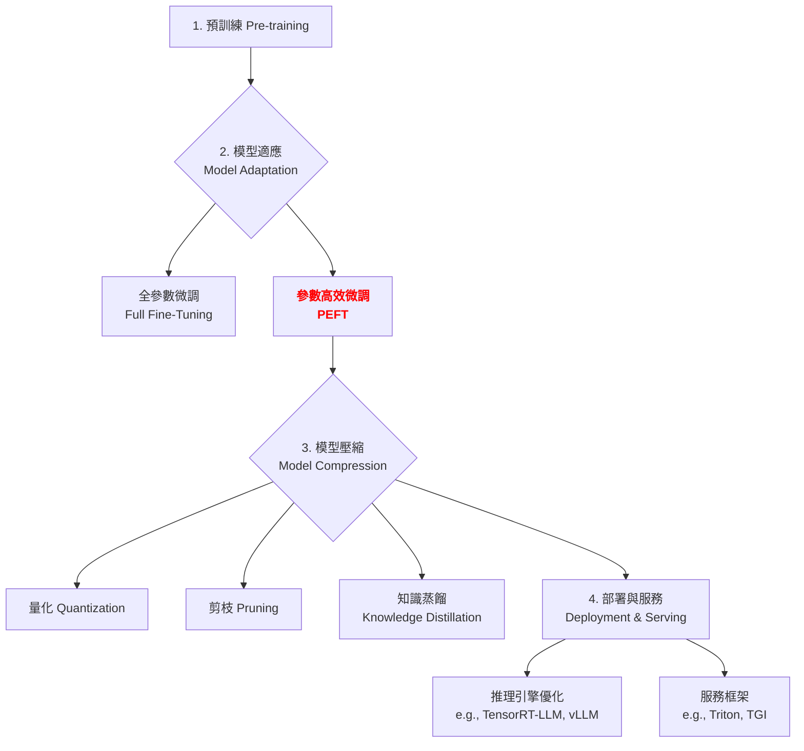

# 第 1.1 章：參數高效微調 (Parameter-Efficient Fine-Tuning, PEFT)

本章旨在為您提供一份教科書級別的教學講義，深入探討參數高效微調 (PEFT) 的核心概念、基本原理與實務應用。我們將從基礎理論出發，深入第一原理，最終將 PEFT 置於大型語言模型 (LLM) 的宏觀知識體系中進行審視。

| 概念 | 中文譯名 | 典型用途 | 優點 | 侷限 |
| :--- | :--- | :--- | :--- | :--- |
| **Fundamentals** | 基礎理論 | 快速掌握 PEFT 的核心技術與主流方法 (如 LoRA, Prefix-Tuning)。 | 直觀易懂，能快速建立實作能力。 | 易忽略技術背後的數學原理。 |
| **First Principles** | 第一原理 | 從根本的權重更新與梯度下降問題，理解為何需要 PEFT。 | 深入本質，有助於創新與變體理解。 | 理論性強，需要較強的數學背景。 |
| **Body of Knowledge** | 知識體系 | 將 PEFT 置於大型語言模型 (LLM) 訓練與部署的完整框架中。 | 結構完備，能與其他技術（如量化、蒸餾）整合。 | 內容龐雜，不適合快速入門。 |

---

### 1. Fundamentals (基礎理論)

在大型語言模型 (LLM) 的時代，**全參數微調 (Full Fine-Tuning)**，即調整模型所有權重，帶來了兩個主要挑戰：
1.  **巨大的計算成本**：微調一個數十億參數的模型需要大量的 GPU 記憶體與時間。
2.  **高昂的儲存成本**：為每個下游任務都儲存一個完整的模型副本，成本極高。

**參數高效微調 (PEFT)** 的核心思想是：**凍結大部分預訓練模型的權重，僅微調一小部分新增的或特定的參數**。這樣不僅能顯著降低計算與儲存需求，還能在許多任務上達到與全參數微調相當甚至更好的表現，同時有效緩解**災難性遺忘 (Catastrophic Forgetting)** 的問題。

#### PEFT 方法學分類

根據參數修改方式的不同，主流 PEFT 方法可分為三大類：

**1. 附加式方法 (Addition-based Methods)**: 在原模型基礎上增加新的可訓練模組。

*   **Adapter Layers**:
    *   **核心思想**: 在 Transformer 的每個區塊中插入小型的「適配器 (Adapter)」模組。Adapter 通常由兩個線性層和一個非線性激活函數組成，形成一個「降維-激活-升維」的瓶頸結構。
    *   **優劣**: 歷史悠久，效果穩定，但會在模型中增加額外層，可能引入推理延遲。

*   **Prefix-Tuning & Prompt-Tuning (P-Tuning)**:
    *   **核心思想**: 固定模型全部參數，轉而優化添加到輸入端的少量「軟提示 (Soft Prompt)」參數。
    *   **運作方式**:
        *   **Prefix-Tuning**: 在 Transformer 的每一層的 Key 和 Value 向量前，添加可訓練的虛擬 Token（前綴），以引導注意力機制的行為。
        *   **P-Tuning**: 僅在輸入的 Embedding 層加入可訓練的虛擬 Token，並使用一個小型的 Prompt Encoder (如 MLP) 進行優化。
    *   **優劣**: 在自然語言生成 (NLG) 任務上表現尤其出色，完全不改變原模型結構，但訓練穩定性有時不及 LoRA。

**2. 重參數化方法 (Reparametrization-based Methods)**: 對現有權重進行變換，僅訓練變換中的參數。

*   **LoRA (Low-Rank Adaptation)**:
    *   **核心思想**: 該方法假設模型權重在適應新任務時的變化量 `ΔW` 是一個低秩矩陣。因此，它將權重更新分解為兩個較小的低秩矩陣 `A` 和 `B` 的乘積。
    *   **運作方式**: 對於一個預訓練權重矩陣 $ W_0 \in \mathbb{R}^{d \times k} $，其更新表示為 $ W_0 + \Delta W = W_0 + BA $，其中 $ B \in \mathbb{R}^{d \times r} $, $ A \in \mathbb{R}^{r \times k} $，而秩 $ r \ll \min(d, k) $。訓練時，$W_0$ 保持凍結，僅更新 A 和 B。
    *   **優劣**: 性能強，微調後的權重可以輕鬆與原模型合併，不增加推理延遲，生態豐富。其變體 **QLoRA** 進一步結合 4-bit 量化，極大地降低了硬體門檻。

**3. 選擇性方法 (Selection-based Methods)**: 選擇模型中的一小部分現有參數進行更新。

*   **BitFit (Bias-term Fine-tuning)**:
    *   **核心思想**: 僅微調模型中的偏置 (bias) 參數和特定任務的分類層，凍結其他所有參數。
    *   **優劣**: 參數效率極高，實現簡單，適用於資源極度受限的場景，但性能上限可能低於 LoRA。

*   **(IA)³ (Infused Adapter by Inhibiting and Amplifying)**:
    *   **核心思想**: 這是一種極其高效的方法，它不新增複雜的模組，而是學習三個可訓練的向量 $l_K, l_V, l_{FF}$ 來分別對 Key、Value 和前饋網路 (Feed-Forward Network) 的內部激活值進行**逐元素縮放**。
    *   **優劣**: 參數效率極高，甚至優於 LoRA，且實現簡單，但性能可能略遜於高秩的 LoRA。

---

### 2. First Principles (第一原理)

從第一原理出發，PEFT 的有效性根植於對大型模型參數空間特性的深刻洞察。

*   **權重更新的低內在維度 (Low Intrinsic Dimension)**：Aghajanyan et al. (2020) 的研究指出，預訓練模型在適應下游任務時，其參數更新量 `ΔW` 實際上位居於一個極低的「內在維度」子空間中。這意味著，儘管模型擁有數十億個參數，但解決特定任務所需的「有效自由度」其實非常有限。
*   **流形假設 (Manifold Hypothesis)**：此觀點認為，特定任務的有效模型解，存在於高維參數空間中的一個低維流形上。全參數微調是在整個高維空間中進行搜索，計算昂貴且容易過擬合；而 PEFT 方法，如 LoRA，則是嘗試直接在該低維流形上進行優化，從而更高效、更穩定地找到解決方案。

因此，PEFT 的第一原理可以概括為：**在凍結大部分權重的前提下，識別並優化一個與任務相關的低維度參數子空間，以最小的代價高效地適應下游任務。**

---

### 3. Body of Knowledge (知識體系)

在 LLM 的完整生命週期中，PEFT 扮演著關鍵的**「模型適應 (Model Adaptation)」**角色。它不僅是一項獨立技術，更是串連整個工作流程的核心環節。

PEFT 技術經常與其他技術結合使用。例如，我們可以對一個經過 **LoRA** 微調的模型，再進行 **4-bit 量化 (QLoRA)**，從而實現更極致的資源節省。這種組合策略是當前在有限資源下最大化模型效能的業界標準實踐。

---

### 4. 方法選擇指引與未來趨勢

#### 4.1 實踐選擇建議

| 場景 | 推薦方法 | 原因 |
| :--- | :--- | :--- |
| **追求最佳性能與通用性** | **LoRA / QLoRA** | 效果最接近全參數微調，生態成熟，無推理延遲。 |
| **自然語言生成 (NLG) 任務** | **Prefix-Tuning / P-Tuning** | 專為生成任務設計，在部分場景效果更優。 |
| **資源極度受限** | **BitFit / (IA)³** | 可訓練參數最少，對記憶體和計算資源要求最低。 |
| **需要快速實驗多種方案** | **Adapter** | 模組化設計，方便即插即用和組合。 |

#### 4.2 未來趨勢：混合式 PEFT (Hybrid PEFT)

未來的研究趨勢是將多種 PEFT 方法結合起來，以取長補短。例如，**MAM Adapter** 結合了 Adapter 和 LoRA 的思想；**UniPELT** 則嘗試為模型每一層動態選擇最合適的 PEFT 方法。這種混合策略有望在性能和效率之間達到新的平衡。

---

## 結論與建議

1.  **日常溝通與實作**：優先掌握 **Fundamentals** 中的 **LoRA** 及其變體 **QLoRA**，它們是目前工業界與學術界應用最廣、生態最成熟的技術。
2.  **強調方法論與創新**：從 **First Principles** 出發，理解 PEFT 為何有效（低內在維度），有助於您在面對新問題時，設計或選擇更合適的微調策略，甚至啟發新的 PEFT 方法。
3.  **構建宏觀視野**：將 PEFT 放入 **Body of Knowledge** 的框架中，可以清晰地看到它在整個 LLM 工作流程中的戰略位置，以及如何與模型壓縮、部署等其他環節協同工作，實現成本與性能的最佳平衡。

透過本章的學習，您應當已經掌握了 PEFT 的核心思想與前沿技術，並能從更宏觀的視角理解其在現代 AI 開發中的關鍵作用。

---

### 延伸閱讀 (Further Reading)

#### 關鍵論文 (Key Papers)
1.  **LoRA**: Hu, E. J., et al. (2021). *LoRA: Low-Rank Adaptation of Large Language Models*. arXiv:2106.09685.
2.  **QLoRA**: Dettmers, T., et al. (2023). *QLoRA: Efficient Finetuning of Quantized LLMs*. arXiv:2305.14314.
3.  **Prefix-Tuning**: Li, X. L., & Liang, P. (2021). *Prefix-Tuning: Optimizing Continuous Prompts for Generation*. arXiv:2101.00190.
4.  **P-Tuning v2**: Liu, X., et al. (2021). *P-Tuning v2: Prompt Tuning Can Be Comparable to Fine-tuning Universally Across Scales and Tasks*. arXiv:2110.07602.
5.  **Intrinsic Dimension**: Aghajanyan, A., Zettlemoyer, L., & Gupta, S. (2020). *Intrinsic Dimensionality Explains the Effectiveness of Language Model Fine-Tuning*. arXiv:2012.13255.
6.  **(IA)³**: Liu, H., et al. (2022). *Few-Shot Parameter-Efficient Fine-Tuning is Better and Cheaper than In-Context Learning*. arXiv:2205.05638.

#### 綜述性文章 (Survey Papers)
1.  Han, Z., et al. (2024). *Parameter-Efficient Fine-Tuning for Large Models: A Comprehensive Survey*. arXiv:2403.14608.
2.  Lialin, V., et al. (2023). *Scaling Down to Scale Up: A Guide to Parameter-Efficient Fine-Tuning*. arXiv:2303.15647.
3.  Fu, Z., et al. (2022). *On the Effectiveness of Parameter-Efficient Fine-Tuning*. arXiv:2211.15583.
