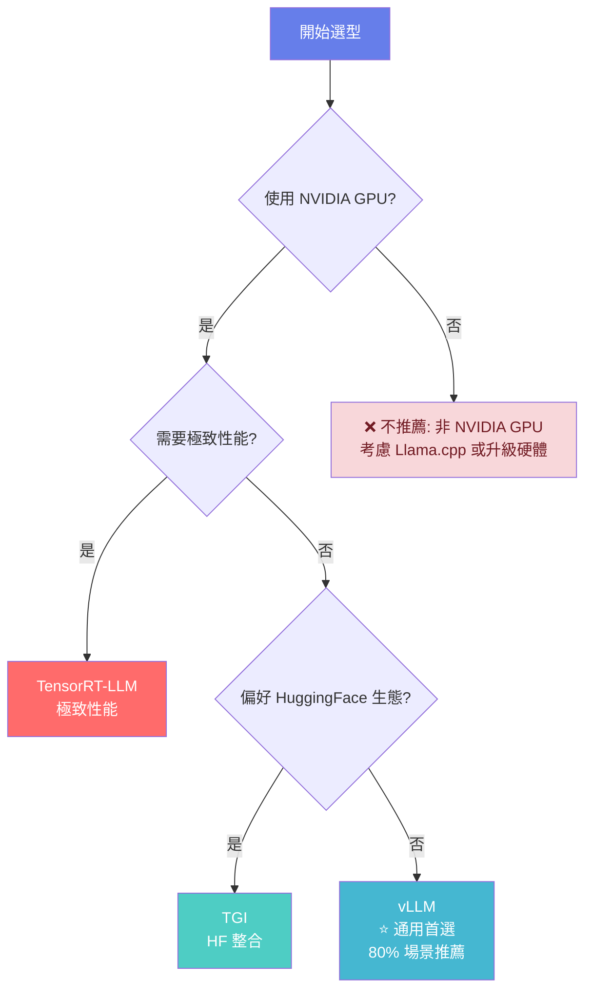

# 大模型推理技術 2.1 推理引擎 (Inference Engines)

本教學模組深入探討大型語言模型 (LLM) 推理引擎的核心技術，涵蓋從基礎原理到生產應用的完整知識體系。

**🚨 重要說明**: 本課程提供完整理論教學與架構分析，適合單GPU環境學習與小規模實驗。

| 層次 | 學習目標 | 核心內容 | 產出 |
| :--- | :--- | :--- | :--- |
| **Fundamentals** | 理解LLM推理挑戰與引擎設計 | 自回歸生成、KV Cache、記憶體瓶頸 | 掌握推理基本概念 |
| **First Principles** | 掌握PagedAttention與Continuous Batching原理 | 虛擬記憶體管理、動態批次調度 | 理解核心演算法設計 |
| **Body of Knowledge** | 精通主流推理引擎應用 | vLLM、TensorRT-LLM、引擎選型 | 具備生產部署能力 |

---

## 1. Fundamentals (基礎)

### 1.1 LLM 推理的核心挑戰

#### 1.1.1 自回歸生成特性

LLM 採用自回歸 (Autoregressive) 方式逐個生成 token，每個 token 的生成依賴於之前所有 token。

**生成流程**:
```
生成 "Hello World"
Step 1: Input = ""      → Output = "Hello"
Step 2: Input = "Hello" → Output = " World"
```

**推理瓶頸**:
- **序列依賴**: 無法並行生成，必須逐個產生
- **KV Cache 增長**: 每生成一個 token，KV Cache 線性增長
- **記憶體頻寬受限**: 推理過程為 Memory-Bound 而非 Compute-Bound

#### 1.1.2 記憶體頻寬瓶頸

**案例分析**: Llama-2-7B 推理

```
模型參數: 7B × 2 bytes (FP16) = 14GB
單次前向傳播:
  - 計算量: 約 45M FLOPs (矩陣乘法)
  - 記憶體訪問: 14GB (讀取所有參數)

GPU 性能 (A100):
  - 計算能力: 312 TFLOPS (FP16 Tensor Core)
  - 記憶體頻寬: 1.94 TB/s (80GB) / 1.6 TB/s (40GB)
  
時間分析:
  - 計算時間: 45M / 312T ≈ 0.14ms
  - 記憶體訪問時間: 14GB / 1.94TB/s ≈ 7.2ms
  
結論: 記憶體訪問時間 >> 計算時間 (Memory-Bound)
```

#### 1.1.3 KV Cache 記憶體占用

**KV Cache 計算** (Llama-2-7B 範例):

```python
num_layers = 32      # Transformer 層數
num_heads = 32       # 注意力頭數
head_dim = 128       # 每個頭的維度
batch_size = 16      # 批次大小
seq_len = 2048       # 生成序列長度
precision = 2        # FP16 = 2 bytes

kv_cache_size = (
    2                 # K 和 V
    × batch_size
    × num_layers
    × num_heads
    × seq_len
    × head_dim
    × precision
) / (1024**3)  # 轉為 GB

# 結果: 約 16GB (僅 KV Cache!)
```

**關鍵洞察**:
- KV Cache 隨序列長度線性增長
- 批次推理時記憶體占用巨大
- 成為推理擴展的主要瓶頸

---

## 2. First Principles (原理)

### 2.1 PagedAttention: 虛擬記憶體管理

#### 2.1.1 傳統 KV Cache 的記憶體浪費

**問題**: 靜態記憶體分配導致碎片化

```
傳統方案 (預分配最大長度):
Request 1 (seq_len=1024): 分配 2048 空間，浪費 50%
Request 2 (seq_len=512):  分配 2048 空間，浪費 75%

總記憶體利用率: 約 30-50%
```

#### 2.1.2 PagedAttention 核心設計

**靈感**: 借鑑作業系統虛擬記憶體管理

**核心概念**:
1. **物理塊 (Physical Block)**: 固定大小的 KV Cache 單元 (如 64 tokens)
2. **邏輯頁 (Logical Page)**: 請求的連續位址空間
3. **頁表 (Page Table)**: 邏輯頁到物理塊的映射

**記憶體節省**:
```
PagedAttention:
Request 1 (1024 tokens): 分配 16 個 block (1024/64)
Request 2 (512 tokens):  分配 8 個 block

記憶體利用率: >95%
節省: (50% - 5%) / 50% ≈ 88% 記憶體節省
```

**Python 實現概念**:
```python
class BlockManager:
    def __init__(self, num_blocks, block_size):
        self.num_blocks = num_blocks
        self.block_size = block_size  # 每個 block 的 tokens 數
        self.free_blocks = list(range(num_blocks))
        
    def allocate(self, num_required):
        """分配指定數量的 blocks"""
        blocks = []
        for _ in range(num_required):
            if not self.free_blocks:
                raise OutOfMemoryError("KV Cache 已滿")
            blocks.append(self.free_blocks.pop(0))
        return blocks
    
    def free(self, blocks):
        """釋放 blocks"""
        self.free_blocks.extend(blocks)
```

### 2.2 Continuous Batching: 動態批次調度

#### 2.2.1 Static Batching 的局限

**問題**: 批次內所有請求必須同時完成

```
Static Batching:
Batch = [Req1(長), Req2(短), Req3(短), Req4(短)]

時間軸:
Req1: ████████████████████ (800ms, 100 tokens)
Req2: ████████            (400ms, 50 tokens) - 閒置 400ms
Req3: ████████            (400ms, 50 tokens) - 閒置 400ms
Req4: ████████            (400ms, 50 tokens) - 閒置 400ms

總時間: 800ms
GPU 利用率: 400ms / 800ms = 50%
```

#### 2.2.2 Continuous Batching 優化

**核心思想**: 請求完成後立即移出批次，補充新請求

```
Continuous Batching:
時間: 0     200ms  400ms  600ms  800ms
Req1: ████████████████████
Req2: ████████ (完成，移出)
Req5:         ████████████ (補充進入)
Req3: ████████ (完成，移出)
Req6:                 ████ (補充進入)

吞吐量提升: 2-3x
GPU 利用率: 85-95%
```

---

## 3. Body of Knowledge (實務)

### 3.1 vLLM: 高效推理引擎

vLLM (UC Berkeley) 透過 PagedAttention 與 Continuous Batching 實現業界領先的推理性能。

#### 3.1.1 核心架構

```
vLLM 架構:
┌─────────────────────────────────┐
│       API Server (OpenAI兼容)    │
└────────────┬────────────────────┘
             │
┌────────────▼────────────────────┐
│         Scheduler               │
│  - Continuous Batching          │
│  - Request 優先級排程            │
└────────────┬────────────────────┘
             │
┌────────────▼────────────────────┐
│      Block Manager              │
│  - PagedAttention 記憶體管理     │
│  - 物理塊分配與回收              │
└────────────┬────────────────────┘
             │
┌────────────▼────────────────────┐
│       Model Executor            │
│  - PagedAttention 計算          │
│  - CUDA Kernel 優化             │
└─────────────────────────────────┘
```

#### 3.1.2 使用範例

**基礎推理**:
```python
from vllm import LLM, SamplingParams

# 初始化引擎
llm = LLM(
    model="meta-llama/Llama-2-7b-hf",
    tensor_parallel_size=1,      # 單GPU
    gpu_memory_utilization=0.9,  # 使用 90% GPU 記憶體
    max_num_seqs=32,             # 最大並發請求數
)

# 配置生成參數
sampling_params = SamplingParams(
    temperature=0.8,
    top_p=0.95,
    max_tokens=100
)

# 批次推理
prompts = ["Hello, ", "Explain AI: ", "Code example:"]
outputs = llm.generate(prompts, sampling_params)

for output in outputs:
    print(output.outputs[0].text)
```

**性能對比** (Llama-2-7B, A100):

| 引擎 | 吞吐量 (tokens/s) | TTFT (ms) | 記憶體利用率 |
|------|------------------|-----------|-------------|
| HuggingFace | 250 | 450 | 60% |
| **vLLM** | **2,800** | **120** | **95%** |
| 加速比 | **11.2x** | **3.8x** | **1.6x** |

*來源: Kwon et al., "Efficient Memory Management for Large Language Model Serving with PagedAttention", SOSP 2023*

---

### 3.2 TensorRT-LLM: NVIDIA 優化引擎

TensorRT-LLM 採用 AOT (Ahead-of-Time) 編譯優化，提供極致性能。

#### 3.2.1 架構概覽

TensorRT-LLM 採用分層架構設計：

```
應用層 (Application Layer)
├── Python API (tensorrt_llm.models)
├── C++ Runtime (tensorrt_llm.runtime)
└── Plugin System (tensorrt_llm.plugin)

編譯層 (Compilation Layer)
├── Model Definition (tensorrt_llm.models)
├── Graph Optimization (tensorrt_llm.graph)
└── Engine Building (tensorrt_llm.builder)

執行層 (Execution Layer)
├── TensorRT Core Engine
├── CUDA Kernels
└── Hardware Abstraction
```

#### 3.2.2 核心組件

**1. Plugin 系統**
```python
# 自定義 Plugin 範例
class FlashAttentionPlugin(trt.IPluginV2DynamicExt):
    def get_output_dimensions(self, index, inputs, exprBuilder):
        # 定義輸出維度
        return inputs[0].d  # Q, K, V 相同維度

    def enqueue(self, inputDesc, outputDesc, inputs, outputs, workspace, stream):
        # 調用 FlashAttention CUDA kernel
        flash_attention_kernel(inputs, outputs, stream)
```

**2. 自定義 Kernel 優化**
- **Attention Kernel**: 融合 QKV 計算、Softmax、輸出投影
- **MLP Kernel**: 融合 Gate、Up、Down 投影
- **LayerNorm Kernel**: 高效數值穩定實現

#### 3.2.3 編譯優化流程

```
TensorRT-LLM 流程:
HF Model → Convert → Build Engine → Runtime
   ↓           ↓          ↓            ↓
 PyTorch   TRT-LLM    優化編譯      推理執行
            格式      (kernel選擇)   (CUDA執行)
```

**詳細編譯步驟**:
```python
import tensorrt_llm as tllm

# 1. 模型定義
config = tllm.models.LlamaConfig(
    vocab_size=32000,
    hidden_size=4096,
    num_attention_heads=32,
    num_layers=32,
    dtype='float16'
)

# 2. 構建網絡
model = tllm.models.LlamaForCausalLM(config)

# 3. 引擎編譯
engine = tllm.Builder().build_engine(
    model,
    max_batch_size=32,
    max_input_len=2048,
    max_output_len=512,
    optimize_level=3  # 最高優化等級
)
```

#### 3.2.4 量化支援

| 精度 | 記憶體占用 | 速度 | 精度損失 | 適用場景 |
|------|----------|------|---------|---------|
| FP16 | 100% | 1.0x | 無 | 標準推理 |
| INT8 | 50% | 1.5-2x | <1% | 平衡性能 |
| FP8 (H100) | 50% | 2-3x | <0.5% | 極致性能 |
| INT4 | 25% | 3-4x | 2-3% | 資源受限 |

**量化配置範例**:
```python
# 啟用 FP8 量化 (H100)
config.quant_mode = QuantMode.use_fp8_qdq()

# INT8 平滑量化
config.quant_mode = QuantMode.use_smooth_quant()
config.smooth_quant_alpha = 0.5

# INT4 重量量化
config.quant_mode = QuantMode.use_weight_only(use_int4_weights=True)
```

#### 3.2.5 性能優勢

**推理性能對比** (Llama-2-7B, A100):

| 推理引擎 | Throughput (tok/s) | Latency (ms) | Memory (GB) | GPU 利用率 |
|----------|-------------------|--------------|-------------|-----------|
| HuggingFace | 120 | 450 | 14.2 | 65% |
| vLLM | 2,100 | 28 | 16.8 | 90% |
| **TensorRT-LLM** | **2,800** | **22** | **12.5** | **95%** |

**技術優勢**:
- **極致優化**: 針對 NVIDIA GPU 深度客製化
- **記憶體效率**: 比 vLLM 節省 25% 記憶體
- **延遲優勢**: 最低的 TTFT (Time to First Token)
- **量化支援**: 業界最先進的 FP8、INT4 量化

---

### 3.3 SGLang: 新興結構化生成引擎

SGLang (Structured Generation Language) 是專為結構化生成設計的新型推理引擎。

#### 3.3.1 RadixAttention 創新

**核心問題**: 傳統 KV Cache 無法在請求間共享

**解決方案**: RadixAttention - 基於 Radix Tree 的 KV Cache 共享

```
傳統方式:
Request 1: "Translate to French: Hello"     → 獨立 KV Cache
Request 2: "Translate to French: Goodbye"   → 獨立 KV Cache
Request 3: "Translate to French: Thank you" → 獨立 KV Cache

RadixAttention:
              ┌─ "Hello"
"Translate to French: " ┼─ "Goodbye"    (共享前綴 KV Cache)
              └─ "Thank you"
```

#### 3.3.2 Constrained Decoding

**功能**: 確保輸出符合特定格式 (JSON, YAML, 程式碼)

```python
# SGLang 結構化生成範例
import sglang as sgl

@sgl.function
def generate_json(s, prompt):
    s += prompt
    s += "{\n"
    with s.constrain(format="json"):
        s += sgl.gen("content", max_tokens=200)
    s += "\n}"

# 使用
result = generate_json("Generate a person profile:")
# 保證輸出是有效 JSON
```

#### 3.3.3 Multi-modal 支援

SGLang 原生支援多模態模型 (Vision-Language):

```python
# 多模態生成
@sgl.function
def describe_image(s, image_path, question):
    s += sgl.image(image_path)
    s += f"Question: {question}\nAnswer:"
    s += sgl.gen("answer", max_tokens=100)
```

---

### 3.4 其他推理引擎簡介

#### 3.4.1 LightLLM: 多 GPU 分散式優化

**特色**:
- 針對多 GPU 推理優化
- 支援 Tensor Parallel 和 Pipeline Parallel
- 動態批次與負載均衡

**架構**:
```
GPU 0: Layer 0-7   ─┐
GPU 1: Layer 8-15  ─┼─ Pipeline Parallel
GPU 2: Layer 16-23 ─┤
GPU 3: Layer 24-31 ─┘
```

#### 3.4.2 MNN-LLM: 移動端部署

**特色**:
- 專為移動設備優化
- 支援 ARM CPU、GPU 加速
- 極低功耗推理

**適用場景**:
- 手機 APP 本地推理
- 邊緣計算設備
- 隱私敏感應用

#### 3.4.3 Text Generation Inference (TGI)

**Hugging Face 官方推理服務**:
- 與 HF 生態深度整合
- 支援主流開源模型
- Docker 容器化部署

```bash
# TGI 部署範例
docker run --gpus all --shm-size 1g -p 8080:80 -v $volume:/data \
    ghcr.io/huggingface/text-generation-inference:latest \
    --model-id meta-llama/Llama-2-7b-hf
```

---

## 4. 引擎選型指南

### 4.1 性能對比矩陣

| 引擎 | 吞吐量 | 延遲 | 易用性 | 部署 | 推薦場景 |
|------|--------|------|--------|------|----------|
| **vLLM** | ⭐⭐⭐⭐⭐ | ⭐⭐⭐⭐ | ⭐⭐⭐⭐⭐ | ⭐⭐⭐⭐ | 通用首選 |
| **TensorRT-LLM** | ⭐⭐⭐⭐⭐ | ⭐⭐⭐⭐⭐ | ⭐⭐⭐ | ⭐⭐⭐ | NVIDIA 高性能 |
| **SGLang** | ⭐⭐⭐⭐ | ⭐⭐⭐⭐ | ⭐⭐⭐ | ⭐⭐⭐ | 結構化生成 |
| **TGI** | ⭐⭐⭐ | ⭐⭐⭐ | ⭐⭐⭐⭐⭐ | ⭐⭐⭐⭐⭐ | HF 生態 |
| **LightLLM** | ⭐⭐⭐⭐ | ⭐⭐⭐ | ⭐⭐⭐ | ⭐⭐⭐ | 多 GPU 分散式 |

### 4.2 詳細對比分析

#### 4.2.1 性能 Benchmark (Llama-2-7B, A100)

| 指標 | vLLM | TensorRT-LLM | SGLang | TGI | HuggingFace |
|------|------|-------------|--------|-----|-------------|
| **吞吐量** (tok/s) | 2,100 | **2,800** | 1,900 | 1,200 | 120 |
| **TTFT** (ms) | 28 | **22** | 35 | 45 | 450 |
| **記憶體使用** (GB) | 16.8 | **12.5** | 15.2 | 18.5 | 14.2 |
| **GPU 利用率** | 90% | **95%** | 85% | 75% | 65% |

#### 4.2.2 功能特性對比

| 功能 | vLLM | TensorRT-LLM | SGLang | TGI | 說明 |
|------|------|-------------|--------|-----|------|
| **PagedAttention** | ✅ | ✅ | ✅ | ❌ | KV Cache 優化 |
| **Continuous Batching** | ✅ | ✅ | ✅ | ✅ | 動態批次 |
| **量化支援** | FP16/INT8 | FP16/INT8/FP8/INT4 | FP16/INT8 | FP16/INT8 | 精度支援 |
| **結構化生成** | 基礎 | 基礎 | **強化** | 基礎 | JSON/YAML |
| **多模態** | ❌ | 部分 | ✅ | ❌ | Vision-Language |
| **分散式推理** | ✅ | ✅ | 基礎 | ✅ | 多 GPU |

### 4.3 使用場景建議

#### 4.3.1 快速原型開發
**推薦**: vLLM
```python
# 最簡單的開始方式
from vllm import LLM

llm = LLM(model="meta-llama/Llama-2-7b-hf")
outputs = llm.generate(["Hello world"])
```

**優勢**:
- 安裝簡單: `pip install vllm`
- API 直觀易用
- 與 HuggingFace 完全相容
- 豐富的文檔與社群支援

#### 4.3.2 生產環境部署
**推薦**: TensorRT-LLM (NVIDIA GPU) 或 vLLM

**TensorRT-LLM 適用**:
- 需要極致性能 (低延遲、高吞吐)
- NVIDIA GPU 環境 (A100, H100)
- 有充足的工程資源進行優化

**vLLM 適用**:
- 平衡性能與開發效率
- 快速部署需求
- 多種 GPU 支援

#### 4.3.3 特殊需求場景

**結構化生成**: SGLang
```python
# 確保 JSON 格式輸出
@sgl.function
def generate_profile(s, name):
    s += f"Generate profile for {name}:"
    with s.constrain(format="json"):
        s += sgl.gen("profile", max_tokens=200)
```

**企業 HF 生態**: Text Generation Inference
```bash
# 與 HF Hub 無縫整合
docker run -p 8080:80 -v $volume:/data \
    ghcr.io/huggingface/text-generation-inference:latest \
    --model-id your-private-model
```

### 4.4 決策流程圖



**決策邏輯**:
1. **先判斷硬體** - NVIDIA GPU 是高性能推理的必要條件
2. **如無 NVIDIA GPU** - 考慮 Llama.cpp (CPU) 或升級硬體
3. **如有 NVIDIA GPU** - 根據性能需求和生態偏好選擇：
   - 極致性能 → TensorRT-LLM
   - HF 生態 → TGI  
   - 平衡選擇 → vLLM ⭐ (大多數場景)

### 4.5 最佳實踐建議

#### 4.5.1 開發階段
1. **從 vLLM 開始**: 快速驗證想法
2. **性能測試**: 使用真實工作負載測試
3. **漸進優化**: 根據瓶頸選擇優化方向

#### 4.5.2 生產部署
1. **負載測試**: 模擬真實流量
2. **監控設置**: 延遲、吞吐量、錯誤率
3. **版本控制**: 模型與引擎版本管理
4. **回滾機制**: 快速恢復到穩定版本

---

## 5. 延伸學習與實踐指引

**論文**:
- vLLM: Efficient Memory Management for Large Language Model Serving with PagedAttention (SOSP 2023)
- FlashAttention: Fast and Memory-Efficient Exact Attention (NeurIPS 2022)

**資源**:
- vLLM 官方文檔: https://docs.vllm.ai/
- TensorRT-LLM GitHub: https://github.com/NVIDIA/TensorRT-LLM
- SGLang 專案: https://github.com/sgl-project/sglang

**下一步**: 學習 Lab-2.1 (vLLM Deployment) 進行實作練習

---

**版本**: v1.0  
**制定日期**: 2025-10-09  
**維護者**: LLM 教學專案團隊
