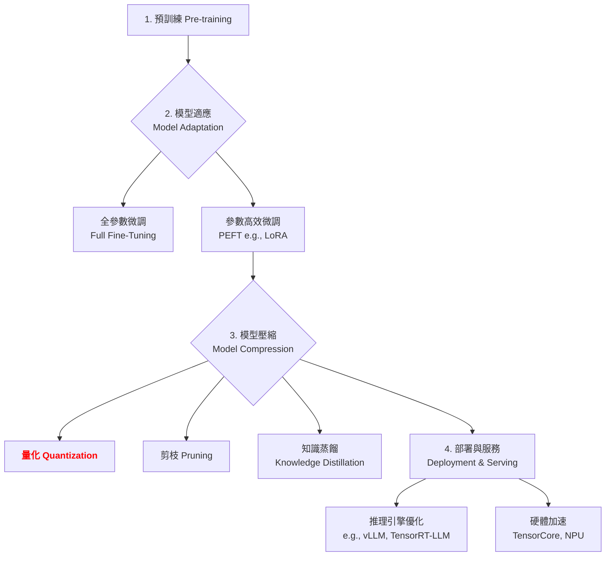

# 第 3.1 章:量化 (Quantization)

本章旨在為您提供一份教科書級別的教學講義,深入探討量化 (Quantization) 的核心概念、基本原理與實務應用。我們將從基礎理論出發,深入第一原理,最終將量化置於大型語言模型 (LLM) 的宏觀知識體系中進行審視。

| 概念 | 中文譯名 | 典型用途 | 優點 | 侷限 |
| :--- | :--- | :--- | :--- | :--- |
| **Fundamentals** | 基礎理論 | 快速掌握量化的核心技術與主流方法 (如 GPTQ, AWQ)。 | 直觀易懂,能快速建立實作能力。 | 易忽略技術背後的數學原理。 |
| **First Principles** | 第一原理 | 從根本的數值表示與資訊理論,理解為何量化能保持精度。 | 深入本質,有助於創新與變體理解。 | 理論性強,需要較強的數學背景。 |
| **Body of Knowledge** | 知識體系 | 將量化置於 LLM 壓縮與部署的完整框架中。 | 結構完備,能與其他技術 (如剪枝、蒸餾) 整合。 | 內容龐雜,不適合快速入門。 |

---

### 1. Fundamentals (基礎理論)

在大型語言模型 (LLM) 的時代,**全精度推理 (Full-Precision Inference)** 面臨三大挑戰:
1. **巨大的記憶體占用**: Llama-2-70B 的 FP16 權重需要 140GB 記憶體。
2. **高昂的部署成本**: 邊緣設備與消費級硬體無法負擔。
3. **緩慢的推理速度**: 高精度浮點運算的吞吐量受限。

**量化 (Quantization)** 的核心思想是:**將模型中的高精度浮點數 (FP32/FP16) 轉換為低精度整數 (INT8/INT4),從而大幅減少模型大小、加速推理速度,同時盡可能保持模型性能**。

#### 量化方法學分類

根據時機、範圍與粒度的不同,主流量化方法可分為以下類別:

**1. 按時機分類 (Timing-based Classification)**

* **訓練後量化 (Post-Training Quantization, PTQ)**:
    * **核心思想**: 模型訓練完成後,直接對權重和激活值進行量化,無需重新訓練。
    * **代表方法**: **GPTQ** (逐層重構 + Hessian 誤差補償), **AWQ** (激活感知權重縮放), **SmoothQuant** (異常值平滑遷移)。
    * **優劣**: 部署成本低,數小時內完成,但極低位元 (2-bit) 時精度損失較大。

* **量化感知訓練 (Quantization-Aware Training, QAT)**:
    * **核心思想**: 訓練過程中模擬量化效果,讓模型學習適應量化誤差。
    * **代表方法**: LLM-QAT, **QLoRA** (4-bit 量化 + LoRA 微調的混合方法)。
    * **優劣**: 精度損失最小 (<0.5%),支持極低位元,但需要完整訓練流程,計算成本高。

**2. 按範圍分類 (Scope-based Classification)**

* **僅權重量化 (Weight-Only Quantization)**:
    * **核心思想**: 僅量化模型權重,激活值保持 FP16。適用於 LLM 推理 (權重占記憶體主導地位)。
    * **代表方法**: **GPTQ**, **AWQ**。
    * **效果**: 模型大小 ↓75% (INT4),推理加速 1.5-2x (受限於激活值計算)。

* **權重+激活量化 (Weight-Activation Quantization)**:
    * **核心思想**: 同時量化權重和激活值,充分利用硬體加速。
    * **代表方法**: **SmoothQuant**, ZeroQuant。
    * **效果**: 推理加速 3-4x (硬體加速 + 記憶體帶寬)。

**3. 按粒度分類 (Granularity-based Classification)**

* **按張量量化 (Per-Tensor)**: 整個張量使用統一的縮放因子。計算簡單,但精度損失較大。
* **按通道量化 (Per-Channel)**: 每個輸出通道獨立縮放因子。工業界標準做法,精度損失 <1%。
* **按分組量化 (Per-Group)**: 權重分組獨立縮放 (GPTQ/AWQ 使用,group_size=128)。平衡精度與記憶體。

---

### 2. First Principles (第一原理)

從第一原理出發,量化的有效性根植於對數值表示與資訊理論的深刻洞察。

* **香農資訊理論 (Shannon Information Theory)**: 資訊的表示不需要與其精度成正比。大部分模型權重的「有效資訊」集中在數值的高位元,低位元往往是雜訊。量化通過捨棄低位元,保留高位元的有效資訊,實現壓縮。

* **權重分佈的長尾特性 (Long-Tail Distribution)**: LLM 的權重分佈通常呈現長尾特性,大部分權重集中在較小範圍,僅少數權重幅度較大。量化演算法 (如 AWQ) 針對性地保護這些「顯著權重」,實現精度與壓縮的平衡。

* **激活值的異常值問題 (Outlier Problem)**: LLM 的激活值存在極端異常值 (<0.1%),但對輸出影響巨大。**SmoothQuant** 通過「平滑遷移」將激活值的量化難度轉移到權重,突破這一瓶頸。

* **低秩近似與誤差補償 (Low-Rank Approximation & Error Compensation)**: **GPTQ** 利用 Hessian 矩陣 (二階導數) 計算權重敏感度,逐層量化並將誤差分攤到後續未量化的權重,實現「局部最優」逼近「全局最優」。

因此,量化的第一原理可以概括為:**在保留權重與激活值的有效資訊前提下,通過數學優化與誤差補償策略,將數值表示映射到低位元整數空間,以最小的精度代價實現最大的壓縮效益。**

---

### 3. Body of Knowledge (知識體系)

在 LLM 的完整生命週期中,量化扮演著關鍵的**「模型壓縮 (Model Compression)」**角色。它不僅是一項獨立技術,更是串連整個工作流程的核心環節。



量化技術經常與其他技術結合使用。例如,我們可以對一個經過 **LoRA** 微調的模型,再進行 **4-bit 量化 (QLoRA)**,從而實現記憶體與性能的雙重優化。這種組合策略是當前在有限資源下最大化模型效能的業界標準實踐。

---

### 4. 主流量化演算法深度解析

#### 4.1 GPTQ (Post-Training Quantization for GPT)

**論文**: Frantar et al. (2023), ICML 2023
**核心思想**: 通過 Hessian 矩陣指導的逐層誤差補償,實現高精度的訓練後量化。

**數學原理**:
```
目標: min ||W·X - Ŵ·X||²
其中: W 為原始權重, Ŵ 為量化後權重, X 為校準數據激活值
```

**演算法流程**:
1. **計算 Hessian 矩陣**: `H = 2·X·Xᵀ` (表示權重敏感度)
2. **逐列量化**: 量化第 i 列權重 `w_quantized[i] = quantize(w[i])`
3. **誤差補償**: 將量化誤差分攤到後續未量化的列 `w[i+1:] -= (error / H[i,i]) * H[i, i+1:]`

**性能表現** (Llama-2-7B):
| 精度類型 | Perplexity | 模型大小 | 量化時間 |
|:---|:---|:---|:---|
| FP16 (基準) | 5.68 | 13.5 GB | - |
| GPTQ 4-bit | 5.85 (+0.17) | **3.5 GB** (3.86x) | ~30 min |
| GPTQ 8-bit | 5.71 (+0.03) | 7.0 GB (1.93x) | ~20 min |

**使用範例**:
```python
from transformers import AutoModelForCausalLM, GPTQConfig

# 配置 GPTQ 量化
quantization_config = GPTQConfig(
    bits=4,                    # 4-bit 量化
    group_size=128,            # 分組量化 (平衡精度與記憶體)
    desc_act=True,             # 激活值排序優化
    sym=True,                  # 對稱量化
    dataset="c4",              # 校準數據集
    tokenizer=tokenizer
)

# 載入並量化模型
model = AutoModelForCausalLM.from_pretrained(
    "meta-llama/Llama-2-7b-hf",
    quantization_config=quantization_config,
    device_map="auto"
)

# 保存量化模型
model.save_pretrained("./llama-2-7b-gptq")
```

---

#### 4.2 AWQ (Activation-aware Weight Quantization)

**論文**: Lin et al. (2023), arXiv:2306.00978
**核心思想**: 保護對輸出影響大的「顯著權重」,而非平均優化所有權重。

**關鍵洞察**:
- 1% 的顯著權重貢獻 99% 的模型性能
- 顯著權重往往對應高激活值 → **激活感知**

**演算法流程**:
1. **統計激活值**: `s = mean(|X|, axis=0)`  (在校準數據上統計)
2. **權重縮放**: `W_scaled = W · s^α`  (α 通常 0.5)
3. **量化**: `W_quantized = quantize(W_scaled)`
4. **推理時反縮放**: `output = (W_quantized / s^α) @ X`

**與 GPTQ 對比**:
| 特性 | GPTQ | AWQ |
|:---|:---|:---|
| 核心策略 | Hessian 誤差補償 | 激活感知縮放 |
| 量化速度 | 慢 (~30min) | **快 (~5min, 6x)** |
| 精度損失 | 低 (Perplexity 5.85) | **更低 (Perplexity 5.78)** |
| 硬體友好度 | 一般 | **高 (無額外計算)** |

**適用場景**: 快速部署 / 追求最佳性能 / 推理延遲敏感的場景。

---

#### 4.3 SmoothQuant

**論文**: Xiao et al. (2023), ICML 2023
**核心思想**: 通過「平滑遷移」解決激活值異常值導致的量化困難。

**問題背景**:
- LLM 激活值存在極端異常值 (幅度 >100x)
- 占比極小 (<0.1%) 但對輸出影響巨大
- 直接 INT8 量化 → Perplexity 從 5.68 崩潰到 12.3

**核心策略**:
```
數學表達式: Y = (X · diag(s)) · (diag(s)⁻¹ · W) = X' · W'
其中: s 為平滑縮放因子, α ∈ [0, 1]
```

**效果對比**:
| 方法 | 權重/激活精度 | Perplexity | 加速比 |
|:---|:---|:---|:---|
| FP16 (基準) | 16/16 | 5.68 | 1x |
| Naive INT8 | 8/8 | **12.3** (崩潰) | - |
| **SmoothQuant** | 8/8 | **5.81** (+0.13) | **3.2x** |

**適用場景**: 追求極致推理速度 / 硬體支持 INT8 加速 (TensorCore)。

---

### 5. 方法選擇指引與實戰策略

#### 5.1 實踐選擇建議

| 場景 | 推薦方法 | 原因 |
| :--- | :--- | :--- |
| **追求最佳壓縮比 (極致記憶體優化)** | **AWQ 4-bit / GPTQ 4-bit** | 壓縮比 4x,精度損失 <3%。 |
| **追求最佳推理速度 (硬體加速)** | **SmoothQuant INT8** | 權重+激活量化,加速 3-4x。 |
| **追求精度與壓縮平衡** | **GPTQ 8-bit** | 壓縮比 2x,精度損失 <1%。 |
| **資源極度受限 (邊緣/移動設備)** | **GGUF 2-4 bit (llama.cpp)** | CPU 優化,極低記憶體占用。 |
| **研究與微調** | **QLoRA (4-bit + LoRA)** | 可訓練參數極少 (~6GB 訓練 7B 模型)。 |

#### 5.2 量化決策樹

```
是否需要量化 LLM?
│
├─ 減少模型大小 (記憶體受限)
│   └─ 使用 GPTQ/AWQ 4-bit (僅權重)
│       ├─ 追求速度 → AWQ (量化速度快 6x)
│       └─ 追求精度 → GPTQ (Hessian 誤差補償)
│
├─ 加速推理 (計算受限)
│   └─ 使用 SmoothQuant INT8 (權重+激活)
│       └─ 硬體支持 INT8? → 可加速 3x
│
└─ 極致壓縮 (邊緣部署)
    └─ 使用 GGUF 2-4 bit (CPU 優化)
        └─ 適合移動設備/樹莓派/IoT
```

#### 5.3 未來趨勢: 混合量化與自適應策略

未來的研究趨勢是將多種量化方法結合起來,以取長補短。例如:
- **混合精度量化**: 敏感層 (如注意力層) 使用 8-bit,其餘層使用 4-bit。
- **動態量化**: 根據輸入複雜度動態調整量化位元數。
- **量化 + 剪枝 + 蒸餾**: 組合策略實現 10-20x 極致壓縮。

---

## 結論與建議

1. **日常溝通與實作**: 優先掌握 **Fundamentals** 中的 **GPTQ** 及 **AWQ**,它們是目前工業界與學術界應用最廣、生態最成熟的訓練後量化技術。

2. **強調方法論與創新**: 從 **First Principles** 出發,理解量化為何有效 (資訊理論 + 誤差補償),有助於您在面對新問題時,設計或選擇更合適的量化策略,甚至啟發新的量化方法。

3. **構建宏觀視野**: 將量化放入 **Body of Knowledge** 的框架中,可以清晰地看到它在整個 LLM 工作流程中的戰略位置,以及如何與 PEFT、剪枝、部署等其他環節協同工作,實現成本與性能的最佳平衡。

透過本章的學習,您應當已經掌握了量化的核心思想與前沿技術,並能從更宏觀的視角理解其在現代 AI 開發中的關鍵作用。

---

### 延伸閱讀 (Further Reading)

#### 關鍵論文 (Key Papers)
1. **GPTQ**: Frantar, E., et al. (2023). *GPTQ: Accurate Post-Training Quantization for Generative Pre-trained Transformers*. ICML 2023.
2. **AWQ**: Lin, J., et al. (2023). *AWQ: Activation-aware Weight Quantization for LLM Compression and Acceleration*. arXiv:2306.00978.
3. **SmoothQuant**: Xiao, G., et al. (2023). *SmoothQuant: Accurate and Efficient Post-Training Quantization for Large Language Models*. ICML 2023.
4. **QLoRA**: Dettmers, T., et al. (2023). *QLoRA: Efficient Finetuning of Quantized LLMs*. NeurIPS 2023.
5. **LLM.int8()**: Dettmers, T., et al. (2022). *LLM.int8(): 8-bit Matrix Multiplication for Transformers at Scale*. NeurIPS 2022.

#### 工具與實現 (Tools & Implementations)
- **auto-gptq**: https://github.com/PanQiWei/AutoGPTQ
- **AutoAWQ**: https://github.com/casper-hansen/AutoAWQ
- **bitsandbytes**: https://github.com/TimDettmers/bitsandbytes
- **llama.cpp**: https://github.com/ggerganov/llama.cpp
- **vLLM**: https://github.com/vllm-project/vllm
- **TensorRT-LLM**: https://github.com/NVIDIA/TensorRT-LLM

#### 學習資源 (Learning Resources)
- Hugging Face Quantization Guide: https://huggingface.co/docs/transformers/main/en/quantization
- PyTorch Quantization Tutorial: https://pytorch.org/docs/stable/quantization.html

---

**下一章節**: [3.2 剪枝 (Pruning)](./3.2-Pruning.md)
