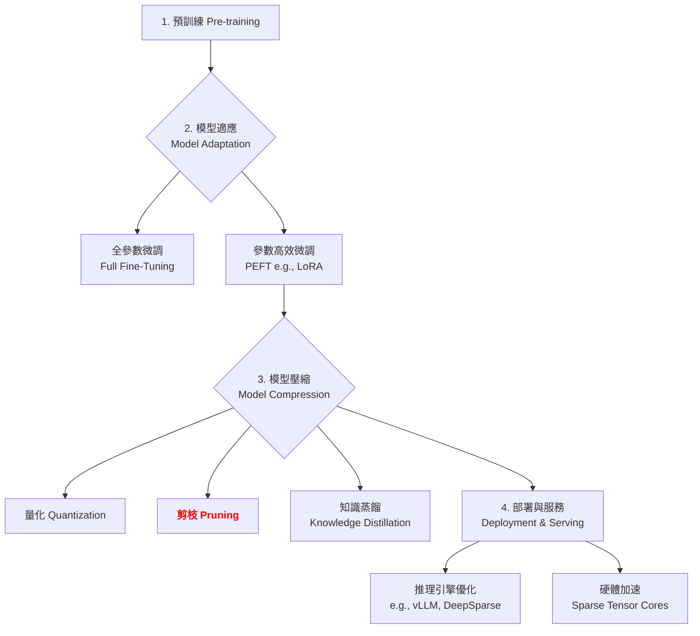

# 第 3.2 章:剪枝 (Pruning)

本章旨在為您提供一份教科書級別的教學講義,深入探討剪枝 (Pruning) 的核心概念、基本原理與實務應用。我們將從基礎理論出發,深入第一原理,最終將剪枝置於大型語言模型 (LLM) 的宏觀知識體系中進行審視。

| 概念 | 中文譯名 | 典型用途 | 優點 | 侷限 |
| :--- | :--- | :--- | :--- | :--- |
| **Fundamentals** | 基礎理論 | 快速掌握剪枝的核心技術與主流方法 (如 Wanda, SparseGPT)。 | 直觀易懂,能快速建立實作能力。 | 易忽略硬體加速的實際困難。 |
| **First Principles** | 第一原理 | 從神經網絡過參數化假設,理解為何剪枝能保持性能。 | 深入本質,有助於創新與變體理解。 | 理論性強,需要較強的數學背景。 |
| **Body of Knowledge** | 知識體系 | 將剪枝置於 LLM 壓縮與部署的完整框架中。 | 結構完備,能與量化、蒸餾整合。 | 內容龐雜,不適合快速入門。 |

---

### 1. Fundamentals (基礎理論)

在大型語言模型 (LLM) 的時代,**全參數推理 (Full-Parameter Inference)** 面臨的挑戰不僅是記憶體占用,還包括計算效率:
1. **參數冗餘**: 研究顯示 LLM 存在 30-50% 的冗餘參數可安全移除。
2. **計算浪費**: 大量參數的矩陣運算消耗寶貴的 GPU 算力。
3. **能耗問題**: 邊緣設備的功耗限制使得全參數推理不可行。

**剪枝 (Pruning)** 的核心思想是:**識別並移除模型中冗餘或不重要的參數,創建稀疏模型,從而減少計算成本與記憶體占用,同時盡可能保持模型性能**。

#### 剪枝方法學分類

根據結構、時機與粒度的不同,主流剪枝方法可分為以下類別:

**1. 按結構分類 (Structure-based Classification)**

* **非結構化剪枝 (Unstructured Pruning)**:
    * **核心思想**: 逐元素剪枝,創建不規則稀疏模式。權重矩陣中任意位置的元素都可以被剪枝。
    * **代表方法**: **Magnitude Pruning** (幅度剪枝), **Wanda** (激活感知剪枝), **SparseGPT** (誤差補償剪枝)。
    * **優劣**: 最高壓縮比 (可達 90% 稀疏度),精度損失最小,但**不規則稀疏模式難以在通用硬體上加速**。

* **結構化剪枝 (Structured Pruning)**:
    * **核心思想**: 移除完整的結構單元 (如通道、層、注意力頭)。
    * **代表方法**: Channel Pruning (通道剪枝), Layer Pruning (層剪枝), Head Pruning (注意力頭剪枝)。
    * **優劣**: **硬體友好**,實際加速效果好,但壓縮比較低 (通常 <50%),精度損失較大。

* **半結構化剪枝 (Semi-Structured Pruning)**:
    * **核心思想**: N:M 稀疏模式 (例如 2:4 稀疏,每 4 個元素中保留 2 個)。
    * **代表方法**: NVIDIA 2:4 Sparse Tensor Cores。
    * **優劣**: 平衡非結構化與結構化的優勢,**NVIDIA A100 原生硬體支持**,實際加速 2x。

**2. 按時機分類 (Timing-based Classification)**

* **訓練時剪枝 (During Training)**: 訓練過程中動態剪枝,讓網絡學習適應稀疏結構。計算成本高,適合從頭訓練。
* **訓練後剪枝 (Post-Training)**: 訓練完成後剪枝,對 LLM 尤其重要 (訓練成本極高,難以重新訓練)。
    * **代表方法**: **Wanda**, **SparseGPT** (一次性剪枝,無需微調)。

**3. 按粒度分類 (Granularity-based Classification)**

* **全局剪枝 (Global Pruning)**: 統一閾值,全局選擇最不重要的參數剪枝。
* **逐層剪枝 (Per-Layer Pruning)**: 每層獨立設置閾值,保護關鍵層 (如嵌入層)。
* **逐通道剪枝 (Per-Channel Pruning)**: 針對卷積/線性層的輸出通道進行剪枝。

---

### 2. First Principles (第一原理)

從第一原理出發,剪枝的有效性根植於對神經網絡過參數化特性的深刻洞察。

* **中獎彩票假設 (The Lottery Ticket Hypothesis, Frankle & Carbin 2019)**: 大型神經網絡包含「中獎子網絡」(winning subnetworks),這些子網絡可以達到與完整網絡相當的性能。LLM 的大量參數中存在顯著冗餘,剪枝的目標就是找到這些「中獎子網絡」。

* **過參數化與泛化能力 (Overparameterization & Generalization)**: 儘管 LLM 擁有數十億參數,但其有效自由度遠小於參數數量。大部分參數在推理時貢獻極小,剪枝移除這些「冗餘參數」不會顯著影響泛化能力。

* **激活感知的重要性評估 (Activation-Aware Importance)**: 權重的重要性不僅取決於其幅度,還取決於對應的激活值。**小權重 × 大激活 = 重要特徵**。Wanda 基於此洞察,同時考慮權重與激活值,實現更準確的重要性評估。

* **誤差補償與局部最優 (Error Compensation & Local Optimality)**: SparseGPT 借鑒 GPTQ 的思想,在剪枝時通過 Hessian 矩陣計算誤差並分攤到未剪枝的權重,實現「局部最優」逼近「全局最優」。

因此,剪枝的第一原理可以概括為:**在保留網絡有效自由度的前提下,通過重要性評估與誤差補償策略,移除冗餘參數,以最小的精度代價實現最大的計算效率提升。**

---

### 3. Body of Knowledge (知識體系)

在 LLM 的完整生命週期中,剪枝扮演著**「模型壓縮 (Model Compression)」**中的結構優化角色。它與量化、蒸餾相輔相成,共同構建高效部署方案。



剪枝技術經常與其他技術組合使用。例如:
- **剪枝 + 量化**: 先剪枝 (50% 稀疏度) 再量化 (4-bit) → 8x 壓縮比
- **剪枝 + 蒸餾**: 從密集大模型蒸餾到稀疏小模型 → 保持性能的極致壓縮

---

### 4. 主流剪枝演算法深度解析

#### 4.1 Magnitude Pruning (幅度剪枝)

**核心思想**: 移除權重幅度最小的參數 (最簡單直觀的方法)。

**數學原理**:
```
重要性得分: I(w_i) = |w_i|
剪枝準則: 保留前 (1-s) × n 個權重,其中 s 為目標稀疏度
```

**演算法流程**:
1. 收集所有權重的絕對值
2. 計算第 s 百分位數作為閾值
3. 將低於閾值的權重設為零

**優劣分析**:
| 優勢 | 劣勢 |
|:---|:---|
| 極其簡單,計算成本 O(n) | 沒有考慮權重的上下文重要性 |
| 不需要梯度或 Hessian 信息 | 對層級不敏感 (可能過度剪枝關鍵層) |
| 適合快速原型驗證 | 精度損失較大 (高稀疏度時) |

**性能表現** (Llama-2-7B):
| 稀疏度 | Perplexity | 零樣本準確率 |
|:---|:---|:---|
| 0% (基準) | 5.68 | 100% |
| 50% | 6.82 (+1.14) | 91.8% (-8.2%) |
| 70% | 11.25 (+5.57) | 76.3% (-23.7%) |

---

#### 4.2 Wanda (Weights and Activations for Pruning)

**論文**: Sun et al. (2023), arXiv:2306.11695
**核心思想**: 激活感知的權重剪枝,同時考慮權重幅度和對應的激活值大小。

**關鍵洞察**:
- 小權重 × 大激活 = 重要特徵 (應保留)
- 大權重 × 小激活 = 不重要特徵 (可剪枝)
- 應該保留對輸出影響大的權重

**演算法流程**:
1. **收集激活值統計**:
   ```python
   # 在校準數據上統計激活值的平均幅度
   activation_stats[layer] = input.abs().mean(dim=0)
   ```

2. **計算權重重要性**:
   ```python
   # 重要性 = |權重| × |激活值|
   importance = weight.abs() * activation_stats.unsqueeze(0)
   ```

3. **按重要性剪枝**:
   ```python
   # 逐層剪枝,保留前 (1-s) × n 個最重要的權重
   num_prune = int(sparsity * importance.numel())
   threshold = torch.topk(importance.view(-1), num_prune, largest=False)[0].max()
   mask = (importance >= threshold).float()
   ```

**性能表現** (Llama-2-7B):
| 方法 | 稀疏度 | Perplexity | 零樣本準確率 |
|:---|:---|:---|:---|
| 原始模型 | 0% | 5.68 | 100% |
| Magnitude | 50% | 6.82 (+1.14) | 91.8% (-8.2%) |
| **Wanda** | 50% | **6.12 (+0.44)** | **96.9% (-3.1%)** |
| Wanda | 70% | 8.35 (+2.67) | 87.5% (-12.5%) |

**適用場景**: 快速部署 / 追求性能與壓縮平衡 / 無需微調的一次性剪枝。

---

#### 4.3 SparseGPT

**論文**: Frantar & Alistarh (2023), arXiv:2301.00774
**核心思想**: 逐層重構 + Hessian 誤差補償 (類似 GPTQ 的量化策略)。

**數學原理**:
```
目標: min ||W·X - W'·X||²
其中: W 為原始權重, W' 為剪枝後權重, X 為校準數據激活值
```

**演算法流程**:
1. **計算 Hessian 矩陣**: `H = 2·X·Xᵀ` (表示權重敏感度)
2. **逐行剪枝**: 選擇最不重要的權重剪枝 (基於 Hessian 對角元素)
3. **誤差補償**: 將剪枝誤差分攤到未剪枝的權重

**與 Wanda 對比**:
| 特性 | Wanda | SparseGPT |
|:---|:---|:---|
| 核心策略 | 激活感知 | Hessian 誤差補償 |
| 計算複雜度 | 低 (O(n)) | 高 (O(n²)) |
| 剪枝速度 | 快 (~5 分鐘) | 慢 (~30 分鐘) |
| 精度損失 | 中等 | **最低** |
| 記憶體需求 | 低 | 高 (需存儲 Hessian) |
| **適用場景** | 快速部署 | 追求極致精度 |

---

### 5. 方法選擇指引與實戰策略

#### 5.1 實踐選擇建議

| 場景 | 推薦方法 | 原因 |
| :--- | :--- | :--- |
| **追求性能與壓縮平衡** | **Wanda (50% 稀疏度)** | 精度損失 <5%,無需微調。 |
| **追求極致精度** | **SparseGPT** | 精度損失最小,但計算成本高。 |
| **快速原型驗證** | **Magnitude Pruning** | 最簡單,適合基線對比。 |
| **硬體加速需求** | **2:4 半結構化剪枝** | NVIDIA A100 原生支持,實際加速 2x。 |
| **結構化剪枝** | **Layer/Head Pruning** | 硬體友好,無需專用推理引擎。 |

#### 5.2 剪枝決策樹

```
是否需要剪枝 LLM?
│
├─ 追求壓縮比 (記憶體受限)
│   └─ 使用 Wanda 50% 非結構化剪枝
│       ├─ 追求速度 → Wanda (5 分鐘剪枝)
│       └─ 追求精度 → SparseGPT (30 分鐘剪枝)
│
├─ 追求實際加速 (計算受限)
│   └─ 使用 2:4 半結構化剪枝
│       └─ 硬體支持? → NVIDIA A100 加速 2x
│
└─ 極致壓縮 (壓縮比 > 50%)
    └─ 剪枝 + 量化組合
        └─ 50% 剪枝 + 4-bit 量化 → 8x 壓縮比
```

#### 5.3 未來趨勢: 動態稀疏與訓練時稀疏化

未來的研究趨勢包括:
- **動態稀疏性 (Dynamic Sparsity)**: 根據輸入複雜度動態調整稀疏模式。
- **訓練時稀疏化 (Training with Sparsity)**: 從頭訓練稀疏 LLM,節省訓練成本。
- **稀疏 + MoE (Mixture of Experts)**: MoE 本身已是稀疏激活,再對每個專家剪枝 → 10x+ 壓縮。

---

## 結論與建議

1. **日常溝通與實作**: 優先掌握 **Fundamentals** 中的 **Wanda**,它是目前訓練後剪枝的最佳實踐,快速、有效、無需微調。

2. **強調方法論與創新**: 從 **First Principles** 出發,理解剪枝為何有效 (中獎彩票假設 + 激活感知),有助於您在面對新問題時,設計或選擇更合適的剪枝策略。

3. **構建宏觀視野**: 將剪枝放入 **Body of Knowledge** 的框架中,可以清晰地看到它在整個 LLM 工作流程中的戰略位置,以及如何與量化、蒸餾協同工作,實現極致壓縮。

**⚠️ 重要提醒**: 剪枝的實際加速效果高度依賴硬體支持。非結構化剪枝在通用 GPU 上幾乎無加速,務必結合硬體能力選擇剪枝策略。

透過本章的學習,您應當已經掌握了剪枝的核心思想與前沿技術,並能從更宏觀的視角理解其在現代 AI 開發中的關鍵作用。

---

### 延伸閱讀 (Further Reading)

#### 關鍵論文 (Key Papers)
1. **Wanda**: Sun, M., et al. (2023). *A Simple and Effective Pruning Approach for Large Language Models*. arXiv:2306.11695.
2. **SparseGPT**: Frantar, E., & Alistarh, D. (2023). *SparseGPT: Massive Language Models Can Be Accurately Pruned in One-Shot*. arXiv:2301.00774.
3. **Lottery Ticket Hypothesis**: Frankle, J., & Carbin, M. (2019). *The Lottery Ticket Hypothesis: Finding Sparse, Trainable Neural Networks*. ICLR 2019.
4. **LLM-Pruner**: Ma, X., et al. (2023). *LLM-Pruner: On the Structural Pruning of Large Language Models*. NeurIPS 2023.

#### 工具與實現 (Tools & Implementations)
- **Wanda GitHub**: https://github.com/locuslab/wanda
- **SparseGPT GitHub**: https://github.com/IST-DASLab/sparsegpt
- **PyTorch Pruning**: https://pytorch.org/tutorials/intermediate/pruning_tutorial.html
- **DeepSparse**: https://github.com/neuralmagic/deepsparse (CPU 稀疏推理引擎)

#### 學習資源 (Learning Resources)
- NVIDIA 2:4 Sparse Tutorial: https://docs.nvidia.com/deeplearning/performance/dl-performance-sparse/
- Hugging Face Pruning Guide: https://huggingface.co/docs/optimum/concept_guides/pruning

---

**下一章節**: [3.3 知識蒸餾 (Knowledge Distillation)](./3.3-Knowledge_Distillation.md)
