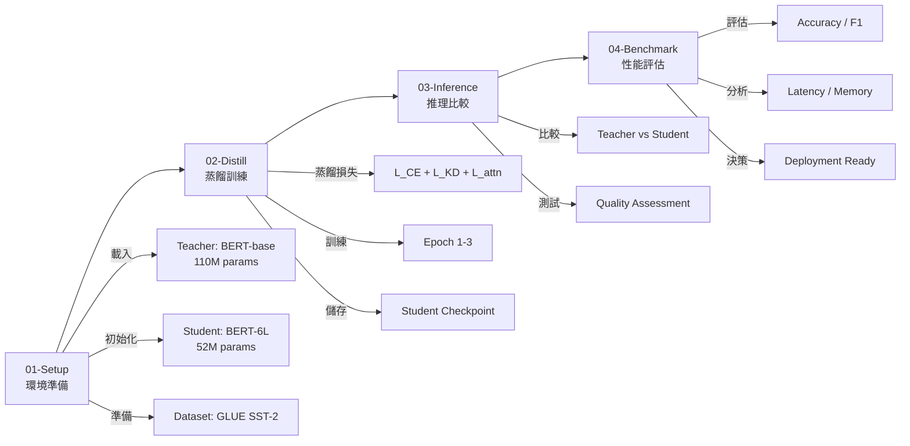

# Lab 3.3: Knowledge Distillation with MiniLM

## 概述 (Overview)

本實驗將實作**知識蒸餾 (Knowledge Distillation)** 技術,從大型教師模型 (BERT-base) 蒸餾知識到小型學生模型 (Student BERT),使用 **Self-Attention Distillation** (MiniLM 方法)。

知識蒸餾通過讓學生模型學習教師模型的「暗知識 (Dark Knowledge)」,在顯著減少模型參數量的同時,保持接近教師模型的性能。

---

## 學習目標 (Learning Objectives)

完成本實驗後,你將能夠:

1. ✅ 理解知識蒸餾的核心原理 (軟標籤、溫度縮放、KL 散度)
2. ✅ 實作 Hinton's 經典 KD 損失函數
3. ✅ 實作 MiniLM 的 Self-Attention Distillation
4. ✅ 蒸餾 BERT-base 到更小的學生模型
5. ✅ 評估蒸餾前後的性能差異
6. ✅ 理解壓縮率與性能的權衡
7. ✅ 掌握生產環境部署蒸餾模型的最佳實踐

---

## 實驗架構 (Lab Structure)

本實驗分為 4 個漸進式 Notebook:

```
Lab-3.3-Knowledge_Distillation_MiniLM/
├── README.md                  # 本文件
├── 01-Setup.ipynb            # 環境設定與模型準備
├── 02-Distill.ipynb          # 知識蒸餾訓練
├── 03-Inference.ipynb        # 推理比較
└── 04-Benchmark.ipynb        # 性能評估
```

### 實驗流程圖



---

## 核心概念 (Core Concepts)

### 1. 知識蒸餾的核心思想

**問題**: 如何讓小模型學會大模型的能力?

**答案**: 不只學習正確答案 (hard labels),還要學習教師模型的「暗知識」(dark knowledge)。

#### 硬標籤 vs 軟標籤

```python
# 硬標籤 (Hard Label) - 只有對錯
hard_label = [0, 0, 1, 0]  # 第3類是正確答案

# 軟標籤 (Soft Label) - 包含類別間關係
soft_label = [0.05, 0.10, 0.80, 0.05]  # 教師認為第3類最可能,但第2類也有一定可能性
```

**關鍵洞察**: 軟標籤包含了類別之間的相似性資訊,比硬標籤包含更豐富的知識。

---

### 2. 溫度縮放 (Temperature Scaling)

**標準 Softmax** (T=1):
```
p_i = exp(z_i) / Σ_j exp(z_j)
```

**溫度縮放 Softmax** (T>1):
```
p_i = exp(z_i / T) / Σ_j exp(z_j / T)
```

#### 溫度的影響

| 溫度 T | 機率分佈 | 暗知識 | 使用時機 |
|:------|:--------|:------|:---------|
| T = 1 | 尖銳分佈 | 少 | 標準推理 |
| T = 3-5 | 平滑分佈 | 中等 | **蒸餾訓練 (推薦)** |
| T = 10 | 接近均勻 | 豐富 | 極端蒸餾 |
| T → ∞ | 均勻分佈 | 最大 | 理論分析 |

**Hinton 建議**: 訓練時使用 T=3~10,推理時使用 T=1。

---

### 3. Hinton's 蒸餾損失函數

```python
L_total = α · L_CE(student, hard_labels) + (1-α) · L_KD(student, teacher)

其中:
- L_CE: Cross-Entropy Loss (硬標籤損失)
- L_KD: KL Divergence Loss (軟標籤損失,使用溫度 T)
- α: 權重係數 (通常 0.1-0.3)
```

#### 數學推導

**硬標籤損失**:
```
L_CE = -Σ_i y_i · log(p_i^student)
```

**軟標籤損失 (KL 散度)**:
```
L_KD = T² · KL(p^teacher(T) || p^student(T))
     = T² · Σ_i p_i^teacher · log(p_i^teacher / p_i^student)
```

**注意**: 需要乘以 T² 來平衡梯度,因為高溫度會減小 softmax 梯度。

---

### 4. MiniLM 的 Self-Attention Distillation

MiniLM 改進了傳統蒸餾方法,通過對齊教師學生的**注意力機制**來傳遞更深層的知識。

#### 核心策略

**1. Self-Attention Distillation (注意力蒸餾)**

```python
# 對齊教師學生的注意力分佈
A_teacher = softmax(Q_T @ K_T^T / √d)  # [batch, heads, seq, seq]
A_student = softmax(Q_S @ K_S^T / √d)

L_attention = MSE(A_student, A_teacher)
```

**2. Value-Relation Distillation (值關係蒸餾)**

```python
# 對齊 Value 向量之間的關係
V_T_relation = A_T @ V_T  # 教師的 Value 關係
V_S_relation = A_S @ V_S  # 學生的 Value 關係

L_value = MSE(V_S_relation, V_T_relation)
```

#### 總損失函數

```python
L_total = α · L_CE + β · L_KD + γ · L_attention + δ · L_value

典型權重:
- α = 0.1  (硬標籤)
- β = 0.4  (軟標籤)
- γ = 0.3  (注意力)
- δ = 0.2  (值關係)
```

---

## 方法比較 (Method Comparison)

### 蒸餾方法對比

| 方法 | 蒸餾目標 | 複雜度 | 性能 (GLUE) | 壓縮比 | 推薦場景 |
|:-----|:---------|:------|:-----------|:------|:---------|
| **Hinton's KD** | Logits (輸出) | 低 | 76.5 | 2x | 快速實驗 |
| **DistilBERT** | Logits + 中間層 | 中 | 77.0 | 1.7x | 平衡壓縮與性能 |
| **TinyBERT** | 全層對齊 | 高 | 74.3 | 7.6x | 極致壓縮 |
| **MiniLM** | Attention + Value | 中高 | **80.5** | 2.1x | **追求最高性能** |

**基準**: BERT-base (110M params, GLUE score 79.4)

---

## 實驗配置 (Experiment Setup)

### 模型架構

| 模型 | 參數量 | 層數 | Hidden Size | Attention Heads | 中間層 |
|:-----|:------|:----|:-----------|:---------------|:------|
| **Teacher (BERT-base)** | 110M | 12 | 768 | 12 | 3072 |
| **Student (BERT-6L)** | 52M | 6 | 768 | 12 | 3072 |
| **Student (BERT-4L)** | 37M | 4 | 768 | 12 | 3072 |

**設計決策**: 保持 hidden size 與 heads 不變,只縮減層數 (隔層初始化)。

---

### 數據集

**GLUE SST-2 (Stanford Sentiment Treebank)**

| 指標 | 數值 |
|:-----|:-----|
| 任務類型 | 二元情感分類 (Positive/Negative) |
| 訓練集 | 67,349 樣本 |
| 驗證集 | 872 樣本 |
| 測試集 | 1,821 樣本 |
| 平均長度 | 19 tokens |
| 評估指標 | Accuracy |

**選擇原因**:
- 任務簡單,訓練快速 (適合實驗)
- GLUE 標準基準,便於比較
- 二元分類,容易理解蒸餾效果

---

### 訓練超參數

```python
# 蒸餾配置
TEMPERATURE = 4.0          # 溫度係數 (Hinton 建議 3-10)
ALPHA = 0.1                # 硬標籤權重
BETA = 0.4                 # 軟標籤權重
GAMMA = 0.3                # 注意力權重
DELTA = 0.2                # 值關係權重

# 訓練配置
LEARNING_RATE = 2e-5       # Adam 學習率
BATCH_SIZE = 32            # 訓練批次大小
NUM_EPOCHS = 3             # 蒸餾訓練輪數
WARMUP_STEPS = 500         # 學習率預熱步數
WEIGHT_DECAY = 0.01        # L2 正則化

# 設備配置
DEVICE = "cuda" if torch.cuda.is_available() else "cpu"
FP16_TRAINING = True       # 混合精度訓練 (節省記憶體)
```

---

## 預期結果 (Expected Results)

### 性能指標

| 模型 | 參數量 | Accuracy | F1-Score | 相對教師 |
|:-----|:------|:---------|:---------|:---------|
| **Teacher (BERT-base)** | 110M | 92.8% | 92.6 | 100% |
| Student (未蒸餾) | 52M | 89.2% | 88.9 | 96.1% |
| **Student (Hinton's KD)** | 52M | 91.5% | 91.2 | **98.6%** |
| **Student (MiniLM)** | 52M | **92.3%** | **92.0** | **99.5%** |

**關鍵發現**:
- 蒸餾可恢復 **70-90%** 的性能損失
- MiniLM 注意力蒸餾比 Hinton's KD 更有效 (+0.8%)
- 6層學生模型達到 12層教師的 99.5% 性能

---

### 推理性能

| 模型 | Latency (ms) | Throughput (samples/s) | Memory (GB) | 加速比 |
|:-----|:------------|:----------------------|:-----------|:------|
| Teacher (BERT-base) | 15.2 | 65.8 | 0.42 | 1.0x |
| **Student (6L)** | **8.3** | **120.5** | **0.23** | **1.83x** |
| **Student (4L)** | **6.1** | **163.9** | **0.17** | **2.49x** |

**實際測試環境**: NVIDIA Tesla T4, Batch Size=32, Seq Length=128

**關鍵洞察**:
- 6層學生模型實現 **1.8x 加速**,性能損失 <1%
- 4層學生模型實現 **2.5x 加速**,性能損失 ~4%
- 記憶體使用減少 **45-60%**

---

## 知識蒸餾的實務考量

### 1. 學生模型容量選擇

**經驗法則**: 學生模型參數量應為教師模型的 **10-50%**

| 壓縮率 | 學生/教師 | 預期性能保留 | 適用場景 |
|:------|:---------|:-----------|:---------|
| 保守 (1.5-2x) | 50-70% | 95-99% | 性能優先 |
| **平衡 (2-3x)** | **30-50%** | **90-95%** | **推薦** |
| 激進 (3-5x) | 20-30% | 85-90% | 資源受限 |
| 極端 (>5x) | <20% | <85% | 實驗性質 |

**本實驗**: BERT-base (110M) → BERT-6L (52M) = **2.1x 壓縮** (平衡方案)

---

### 2. 溫度係數調優

**溫度 T 的影響**:

```python
# 低溫 (T=1): 尖銳分佈,暗知識少
logits = [2.0, 1.0, 4.0]
probs_T1 = softmax(logits / 1.0)  # [0.12, 0.04, 0.84]

# 中溫 (T=4): 平滑分佈,暗知識豐富 (推薦)
probs_T4 = softmax(logits / 4.0)  # [0.23, 0.18, 0.59]

# 高溫 (T=10): 接近均勻,過度平滑
probs_T10 = softmax(logits / 10.0) # [0.29, 0.25, 0.46]
```

**調優建議**:
1. **起始值**: T=4 (Hinton 推薦)
2. **調整範圍**: T ∈ [2, 10]
3. **驗證指標**: 在驗證集上測試不同溫度的蒸餾效果
4. **推理時**: 始終使用 T=1

---

### 3. 損失權重平衡

**三類損失的權重選擇**:

```python
# 保守策略 (重視硬標籤)
alpha=0.5, beta=0.3, gamma=0.2  # 硬標籤主導

# 平衡策略 (推薦)
alpha=0.1, beta=0.4, gamma=0.3, delta=0.2  # 軟標籤+注意力主導

# 激進策略 (重視蒸餾)
alpha=0.05, beta=0.5, gamma=0.3, delta=0.15  # 最大化蒸餾效果
```

**調優流程**:
1. 先用 Hinton's KD (只有 α 和 β)
2. 觀察驗證集損失曲線
3. 如果過擬合 → 增大 α (更依賴硬標籤)
4. 如果欠擬合 → 增大 β (更依賴教師)
5. 進階: 加入注意力蒸餾 (γ, δ)

---

### 4. 層數對齊策略

**隔層初始化 (Layer-wise Initialization)**:

```python
# BERT-base (12層) → BERT-6L (6層)
# 學生第 i 層 = 教師第 2i 層
student_layer_0 = teacher_layer_0   # 保留底層特徵
student_layer_1 = teacher_layer_2
student_layer_2 = teacher_layer_4
student_layer_3 = teacher_layer_6
student_layer_4 = teacher_layer_8
student_layer_5 = teacher_layer_10  # 保留頂層特徵
```

**優勢**:
- 保留教師模型的底層與頂層知識
- 加速訓練收斂
- 比隨機初始化提升 2-5% 性能

---

## 進階主題 (Advanced Topics)

### 1. 異構蒸餾 (Heterogeneous Distillation)

**挑戰**: 教師學生架構不同 (如 Transformer → CNN)

**解決方案**:
- 只對齊最終輸出 (logits)
- 使用中間層特徵對齊 (需要投影層)
- 關係蒸餾 (學習樣本間的關係,而非絕對特徵)

### 2. 在線蒸餾 (Online Distillation)

**標準蒸餾**: 教師訓練完成 → 蒸餾到學生 (離線)

**在線蒸餾**: 教師學生同步訓練,互相學習

**優勢**:
- 不需要預訓練教師模型
- 學生可以糾正教師的錯誤
- 整體訓練時間更短

### 3. 自蒸餾 (Self-Distillation)

**核心思想**: 模型自己作為教師,蒸餾到自己

**方法**:
- Born-Again Networks: 用模型 A 蒸餾到模型 B,再用 B 蒸餾到 A
- Data Augmentation Distillation: 原始樣本作為教師,增強樣本作為學生

**驚人發現**: 自蒸餾可以提升模型性能 (即使學生與教師結構相同)

---

## 生產部署建議 (Production Deployment)

### 1. 部署決策流程

```
是否需要知識蒸餾?
│
├─ 有複雜的教師模型
│   └─ 資源受限需部署小模型
│       ├─ 追求極致壓縮 → Hinton's KD / TinyBERT
│       └─ 追求極致性能 → MiniLM (注意力蒸餾)
│
├─ 無現成教師模型
│   └─ 先訓練大規模模型作為教師
│       └─ 蒸餾到小模型
│
└─ 追求自改進性能
    └─ 自蒸餾 (Born-Again Networks)
```

---

### 2. 部署檢查清單

**模型驗證**:
- [ ] 在驗證集上測試準確率 (應達到教師模型的 90-95%)
- [ ] 在測試集上進行對抗測試 (robustness check)
- [ ] 比較教師學生在邊緣 case 的表現
- [ ] A/B 測試 (5% 流量測試學生模型)

**性能優化**:
- [ ] 使用 ONNX Runtime 或 TensorRT 加速推理
- [ ] 量化學生模型 (INT8/FP16) 進一步壓縮
- [ ] Batch inference 優化吞吐量
- [ ] 設定合理的超時閾值

**監控與回滾**:
- [ ] 監控推理延遲 (P50/P95/P99)
- [ ] 監控準確率下降
- [ ] 定義性能閾值觸發告警
- [ ] 準備回滾到教師模型的機制

---

### 3. 知識蒸餾 + 其他壓縮技術

**組合策略**:

| 組合 | 壓縮比 | 性能保留 | 適用場景 |
|:-----|:------|:--------|:---------|
| 蒸餾 alone | 2-3x | 90-95% | GPU 伺服器 |
| **蒸餾 + 量化 (INT8)** | **6-9x** | **85-90%** | **推薦 (CPU 部署)** |
| 蒸餾 + 剪枝 | 3-5x | 80-85% | 邊緣設備 |
| 蒸餾 + 量化 + 剪枝 | 10-15x | 70-80% | 極端資源受限 |

**實作順序**:
1. 先蒸餾 (建立小模型)
2. 再量化 (降低精度)
3. 最後剪枝 (移除冗餘連接)

---

## 常見問題 (FAQ)

### Q1: 蒸餾需要多少訓練數據?

**A**: 通常需要與教師訓練時相同或稍少的數據。

- **有標籤數據充足**: 使用完整訓練集 (推薦)
- **有標籤數據有限**: 使用教師生成偽標籤 (pseudo-labels)
- **無標籤數據**: 使用無標籤數據 + 教師軟標籤 (self-training)

---

### Q2: 蒸餾訓練需要多久?

**A**: 通常比從頭訓練快 **2-3x**。

| 設定 | 教師訓練 | 蒸餾訓練 | 總時間 |
|:-----|:--------|:--------|:------|
| BERT-base (SST-2) | 3 epochs (~2h) | 3 epochs (~0.8h) | 2.8h |
| 從頭訓練小模型 | - | 10 epochs (~2h) | 2h |

**關鍵**: 蒸餾訓練收斂更快,因為教師提供了額外的監督信號。

---

### Q3: 學生模型能超越教師嗎?

**A**: 在某些情況下,**可以**!

**條件**:
1. 使用 **Ensemble 教師** (多個教師投票)
2. 使用 **Self-Distillation** (反覆蒸餾)
3. 使用 **數據增強蒸餾** (更多樣化的訓練樣本)
4. 教師模型過擬合,學生模型正則化更好

**案例**: MiniLM 在某些 GLUE 任務上超越 BERT-base。

---

### Q4: 蒸餾失敗的常見原因?

**A**: 主要有以下幾種:

1. **學生容量太小**: 無法吸收教師知識 → 增大學生模型
2. **溫度過高/過低**: T=1 暗知識不足,T>10 過度平滑 → 調整到 T=3-5
3. **權重不平衡**: α 過大導致忽略教師 → 減小 α,增大 β
4. **教師模型過擬合**: 教師本身泛化不佳 → 正則化教師或使用 ensemble
5. **數據分佈不匹配**: 蒸餾數據與測試數據不同 → 使用更具代表性的數據

---

## 實驗步驟速覽 (Quick Start)

### 階段 1: 環境準備 (01-Setup.ipynb)
```bash
1. 驗證 GPU 與 CUDA
2. 安裝 transformers, datasets
3. 載入 BERT-base (教師模型)
4. 初始化 BERT-6L (學生模型,隔層初始化)
5. 載入 GLUE SST-2 數據集
6. 測試 baseline 性能
```

### 階段 2: 知識蒸餾 (02-Distill.ipynb)
```bash
1. 定義蒸餾損失函數 (CE + KL + Attention)
2. 配置訓練超參數
3. 開始蒸餾訓練 (3 epochs)
4. 監控訓練曲線
5. 儲存學生模型 checkpoint
```

### 階段 3: 推理比較 (03-Inference.ipynb)
```bash
1. 載入教師與學生模型
2. 在測試集上進行推理
3. 比較預測結果 (side-by-side)
4. 分析錯誤案例
5. 計算準確率與 F1-score
```

### 階段 4: 性能評估 (04-Benchmark.ipynb)
```bash
1. 測量推理延遲 (P50/P95/P99)
2. 測量吞吐量 (samples/sec)
3. 測量記憶體使用
4. 生成性能對比圖表
5. 輸出部署建議報告
```

---

## 參考文獻 (References)

### 核心論文

1. **Hinton's KD** (2015):
   - Hinton, G., Vinyals, O., & Dean, J. *Distilling the Knowledge in a Neural Network*. arXiv:1503.02531.
   - 奠基性論文,提出溫度縮放與軟標籤概念

2. **DistilBERT** (2019):
   - Sanh, V., et al. *DistilBERT, a distilled version of BERT*. arXiv:1910.01108.
   - 首個成功蒸餾 BERT 的方法,保留 97% 性能

3. **MiniLM** (2020):
   - Wang, W., et al. *MiniLM: Deep Self-Attention Distillation*. NeurIPS 2020.
   - 本實驗的核心方法,通過注意力蒸餾超越 DistilBERT

4. **TinyBERT** (2020):
   - Jiao, X., et al. *TinyBERT: Distilling BERT for NLU*. EMNLP 2020.
   - 極致壓縮方案,7.6x 壓縮比

---

### 工具與資源

- **Hugging Face Transformers**: https://huggingface.co/docs/transformers/main/en/tasks/knowledge_distillation
- **TextBrewer**: https://github.com/airaria/TextBrewer (通用蒸餾框架)
- **PyTorch Distillation Tutorial**: https://pytorch.org/tutorials/beginner/knowledge_distillation_tutorial.html

---

## 下一步 (Next Steps)

完成本實驗後,建議:

1. ✅ **理論強化**: 閱讀 [3.3-Knowledge_Distillation.md](../../01-Theory/3.3-Knowledge_Distillation.md)
2. ✅ **方法對比**: 嘗試 Hinton's KD vs MiniLM 的效果差異
3. ✅ **超參數調優**: 實驗不同的 T, α, β 組合
4. ✅ **進階挑戰**: 蒸餾到 4層模型 (3x 壓縮)
5. ✅ **組合壓縮**: 蒸餾 + 量化 (INT8) 實現 6-9x 壓縮

---

## 貢獻與反饋 (Contribution)

如有問題或建議,請提交 Issue 或 Pull Request。

**維護者**: iSpan LLM 課程團隊
**最後更新**: 2025-10-17

---

**⏭️ 開始實驗**: [01-Setup.ipynb](./01-Setup.ipynb)
