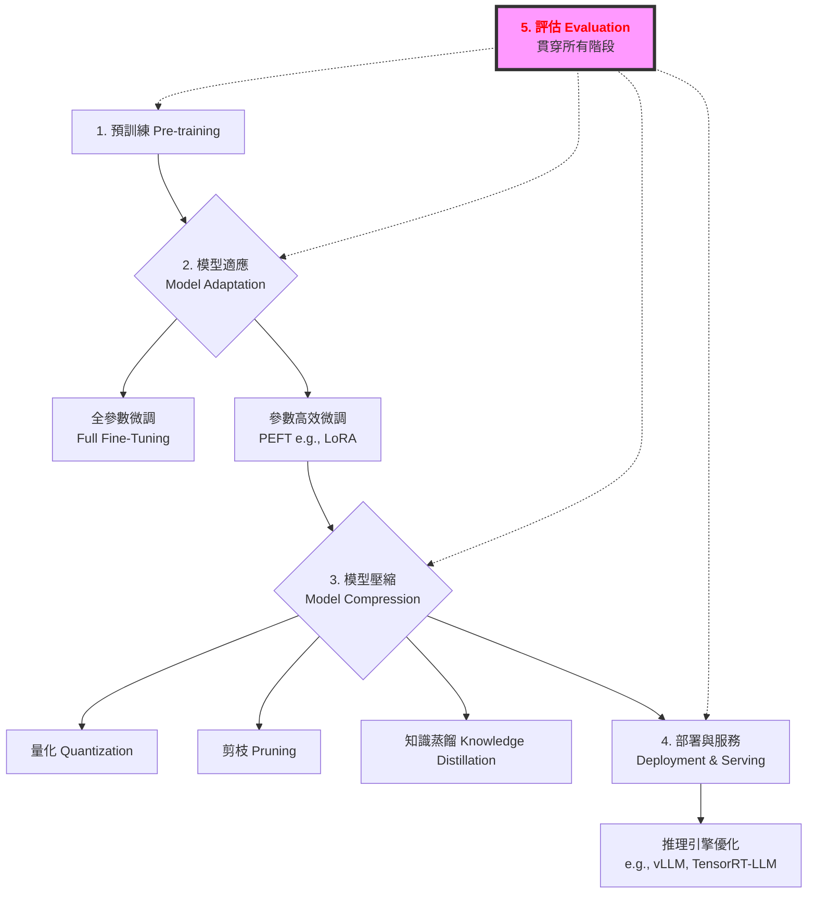

# 第 4.1 章:評估基準 (Evaluation Benchmarks)

本章旨在為您提供一份教科書級別的教學講義,深入探討 LLM 評估基準 (Evaluation Benchmarks) 的核心概念、基本原理與實務應用。我們將從基礎理論出發,深入第一原理,最終將評估基準置於大型語言模型 (LLM) 的宏觀知識體系中進行審視。

| 概念 | 中文譯名 | 典型用途 | 優點 | 侷限 |
| :--- | :--- | :--- | :--- | :--- |
| **Fundamentals** | 基礎理論 | 快速掌握主流評估基準 (MMLU, C-Eval, GSM8K) 與指標。 | 直觀易懂,能快速進行模型評估。 | 易忽略評估背後的科學原理。 |
| **First Principles** | 第一原理 | 從測量理論與統計學,理解為何評估能量化能力。 | 深入本質,有助於設計新評估方法。 | 理論性強,需要統計學背景。 |
| **Body of Knowledge** | 知識體系 | 將評估置於 LLM 完整生命週期的框架中。 | 結構完備,理解評估的戰略價值。 | 內容龐雜,不適合快速入門。 |

---

### 1. Fundamentals (基礎理論)

在大型語言模型 (LLM) 的工程化過程中,**模型評估面臨的三大挑戰**:
1. **能力的多維性**: LLM 具備語言理解、推理、代碼生成等多種能力,如何全面評估?
2. **評估的客觀性**: 如何避免主觀判斷的偏見,提供可重現的量化指標?
3. **基準的時效性**: 模型能力快速進化,現有基準是否足以區分先進模型?

**評估基準 (Evaluation Benchmark)** 的核心思想是:**通過固定的測試集與標準化的評估協議,量化模型在不同能力維度上的表現,從而為模型選擇、優化與部署提供客觀依據。**

#### 評估基準的方法學分類

根據能力維度、評估範式與難度的不同,主流評估基準可分為以下類別:

**1. 按能力維度分類 (Capability-based Classification)**

* **語言理解 (Language Understanding)**:
    * **核心能力**: 閱讀理解、情感分析、自然語言推理。
    * **代表基準**: **GLUE**, **SuperGLUE**, **CLUE**, **C-Eval**。
    * **評估指標**: 準確率 (Accuracy), F1-Score。

* **語言生成 (Language Generation)**:
    * **核心能力**: 文本摘要、對話生成、創意寫作。
    * **代表基準**: CNN/DailyMail, XSum, PersonaChat。
    * **評估指標**: ROUGE, BLEU, 人工評估。

* **知識與推理 (Knowledge & Reasoning)**:
    * **核心能力**: 常識推理、數學推理、因果推理。
    * **代表基準**: **CommonsenseQA**, **GSM8K**, **MATH**, HellaSwag。
    * **評估指標**: 準確率 (Accuracy), Pass@K。

* **代碼能力 (Code Abilities)**:
    * **核心能力**: 代碼生成、代碼理解、問題求解。
    * **代表基準**: **HumanEval**, **MBPP**, CodeXGLUE。
    * **評估指標**: Pass@1, Pass@10。

**2. 按評估範式分類 (Paradigm-based Classification)**

* **判別式評估 (Discriminative Evaluation)**:
    * **核心思想**: 計算各選項的對數似然 (log-likelihood),選擇機率最高的選項。
    * **優勢**: 評估穩定,不依賴生成質量。
    * **適用**: 多選題型 (MMLU, C-Eval)。

* **生成式評估 (Generative Evaluation)**:
    * **核心思想**: 生成完整答案,與參考答案比對。
    * **優勢**: 更接近實際應用,測試生成能力。
    * **挑戰**: 需要複雜的答案匹配邏輯 (exact match, fuzzy match)。
    * **適用**: 開放式問答、代碼生成 (HumanEval)。

* **混合式評估 (Hybrid Evaluation)**:
    * **核心思想**: 結合判別與生成的優勢。
    * **範例**: 先用判別評估快速篩選,再用生成評估精細比較。

**3. 按評估難度分類 (Difficulty-based Classification)**

| 難度 | Few-shot | 任務複雜度 | 推理步驟 | 代表基準 |
|:---|:---:|:---|:---:|:---|
| **簡單** | 0-shot | 單句理解 | 1 步 | SST-2 (情感分析) |
| **中等** | 5-shot | 段落理解 | 2-3 步 | MMLU (多任務理解) |
| **困難** | 5-shot CoT | 多文檔推理 | 5+ 步 | BBH (Big-Bench Hard) |
| **專家級** | Few-shot CoT | 專業領域 | 10+ 步 | MATH, MedQA |

---

### 2. First Principles (第一原理)

從第一原理出發,評估基準的有效性根植於對**測量理論 (Measurement Theory)** 與**統計推斷 (Statistical Inference)** 的深刻洞察。

* **測量的信度與效度 (Reliability & Validity)**:
  評估基準必須滿足兩個核心條件:
  - **信度 (Reliability)**: 多次評估結果一致性高。數學表示:若對同一模型重複評估 N 次,分數方差應盡可能小。
  - **效度 (Validity)**: 評估指標真正測量了目標能力。例如,MMLU 測試的是否真的是「多任務語言理解」,而非記憶訓練數據?

* **樣本量與統計顯著性 (Sample Size & Statistical Significance)**:
  評估結果的可靠性依賴於**充足的樣本量**:
  ```
  標準誤差 (SE) = σ / √n
  其中: σ 為樣本標準差, n 為樣本量
  ```
  **Hinton 建議**: 主流基準樣本量通常 >1000,確保標準誤差 <1%。

  **顯著性檢驗**: 兩個模型分數差異是否具有統計顯著性?
  ```
  t = (score_A - score_B) / √(SE_A² + SE_B²)
  若 t > 1.96,則在 95% 置信水平下差異顯著
  ```

* **基準污染問題 (Benchmark Contamination)**:
  當訓練數據包含測試集數據時,評估結果虛高,失去區分能力。這是當前 LLM 評估的最大挑戰。

  **緩解策略**:
  - 使用新發布的基準 (如每年更新的 CLUE)
  - 動態生成測試集 (如 LiveBench)
  - 多基準交叉驗證 (若模型在所有基準上都異常高,可能存在污染)

* **Chain-of-Thought (CoT) 的數學基礎**:
  CoT 通過**分解複雜任務為多個子任務**,降低每步推理的難度:
  ```
  P(答案正確 | 複雜任務) = P₁ × P₂ × ... × Pₙ
  其中: Pᵢ 為第 i 步推理正確的機率

  若無 CoT: P(答案正確) ≈ 0.1 (單步推理,極難)
  若用 CoT (5 步): P(答案正確) = 0.7⁵ ≈ 0.17 (每步 70% 正確,整體提升 70%)
  ```
  這解釋了為何 CoT 在 GSM8K 等推理任務上能提升 40-50% 性能。

因此,評估基準的第一原理可以概括為:**通過設計高信度、高效度的測試集,並確保充足的樣本量與統計顯著性,從而準確量化模型在特定能力維度上的表現,同時需警惕基準污染導致的評估失效。**

---

### 3. Body of Knowledge (知識體系)

在 LLM 的完整生命週期中,評估扮演著關鍵的**能力驗證 (Capability Validation)** 角色。它不僅是一項獨立技術,更是串連整個工作流程的核心環節。



**評估在不同階段的作用**:
- **預訓練階段**: 使用 **Perplexity** 評估語言建模能力。
- **微調階段**: 使用 **MMLU, C-Eval** 評估下游任務性能。
- **壓縮階段**: 評估精度-效率權衡 (如量化後的 Accuracy 下降幅度)。
- **部署階段**: 評估推理性能 (TTFT, QPS, Throughput)。

評估經常與其他技術結合使用,例如:
- **微調 + 評估**: 每個 checkpoint 都評估,選擇最佳模型。
- **壓縮 + 評估**: 量化/剪枝後立即評估,確保性能下降 <3%。
- **A/B 測試 + 評估**: 生產環境中對比兩個模型版本,基於評估指標決策。

---

### 4. 主流評估基準深度解析

#### 4.1 MMLU (Massive Multitask Language Understanding)

**論文**: Hendrycks et al. (2021), ICLR 2021
**核心思想**: 通過 57 個學科的多選題,全面評估模型的跨領域知識與推理能力。

**關鍵特性**:
- **學科覆蓋**: 57 個學科 (STEM, 人文, 社會科學, 其他)
- **難度**: 從小學到專家級別
- **題型**: 4 選 1 多選題
- **樣本量**: 15,908 道題目
- **評估模式**: 5-shot (每個學科提供 5 個示例)

**主流模型表現** (截至 2024 年):

| 模型 | 整體 | STEM | 人文 | 社會科學 |
|:---|---:|---:|---:|---:|
| GPT-4 | 86.4% | 83.2% | 85.1% | 88.6% |
| Claude-3-Opus | 86.8% | 84.0% | 86.0% | 89.3% |
| Llama-2-70B | 69.8% | 67.3% | 69.2% | 71.4% |
| Llama-2-7B | 46.8% | 43.9% | 46.1% | 48.2% |
| 人類專家 | ~90% | ~85% | ~92% | ~95% |

**關鍵觀察**:
- GPT-4 / Claude-3 已接近人類專家水平 (-3% to -5%)
- 模型在社會科學類別通常表現最好
- 70B 與 7B 模型存在 ~23% 的巨大性能差距

**評估範例** (Python):
```python
from opencompass.models import HuggingFace
from opencompass.datasets import MMLUDataset
from opencompass.evaluators import AccuracyEvaluator

# 載入模型
model = HuggingFace(path='meta-llama/Llama-2-7b-hf')

# 載入 MMLU 數據集
dataset = MMLUDataset(split='test')

# 評估
evaluator = AccuracyEvaluator()
results = evaluator.evaluate(model, dataset, num_shots=5)

print(f"MMLU Overall: {results['accuracy']:.2%}")
print(f"STEM: {results['stem_accuracy']:.2%}")
```

---

#### 4.2 C-Eval (Chinese Evaluation Suite)

**論文**: Huang et al. (2023), arXiv:2305.08322
**核心思想**: 全面的中文評估基準,涵蓋 52 個學科,從中學到專業級別。

**關鍵特性**:
- **學科覆蓋**: 52 個學科 (STEM, 社會科學, 人文, 其他)
- **難度分層**: 初中、高中、大學、專業級別
- **題型**: 多選題 (4 選項)
- **樣本量**: 13,948 道題目

**主流模型表現**:

| 模型 | 整體 | STEM | 社會科學 | 人文 |
|:---|---:|---:|---:|---:|
| GPT-4 | 68.7% | 67.1% | 77.6% | 64.5% |
| Qwen-14B | 72.1% | 70.2% | 81.8% | 67.1% |
| Qwen-7B | 59.7% | 56.2% | 74.1% | 63.1% |
| Llama-2-7B | 45.3% | 42.1% | 52.9% | 48.7% |

**關鍵觀察**:
- **Qwen 系列在中文任務上具有顯著優勢** (+3.4% 超越 GPT-4)
- Llama-2 在中文基準上表現較弱 (-23.4% 落後 Qwen-7B)
- 社會科學類別得分普遍高於 STEM

---

#### 4.3 GSM8K (Grade School Math 8K)

**論文**: Cobbe et al. (2021), arXiv:2110.14168
**核心思想**: 小學數學應用題基準,測試多步驟算術推理能力。

**關鍵特性**:
- **題目數量**: 8,500 道題 (訓練 7.5K, 測試 1K)
- **難度**: 美國小學 2-8 年級水平
- **評估重點**: 多步驟算術推理 (2-8 步)

**主流模型表現**:

| 模型 | 準確率 | 使用 CoT |
|:---|---:|:---:|
| GPT-4 | 92.0% | ✅ |
| Claude-3-Opus | 95.0% | ✅ |
| Llama-2-70B | 56.8% | ✅ |
| Llama-2-7B | 14.6% | ✅ |
| Llama-2-7B | 10.2% | ❌ |

**關鍵觀察**:
- **Chain-of-Thought (CoT) 顯著提升性能** (+43% for Llama-2-7B)
- 小型模型 (<10B) 在數學推理上表現較弱
- GPT-4 已接近人類專家水平 (~95%)

---

#### 4.4 HumanEval (Code Generation)

**論文**: Chen et al. (2021), arXiv:2107.03374
**核心思想**: 函數級別的代碼生成評估,測試實際編程能力。

**關鍵特性**:
- **題目數量**: 164 道編程題
- **語言**: Python
- **評估指標**: Pass@1, Pass@10 (執行通過率)

**主流模型表現**:

| 模型 | Pass@1 | Pass@10 |
|:---|---:|---:|
| GPT-4 | 67.0% | 82.3% |
| Claude-3-Opus | 84.9% | 92.1% |
| CodeLlama-34B | 48.8% | 62.1% |
| Llama-2-7B | 12.8% | 23.4% |

**關鍵觀察**:
- Claude-3-Opus 在代碼生成上超越 GPT-4 (+17.9%)
- Pass@10 顯著高於 Pass@1,說明模型能生成正確答案,但排序能力不足
- 專門的代碼模型 (CodeLlama) 優於通用模型 (Llama-2)

---

### 5. 方法選擇指引與實戰策略

#### 5.1 實踐選擇建議

| 應用場景 | 推薦基準 | 原因 |
| :--- | :--- | :--- |
| **中文通用助手** | **C-Eval, CMMLU** | 全面評估中文能力。 |
| **英文通用助手** | **MMLU, BBH** | 業界標準,可比性強。 |
| **代碼生成** | **HumanEval, MBPP** | 實際編程能力測試。 |
| **數學推理** | **GSM8K, MATH** | 多步驟推理能力。 |
| **專業領域 (醫學)** | **MedQA, MedMCQA** | 專業知識與推理。 |

#### 5.2 評估決策樹

```
需要評估 LLM 能力?
│
├─ 通用能力評估
│   ├─ 中文 → C-Eval (5-shot)
│   └─ 英文 → MMLU (5-shot)
│
├─ 推理能力評估
│   ├─ 數學 → GSM8K (8-shot CoT)
│   └─ 常識 → CommonsenseQA
│
├─ 代碼能力評估
│   └─ HumanEval (0-shot)
│
└─ 專業領域評估
    ├─ 醫學 → MedQA
    ├─ 法律 → LegalBench
    └─ 科學 → ScienceQA
```

#### 5.3 評估預算與時間

| 預算 | 時間 | 推薦策略 | 基準選擇 |
|:---|:---|:---|:---|
| **低** | <1h | 快速驗證 | MMLU 子集 (5 學科), C-Eval 子集 |
| **中** | 2-4h | 標準評估 | MMLU, C-Eval, GSM8K |
| **高** | 6-12h | 全面評估 | MMLU, C-Eval, GSM8K, BBH, HumanEval |

---

### 6. 評估結果解讀

#### 6.1 分數解讀指南

| 分數範圍 (MMLU/C-Eval) | 能力等級 | 適用場景 |
|:---|:---|:---|
| **<40%** | 基礎級 | 簡單對話、基礎分類 |
| **40-60%** | 中級 | 通用助手、信息檢索 |
| **60-80%** | 高級 | 專業領域、複雜推理 |
| **80-95%** | 專家級 | 關鍵任務、高風險場景 |

#### 6.2 人類基準對照

| 基準 | 平均人類 | 專家人類 | GPT-4 | 差距 |
|:---|---:|---:|---:|---:|
| MMLU | ~65% | ~90% | 86.4% | -3.6% |
| C-Eval | ~60% | ~85% | 68.7% | -16.3% |
| GSM8K | ~85% | ~95% | 92.0% | -3.0% |

**關鍵洞察**:
- GPT-4 在英文基準 (MMLU, GSM8K) 上已接近專家人類
- 中文基準 (C-Eval) 仍有較大提升空間 (-16.3%)
- 數學推理 (GSM8K) 已超越平均人類 (+7%)

---

## 結論與建議

1. **日常溝通與實作**: 優先掌握 **Fundamentals** 中的 **MMLU, C-Eval, GSM8K**,它們是業界標準評估基準,覆蓋通用能力、中文能力與推理能力。

2. **強調方法論與創新**: 從 **First Principles** 出發,理解評估的核心 (測量理論 + 統計推斷 + 基準污染),有助於您在面對新任務時,設計或選擇更合適的評估策略,甚至啟發新的評估方法。

3. **構建宏觀視野**: 將評估放入 **Body of Knowledge** 的框架中,可以清晰地看到它在整個 LLM 工作流程中的戰略位置,評估貫穿預訓練、微調、壓縮、部署的所有階段。

**核心要點**: 評估是 LLM 工程化的基石,通過 MMLU (英文通用), C-Eval (中文通用), GSM8K (數學推理), HumanEval (代碼生成) 四大基準,能全面量化模型能力。

透過本章的學習,您應當已經掌握了評估基準的核心思想與前沿技術,並能從更宏觀的視角理解其在現代 AI 開發中的關鍵作用。

---

### 延伸閱讀 (Further Reading)

#### 關鍵論文 (Key Papers)
1. **MMLU**: Hendrycks, D., et al. (2021). *Measuring Massive Multitask Language Understanding*. ICLR 2021.
2. **C-Eval**: Huang, Y., et al. (2023). *C-Eval: A Multi-Level Multi-Discipline Chinese Evaluation Suite*. arXiv:2305.08322.
3. **GSM8K**: Cobbe, K., et al. (2021). *Training Verifiers to Solve Math Word Problems*. arXiv:2110.14168.
4. **HumanEval**: Chen, M., et al. (2021). *Evaluating Large Language Models Trained on Code*. arXiv:2107.03374.

#### 工具與實現 (Tools & Implementations)
- **OpenCompass**: https://opencompass.org.cn/ (最全面的中文評估框架)
- **lm-evaluation-harness**: https://github.com/EleutherAI/lm-evaluation-harness
- **HELM**: https://crfm.stanford.edu/helm/ (Stanford 全面評估體系)

#### 學習資源 (Learning Resources)
- OpenCompass 官方文檔: https://opencompass.readthedocs.io/
- BIG-bench: https://github.com/google/BIG-bench
- LiveBench (動態評估): https://livebench.ai/

---

**下一章節**: [4.2 數據工程 (Data Engineering)](./4.2-Data_Engineering.md)
