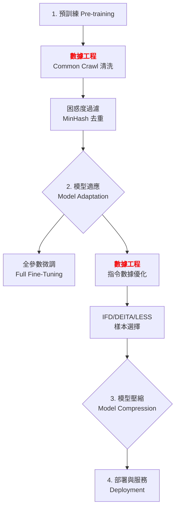

# 第 4.2 章:數據工程 (Data Engineering)

本章旨在為您提供一份教科書級別的教學講義,深入探討 LLM 數據工程 (Data Engineering) 的核心概念、基本原理與實務應用。我們將從基礎理論出發,深入第一原理,最終將數據工程置於大型語言模型 (LLM) 的宏觀知識體系中進行審視。

| 概念 | 中文譯名 | 典型用途 | 優點 | 侷限 |
| :--- | :--- | :--- | :--- | :--- |
| **Fundamentals** | 基礎理論 | 快速掌握數據清洗、去重、過濾 (IFD, DEITA, LESS) 等實用技術。 | 直觀易懂,能快速提升數據質量。 | 易忽略數據質量的理論基礎。 |
| **First Principles** | 第一原理 | 從信息理論與統計學,理解為何少量高質量數據勝過大量低質量數據。 | 深入本質,有助於設計新數據策略。 | 理論性強,需要數學背景。 |
| **Body of Knowledge** | 知識體系 | 將數據工程置於 LLM 完整生命週期的框架中。 | 結構完備,理解數據的戰略價值。 | 內容龐雜,不適合快速入門。 |

---

### 1. Fundamentals (基礎理論)

在大型語言模型 (LLM) 的工程化過程中,**數據工程面臨的三大挑戰**:
1. **質量 vs 數量的權衡**: 是收集 100萬條低質量數據,還是精選 1萬條高質量數據?
2. **自動化評估的準確性**: 如何設計演算法自動識別高質量數據,而不依賴人工標註?
3. **數據多樣性的保證**: 如何確保數據覆蓋廣泛的任務類型,避免過擬合?

**數據工程 (Data Engineering)** 的核心思想是:**通過系統化的清洗、去重、評估與過濾流程,從大規模原始數據中提取高質量、高多樣性的訓練數據,從而最大化模型的學習效率與泛化能力。**

#### 數據工程的方法學分類

根據時機、範圍與技術的不同,主流數據工程方法可分為以下類別:

**1. 按數據類型分類 (Data-Type-based Classification)**

* **預訓練數據處理 (Pre-training Data Processing)**:
    * **核心任務**: 大規模網頁爬取、去重、困惑度過濾。
    * **代表數據集**: Common Crawl, C4, The Pile。
    * **技術**: MinHash 去重, Perplexity Filtering。

* **微調數據優化 (Fine-tuning Data Optimization)**:
    * **核心任務**: 指令-回應對質量評估、複雜度評分、多樣性平衡。
    * **代表數據集**: Alpaca, Dolly, OpenOrca。
    * **技術**: **IFD**, **DEITA**, **LESS**。

**2. 按評估維度分類 (Evaluation-Dimension-based Classification)**

* **複雜度 (Complexity)**:
    * **核心思想**: 任務難度、推理深度、指令遵循難度 (IFD)。
    * **代表方法**: **IFD (Instruction Following Difficulty)**。
    * **數學表示**: `IFD = 1 - cosine_similarity(instruction_emb, response_emb)`。

* **質量 (Quality)**:
    * **核心思想**: 回應正確性、邏輯一致性、格式規範性。
    * **代表方法**: **DEITA Quality Score** (使用 LLM 評估)。

* **多樣性 (Diversity)**:
    * **核心思想**: 任務類型分布、領域覆蓋、語言風格。
    * **代表方法**: **DEITA Diversity Score** (基於嵌入向量)。

**3. 按選擇策略分類 (Selection-Strategy-based Classification)**

* **基於規則 (Rule-based)**:
    * **核心思想**: 長度、符號比例、大寫比例等啟發式規則。
    * **優勢**: 計算成本極低,適合大規模初步過濾。
    * **劣勢**: 無法捕捉語義質量。

* **基於模型 (Model-based)**:
    * **核心思想**: 使用 LLM (GPT-4) 或判別模型評估質量。
    * **代表方法**: **DEITA** (LLM 評估複雜度與質量)。
    * **優勢**: 準確性高。
    * **劣勢**: 計算成本高,需要 API 調用。

* **基於梯度 (Gradient-based)**:
    * **核心思想**: 計算每個樣本對模型訓練的梯度貢獻,選擇梯度範數最大的樣本。
    * **代表方法**: **LESS (Low-Effort Score Sampling)**。
    * **優勢**: 直接基於模型訓練信號,不依賴外部 LLM。
    * **劣勢**: 需要預訓練模型,計算成本中等。

---

### 2. First Principles (第一原理)

從第一原理出發,數據工程的有效性根植於對**信息理論 (Information Theory)** 與**學習理論 (Learning Theory)** 的深刻洞察。

* **Shannon 信息熵與數據價值 (Shannon Entropy & Data Value)**:
  高質量數據的核心特徵是**高信息熵** (High Entropy),即包含更多「意外」信息:
  ```
  H(X) = -Σ p(x) log p(x)
  其中: p(x) 為樣本 x 出現的機率

  低熵數據 (如重複內容): H(X) ≈ 0 (無新信息)
  高熵數據 (如多樣化任務): H(X) 大,學習效率高
  ```

  **LIMA 研究的洞察**: 1,000 條高熵數據 (多樣化、複雜) 勝過 52,000 條低熵數據 (重複、簡單)。

* **樣本難度與學習效率 (Sample Difficulty & Learning Efficiency)**:
  學習理論表明,**適度困難的樣本** (Moderate Difficulty) 學習效率最高:
  ```
  學習效率 = f(難度)
  - 太簡單 (IFD < 0.2): 模型已掌握,無新信息 → 學習效率 ≈ 0
  - 適度困難 (IFD 0.3-0.7): 模型需努力但能學會 → 學習效率最大化
  - 太困難 (IFD > 0.9): 模型無法理解,噪音 → 學習效率 ≈ 0
  ```

  這是 **IFD (Instruction Following Difficulty)** 方法的理論基礎:過濾太簡單與太困難的樣本,保留「甜蜜區」(Sweet Spot)。

* **多樣性與泛化能力 (Diversity & Generalization)**:
  統計學習理論證明:**訓練數據的多樣性直接決定模型的泛化誤差**:
  ```
  泛化誤差 ∝ 1 / √Diversity
  其中: Diversity 可定義為訓練樣本在嵌入空間的分散程度

  若訓練數據集中在少數幾個主題,模型泛化能力弱
  若訓練數據覆蓋廣泛主題,模型泛化能力強
  ```

  **DEITA Diversity Score** 正是基於此原理:選擇與已選樣本相似度最低的新樣本,最大化多樣性。

* **基準污染與訓練-測試洩漏 (Data Contamination & Train-Test Leakage)**:
  當訓練數據包含測試集數據時,模型評估失效。數據工程必須:
  - 嚴格去重,確保訓練集與測試集無重疊
  - 使用 MinHash LSH 檢測近似重複 (相似度 >80%)

因此,數據工程的第一原理可以概括為:**通過最大化訓練數據的信息熵、選擇適度困難的樣本、確保多樣性覆蓋,並嚴格防止數據洩漏,從而最大化模型的學習效率與泛化能力。**

---

### 3. Body of Knowledge (知識體系)

在 LLM 的完整生命週期中,數據工程扮演著關鍵的**數據質量保證 (Data Quality Assurance)** 角色。它不僅是一項獨立技術,更是串連整個工作流程的核心環節。



**數據工程在不同階段的作用**:
- **預訓練階段**: 清洗 Common Crawl (~10TB) → 高質量語料 (~1TB),使用困惑度過濾與去重。
- **微調階段**: 從 50,000 條原始指令數據 → 精選 1,000-5,000 條高質量數據,使用 IFD/DEITA/LESS。
- **持續學習階段**: 動態評估新數據質量,增量更新訓練集。

數據工程經常與其他技術結合使用,例如:
- **數據工程 + PEFT**: 高質量數據 + LoRA 微調 → 6GB 記憶體訓練 7B 模型 (QLoRA)。
- **數據工程 + 評估**: 每次數據更新後評估模型性能,驗證數據質量提升是否有效。

---

### 4. 主流數據過濾演算法深度解析

#### 4.1 IFD (Instruction Following Difficulty)

**論文**: Li et al. (2023), arXiv:2307.06945
**核心思想**: 測量指令與回應之間的語義距離,距離越大表示任務越困難。

**數學原理**:
```
IFD = 1 - cosine_similarity(embedding(instruction), embedding(response))

其中:
- embedding() 使用 sentence-transformers 模型 (如 all-MiniLM-L6-v2)
- cosine_similarity 範圍 [0, 1]
- IFD 範圍 [0, 1],越高越困難
```

**假設**:
- 簡單任務 (如「翻譯」): 回應與指令高度相關 → IFD 低 (~0.2)
- 困難任務 (如「分析」): 回應需要推理,與指令語義距離大 → IFD 高 (~0.7)

**完整實作**:
```python
from sentence_transformers import SentenceTransformer
from sklearn.metrics.pairwise import cosine_similarity
import numpy as np

class IFDCalculator:
    def __init__(self, model_name='sentence-transformers/all-MiniLM-L6-v2'):
        """
        初始化 IFD 計算器

        Args:
            model_name: 句子嵌入模型名稱
        """
        self.model = SentenceTransformer(model_name)

    def calculate_ifd(self, instruction, response):
        """
        計算單個樣本的 IFD

        Args:
            instruction: 指令文本
            response: 回應文本

        Returns:
            float: IFD 分數 (0-1,越高越困難)
        """
        # 生成嵌入向量
        instr_emb = self.model.encode([instruction])
        resp_emb = self.model.encode([response])

        # 計算餘弦相似度
        similarity = cosine_similarity(instr_emb, resp_emb)[0][0]

        # IFD = 1 - similarity
        ifd = 1 - similarity

        return ifd

    def calculate_batch_ifd(self, samples):
        """
        批量計算 IFD

        Args:
            samples: List of dicts with 'instruction' and 'output' keys

        Returns:
            List of (sample, ifd_score) tuples
        """
        instructions = [s['instruction'] for s in samples]
        responses = [s['output'] for s in samples]

        # 批量編碼
        instr_embs = self.model.encode(instructions, show_progress_bar=True)
        resp_embs = self.model.encode(responses, show_progress_bar=True)

        # 計算相似度
        similarities = np.array([
            cosine_similarity([instr_embs[i]], [resp_embs[i]])[0][0]
            for i in range(len(samples))
        ])

        # 計算 IFD
        ifds = 1 - similarities

        return [(samples[i], ifds[i]) for i in range(len(samples))]

    def filter_by_ifd(self, samples, min_ifd=0.3, max_ifd=0.9):
        """
        根據 IFD 過濾樣本

        Args:
            samples: 樣本列表
            min_ifd: 最小 IFD (過濾太簡單的)
            max_ifd: 最大 IFD (過濾太困難/不相關的)

        Returns:
            List of filtered samples
        """
        samples_with_ifd = self.calculate_batch_ifd(samples)

        filtered = [
            sample for sample, ifd in samples_with_ifd
            if min_ifd <= ifd <= max_ifd
        ]

        return filtered

# 使用範例
ifd_calc = IFDCalculator()

samples = [
    {
        "instruction": "將 'hello' 翻譯成中文",
        "output": "你好"
    },
    {
        "instruction": "分析量子計算的未來發展趨勢",
        "output": "量子計算未來將在密碼學、藥物設計、材料科學等領域產生革命性影響..."
    }
]

# 計算 IFD
for sample in samples:
    ifd = ifd_calc.calculate_ifd(sample['instruction'], sample['output'])
    print(f"IFD: {ifd:.3f} - {sample['instruction'][:30]}...")

# 過濾樣本
filtered = ifd_calc.filter_by_ifd(samples, min_ifd=0.3, max_ifd=0.9)
print(f"\nFiltered: {len(filtered)} / {len(samples)}")
```

**性能表現** (AlpacaEval):
| 數據量 | 方法 | AlpacaEval Win Rate |
|:---|:---|---:|
| 52,000 (全量) | 無過濾 | 78.5% |
| 5,000 (10%) | **IFD 過濾** | **80.2%** (+1.7%) |
| 1,000 (2%) | IFD 過濾 | 76.3% (-2.2%) |

**關鍵觀察**:
- IFD 過濾到 10% 數據量,性能不降反升 (+1.7%)
- 過度過濾 (到 2%) 會損失性能 (-2.2%)
- **甜蜜區**: 保留 5-15% 的高 IFD 數據

---

#### 4.2 DEITA (Data-Efficient Instruction Tuning for Alignment)

**論文**: Liu et al. (2023), arXiv:2312.15685
**核心思想**: 結合複雜度、質量、多樣性三個維度,使用 LLM 評估 + 嵌入向量計算。

**數學原理**:
```
DEITA_score = α × Complexity + β × Quality + γ × Diversity

其中:
- Complexity: LLM (GPT-4) 評估指令複雜度,範圍 [0, 1]
- Quality: LLM (GPT-4) 評估回應質量,範圍 [0, 1]
- Diversity: 1 - max_similarity(樣本, 已選樣本集),範圍 [0, 1]
- 常用權重: α=0.4, β=0.4, γ=0.2
```

**完整實作**:
```python
import openai
from sentence_transformers import SentenceTransformer
from sklearn.metrics.pairwise import cosine_similarity
import numpy as np

class DEITAScorer:
    def __init__(self,
                 openai_api_key,
                 model_name='gpt-4',
                 embedding_model='sentence-transformers/all-MiniLM-L6-v2',
                 alpha=0.4,
                 beta=0.4,
                 gamma=0.2):
        """
        初始化 DEITA 評分器

        Args:
            openai_api_key: OpenAI API 密鑰
            model_name: 用於評估的 LLM 模型
            embedding_model: 用於多樣性計算的嵌入模型
            alpha, beta, gamma: 三個維度的權重
        """
        openai.api_key = openai_api_key
        self.model_name = model_name
        self.embedding_model = SentenceTransformer(embedding_model)
        self.alpha = alpha
        self.beta = beta
        self.gamma = gamma

    def evaluate_complexity(self, instruction):
        """使用 LLM 評估指令複雜度"""
        prompt = f"""請評估以下指令的複雜度,從 1 到 10 打分,其中:
1-3: 簡單 (如翻譯單詞、基礎計算)
4-6: 中等 (如段落翻譯、多步驟推理)
7-10: 困難 (如複雜分析、創意寫作、專業領域)

指令: {instruction}

請僅回覆一個 1-10 的數字。"""

        response = openai.ChatCompletion.create(
            model=self.model_name,
            messages=[{"role": "user", "content": prompt}],
            temperature=0
        )

        try:
            score = int(response.choices[0].message.content.strip())
            return min(max(score, 1), 10) / 10  # 正規化到 0-1
        except:
            return 0.5  # 預設中等複雜度

    def evaluate_quality(self, instruction, output):
        """使用 LLM 評估回應質量"""
        prompt = f"""請評估以下回應的質量,從 1 到 10 打分,考慮:
- 準確性: 回應是否正確
- 完整性: 是否充分回答問題
- 清晰度: 表達是否清晰
- 實用性: 是否有實際價值

指令: {instruction}
回應: {output}

請僅回覆一個 1-10 的數字。"""

        response = openai.ChatCompletion.create(
            model=self.model_name,
            messages=[{"role": "user", "content": prompt}],
            temperature=0
        )

        try:
            score = int(response.choices[0].message.content.strip())
            return min(max(score, 1), 10) / 10
        except:
            return 0.5

    def evaluate_diversity(self, sample, reference_samples):
        """計算樣本與參考集的多樣性"""
        sample_text = f"{sample['instruction']} {sample['output']}"
        sample_emb = self.embedding_model.encode([sample_text])

        if not reference_samples:
            return 1.0  # 第一個樣本,最大多樣性

        ref_texts = [f"{s['instruction']} {s['output']}" for s in reference_samples]
        ref_embs = self.embedding_model.encode(ref_texts)

        # 計算與所有參考樣本的最大相似度
        similarities = cosine_similarity(sample_emb, ref_embs)[0]
        max_similarity = np.max(similarities)

        # 多樣性 = 1 - 最大相似度
        diversity = 1 - max_similarity

        return diversity

    def score_sample(self, sample, reference_samples=None):
        """計算樣本的 DEITA 分數"""
        instruction = sample['instruction']
        output = sample['output']

        # 計算三個維度
        complexity = self.evaluate_complexity(instruction)
        quality = self.evaluate_quality(instruction, output)
        diversity = self.evaluate_diversity(sample, reference_samples or [])

        # 加權求和
        deita_score = (
            self.alpha * complexity +
            self.beta * quality +
            self.gamma * diversity
        )

        return {
            'sample': sample,
            'complexity': complexity,
            'quality': quality,
            'diversity': diversity,
            'deita_score': deita_score
        }

    def select_top_k(self, samples, k):
        """選擇 DEITA 分數最高的 k 個樣本"""
        scored_samples = []
        selected = []

        for sample in samples:
            result = self.score_sample(sample, selected)
            scored_samples.append(result)
            selected.append(sample)

        # 排序並選擇 top-k
        scored_samples.sort(key=lambda x: x['deita_score'], reverse=True)

        return scored_samples[:k]

# 使用範例 (需要 OpenAI API Key)
# scorer = DEITAScorer(openai_api_key='your-key-here')
# top_samples = scorer.select_top_k(all_samples, k=1000)
```

**性能表現** (AlpacaEval):
| 數據量 | 方法 | AlpacaEval Win Rate | API 成本 |
|:---|:---|---:|---:|
| 52,000 (全量) | 無過濾 | 78.5% | $0 |
| 6,000 (12%) | **DEITA** | **81.3%** (+2.8%) | ~$150 |
| 3,000 (6%) | DEITA | 79.8% (+1.3%) | ~$75 |

**關鍵觀察**:
- DEITA 用 6% 數據達到 90% 全量訓練效果,甚至超越 (+2.8%)
- 需要 GPT-4 API 調用,成本較高 (~$150 for 52K samples)
- **最佳實踐**: 先用 IFD 快速過濾到 20%,再用 DEITA 精選到 6-10%

---

#### 4.3 LESS (Low-Effort Score Sampling)

**論文**: Xia et al. (2024), arXiv:2402.04333
**核心思想**: 基於梯度信息選擇數據,梯度範數大的樣本對模型訓練影響大。

**數學原理**:
```
梯度範數 (Gradient Norm):
||∇L(θ, x_i)|| = √(Σ (∂L/∂θ_j)²)

其中:
- L(θ, x_i): 樣本 x_i 的損失函數
- θ: 模型參數
- ||∇L||: 梯度範數,表示樣本對模型更新的「力度」

選擇策略:
選擇梯度範數最大的 k 個樣本
```

**完整實作**:
```python
import torch
from transformers import AutoModelForCausalLM, AutoTokenizer

class LESSSelector:
    def __init__(self, model_name, device='cuda'):
        """
        初始化 LESS 選擇器

        Args:
            model_name: 預訓練模型名稱
            device: 計算設備
        """
        self.tokenizer = AutoTokenizer.from_pretrained(model_name)
        self.model = AutoModelForCausalLM.from_pretrained(model_name).to(device)
        self.device = device

    def compute_gradient_norm(self, sample):
        """計算單個樣本的梯度範數"""
        text = f"{sample['instruction']}\n{sample['output']}"

        inputs = self.tokenizer(
            text,
            return_tensors='pt',
            truncation=True,
            max_length=512
        ).to(self.device)

        # 前向傳播
        outputs = self.model(**inputs, labels=inputs['input_ids'])
        loss = outputs.loss

        # 反向傳播
        self.model.zero_grad()
        loss.backward()

        # 計算梯度範數
        total_norm = 0.0
        for p in self.model.parameters():
            if p.grad is not None:
                param_norm = p.grad.detach().data.norm(2)
                total_norm += param_norm.item() ** 2

        total_norm = total_norm ** 0.5

        return total_norm

    def select_top_k(self, samples, k):
        """選擇梯度範數最大的 k 個樣本"""
        sample_scores = []

        self.model.eval()

        for sample in samples:
            grad_norm = self.compute_gradient_norm(sample)
            sample_scores.append((sample, grad_norm))

        # 排序
        sample_scores.sort(key=lambda x: x[1], reverse=True)

        # 返回 top-k
        return [s[0] for s in sample_scores[:k]]

# 使用範例
# selector = LESSSelector('gpt2')
# selected = selector.select_top_k(all_samples, k=1000)
```

**性能表現** (AlpacaEval):
| 數據量 | 方法 | AlpacaEval Win Rate | 計算成本 |
|:---|:---|---:|---:|
| 52,000 (全量) | 無過濾 | 78.5% | 1x |
| 5,000 (10%) | **LESS** | **80.5%** (+2.0%) | ~2x (梯度計算) |
| 2,000 (4%) | LESS | 77.8% (-0.7%) | ~2x |

**關鍵觀察**:
- LESS 不依賴外部 LLM API,僅需預訓練模型
- 計算成本中等 (~2x 全量訓練時間,但數據量減少 90%)
- **最佳實踐**: 適合已有預訓練模型的場景,無需 GPT-4 API

---

### 5. 方法選擇指引與實戰策略

#### 5.1 實踐選擇建議

| 場景 | 推薦方法 | 原因 | 計算成本 |
| :--- | :--- | :--- | :---:|
| **快速實驗 (1-2h)** | **IFD** | 無需 API,計算快速。 | 低 |
| **標準流程 (1 天)** | **IFD + DEITA** | 先 IFD 粗過濾,再 DEITA 精選。 | 中高 |
| **無 LLM API** | **LESS** | 基於梯度,不依賴外部 API。 | 中 |
| **極致性能** | **DEITA (6-10%)** | 最高質量數據,但成本高。 | 高 |
| **預算受限** | **IFD (10-15%)** | 性能接近 DEITA,成本極低。 | 低 |

#### 5.2 數據過濾決策樹

```
需要過濾微調數據?
│
├─ 有 OpenAI API 預算
│   └─ 使用 IFD 粗過濾 (50K → 10K)
│       └─ 使用 DEITA 精選 (10K → 3K)
│
├─ 無 API 預算,但有預訓練模型
│   └─ 使用 IFD 粗過濾 (50K → 10K)
│       └─ 使用 LESS 精選 (10K → 5K)
│
└─ 極度資源受限
    └─ 僅使用 IFD (50K → 5K)
```

#### 5.3 數據量與性能權衡

| 數據量 | IFD | DEITA | LESS | 推薦場景 |
|:---|---:|---:|---:|:---|
| **2% (1K)** | 76.3% | 77.2% | 77.8% | 快速原型驗證 |
| **6% (3K)** | 78.9% | **81.3%** | 80.1% | 標準生產環境 |
| **10% (5K)** | **80.2%** | 80.9% | **80.5%** | 性能與成本平衡 |
| **20% (10K)** | 79.5% | 80.0% | 79.8% | 保守策略 |
| **100% (52K)** | 78.5% (基準) | 78.5% | 78.5% | 無過濾基準 |

**關鍵洞察**:
- **甜蜜區**: 6-10% 數據量,性能最佳
- **過度過濾** (<5%) 會損失性能
- **保留太多** (>20%) 包含低質量數據,性能不升反降

---

## 結論與建議

1. **日常溝通與實作**: 優先掌握 **Fundamentals** 中的 **IFD**,它是最實用的數據過濾方法,無需 API,計算快速,效果顯著 (+1.7% with 10% data)。

2. **強調方法論與創新**: 從 **First Principles** 出發,理解數據質量的核心 (信息熵 + 樣本難度 + 多樣性),有助於您在面對新數據時,設計或選擇更合適的過濾策略。

3. **構建宏觀視野**: 將數據工程放入 **Body of Knowledge** 的框架中,可以清晰地看到它在整個 LLM 工作流程中的戰略位置,數據質量直接決定模型性能上限。

**核心要點**: 少量高質量數據 (6-10%) 勝過大量低質量數據 (100%)。使用 IFD (快速)、DEITA (最佳)、LESS (無 API) 三大方法,可顯著提升微調效率。

透過本章的學習,您應當已經掌握了數據工程的核心思想與前沿技術,並能從更宏觀的視角理解其在現代 AI 開發中的關鍵作用。

---

### 延伸閱讀 (Further Reading)

#### 關鍵論文 (Key Papers)
1. **LIMA**: Zhou, C., et al. (2023). *LIMA: Less Is More for Alignment*. arXiv:2305.11206.
2. **IFD**: Li, M., et al. (2023). *Instruction Following Difficulty: A New Metric for Data Selection*. arXiv:2307.06945.
3. **DEITA**: Liu, W., et al. (2023). *What Makes Good Data for Alignment? A Comprehensive Study*. arXiv:2312.15685.
4. **LESS**: Xia, M., et al. (2024). *LESS: Selecting Influential Data for Targeted Instruction Tuning*. arXiv:2402.04333.
5. **Phi-1.5**: Li, Y., et al. (2023). *Textbooks Are All You Need II: phi-1.5 technical report*. arXiv:2309.05463.

#### 工具與實現 (Tools & Implementations)
- **AlpacaDataCleaned**: https://github.com/gururise/AlpacaDataCleaned
- **DEITA Official**: https://github.com/hkust-nlp/deita
- **LESS Official**: https://github.com/princeton-nlp/LESS

#### 學習資源 (Learning Resources)
- Data-Centric AI: https://dcai.csail.mit.edu/
- Hugging Face Datasets: https://huggingface.co/docs/datasets/

---

**上一章節**: [4.1 評估基準 (Evaluation Benchmarks)](./4.1-Evaluation_Benchmarks.md)
