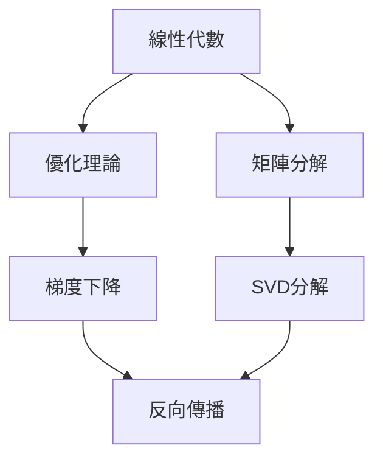
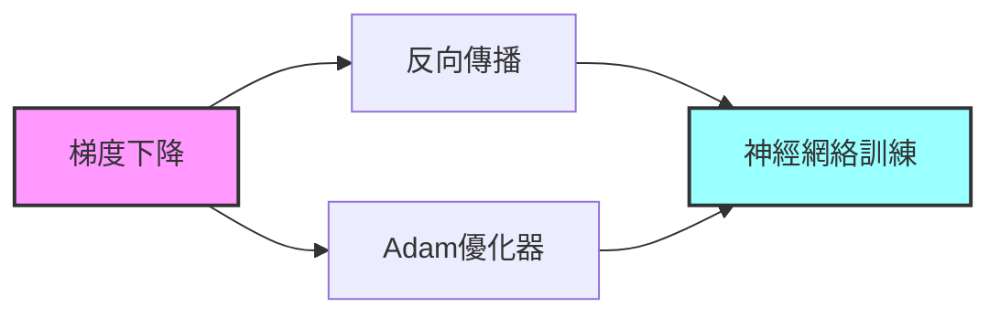
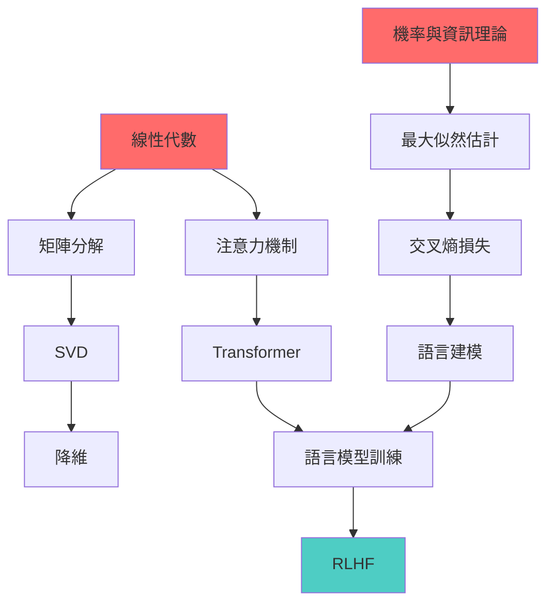

# 理論導向 Roadmap 設計：認知建構式學習路徑

## 核心差異：工具 vs 理論學習

### 傳統工具導向 Roadmap
```
1. 安裝工具 → 2. 學習語法 → 3. 做範例 → 4. 做專案
```
**特點**：快速上手、可見成果、實用為主

### 理論認知導向 Roadmap（本文重點）
```
1. 建構直覺 → 2. 數學形式化 → 3. 理解原理 → 4. 應用驗證
```
**特點**：深度理解、認知建構、原理為主

---

## 第一性原理：理論學習的特殊性

### 1. **認知層次理論** (Cognitive Hierarchy Theory)

學習理論知識必須遵循認知層次：

```
Level 1: 直覺理解 (Intuitive)
    ↓
Level 2: 概念掌握 (Conceptual)
    ↓
Level 3: 形式化表達 (Formal)
    ↓
Level 4: 邏輯推理 (Logical)
    ↓
Level 5: 創新應用 (Innovative)
```

**設計實踐**：
- 每個主題從**直覺**開始（為什麼需要這個？）
- 逐步建立**概念**框架（這是什麼？）
- 然後**形式化**（如何用數學表達？）
- 最後**推理**（能推導出什麼？）
- 最終**創新**（如何應用？）

---

### 2. **螺旋式上升原理** (Spiral Advancement)

理論知識不應該線性學習，而應該**螺旋式重複**：

```
第一輪：基礎概念（What & Why）
    ↓
第二輪：數學原理（How it works）
    ↓
第三輪：進階應用（Advanced use cases）
    ↓
第四輪：前沿研究（Cutting-edge）
```

**具體實踐**：
- 同一主題在不同難度層次重複出現
- 每次重複都加深理解
- 從簡單例子開始，逐步複雜化

---

### 3. **知識依賴網絡** (Knowledge Dependency Network)

理論知識比工具技能有**更強的依賴關係**：



**設計實踐**：
- 明確標示**硬依賴**（必須先學）
- 標示**軟依賴**（建議先學）
- 提供**平行學習**路徑（可同時學）
- 支持**跳躍學習**（高手可跳過基礎）

---

### 4. **認知負荷分層原理** (Cognitive Load Stratification)

理論知識天然複雜，必須**分層遞進**降低認知負荷：

#### 低層：直覺層（認知負荷最低）
```python
# 只用高中數學，用程式碼表達概念
def gradient_descent_conceptual():
    """
    直覺：就像下山找最低點
    """
    position = start_point
    while not_at_bottom:
        look_around = check_slope(position)
        position = position - learning_rate * look_around
    return position
```

#### 中層：概念層（增加抽象）
```python
# 用數學符號表達
# 尋找 f(x) 的最小值
# x_new = x_old - α∇f(x_old)
```

#### 高層：理論層（完全形式化）
```python
# 完整的數學證明和收斂性分析
# 包含定理證明、複雜度分析
```

**設計實踐**：
- 每個知識點提供**三種難度**版本
- 可以選擇適合自己層次的進入點
- 支持從任一層次開始，向上或向下探索

---

### 5. **理解驗證原理** (Understanding Verification)

理論學習的驗證**不是能做專案**，而是：

1. **能解釋**：能用簡單語言說明原理
2. **能證明**：能推導公式和定理
3. **能比較**：能對比不同方法的優劣
4. **能創新**：能提出新的應用或改進

**設計實踐**：
```python
# 理解驗證量表
understanding_levels = {
    "recall": "能記憶公式",
    "comprehension": "能解釋為什麼",
    "application": "能在新場景應用",
    "analysis": "能比較不同方法",
    "synthesis": "能組合知識創新",
    "evaluation": "能評判優劣"
}
```

---

### 6. **元知識建構原理** (Metacognitive Construction)

理論學習最重要的是學會**「如何思考」**，而不只是知識本身。

**設計實踐**：
- 不只是教授**內容**，還要教授**思考方法**
- 不只是**結果**，還要看到**思路**
- 不只是**公式**，還要理解**設計動機**

---

## 理論 Roadmap 的結構設計

### 1. **多維知識體系** (Multi-Dimensional Knowledge Structure)

傳統 Roadmap：
```
AI Engineer
├── Machine Learning
├── Deep Learning
└── NLP
```

理論導向 Roadmap：
```
知識維度：
├── 數學基礎（深度）
│   ├── 線性代數
│   ├── 概率統計
│   └── 優化理論
├── 演算法原理（廣度）
│   ├── 經典算法
│   ├── 啟發式方法
│   └── 演進歷史
└── 認知建構（高度）
    ├── 設計思路
    ├── 理論演進
    └── 前沿突破

應用維度：
├── 何時用（When）
├── 為何用（Why）
├── 如何用（How）
└── 何處用（Where）
```

---

### 2. **知識節點設計** (Knowledge Node Design)

每個知識節點包含：

```json
{
  "id": "gradient-descent",
  "title": "梯度下降法",
  
  // 核心內容
  "content": {
    "intuition": "下山找最低點",
    "concept": "沿梯度的反方向更新",
    "formalization": "數學公式",
    "proof": "收斂性證明",
    "application": "實際案例"
  },
  
  // 認知層次
  "cognitive_levels": {
    "elementary": "用程式理解",
    "intermediate": "數學推導",
    "advanced": "理論證明"
  },
  
  // 依賴關係
  "dependencies": {
    "hard": ["微積分", "線性代數"],
    "soft": ["優化理論"],
    "parallel": ["隨機梯度下降"]
  },
  
  // 驗證方式
  "verification": {
    "explain": "能用簡單語言解釋",
    "derive": "能推導公式",
    "compare": "能與其他方法對比",
    "apply": "能在新場景應用"
  },
  
  // 認知維度
  "dimensions": {
    "mathematical": 0.8,    // 數學深度
    "practical": 0.5,       // 實務性
    "historical": 0.3,      // 歷史淵源
    "philosophical": 0.2    // 哲學思考
  }
}
```

---

### 3. **學習路徑類型** (Learning Path Types)

提供多種路徑適應不同學習者：

#### **A. 按深度學習（Depth-First）**
```
線性代數 → 深入 → 線性變換 → 深入 → 奇異值分解
```

#### **B. 按廣度學習（Breadth-First）**
```
機器學習概覽 → 監督學習 → 無監督學習 → 強化學習
```

#### **C. 按應用學習（Application-Driven）**
```
要解決影像分類 → 學 CNN → 需要理解卷積 → 學訊號處理
```

#### **D. 按歷史學習（Historical）**
```
感知器 → BP 算法 → CNN → RNN → Transformer
```

#### **E. 按認知層次學習（Cognitive-Level）**
```
直覺層 → 概念層 → 形式化層 → 理論層
```

---

### 4. **理解度追蹤** (Understanding Tracking)

不同於傳統的「完成/未完成」，理論學習需要更細緻的追蹤：

```python
class TheoreticalProgress:
    """
    理論學習進度追蹤
    """
    def __init__(self, topic):
        self.topic = topic
        
        # 不同層次的掌握程度
        self.intuition = 0.0      # 直覺理解 (0-1)
        self.concept = 0.0        # 概念掌握 (0-1)
        self.formalization = 0.0  # 形式化 (0-1)
        self.application = 0.0    # 應用能力 (0-1)
        self.proof = 0.0          # 證明能力 (0-1)
        
        # 理解驗證狀態
        self.can_explain = False      # 能解釋
        self.can_derive = False       # 能推導
        self.can_compare = False      # 能比較
        self.can_innovate = False     # 能創新
        
        # 相關知識的掌握
        self.prerequisite_mastery = {}  # 前置知識掌握度
    
    def get_overall_progress(self):
        """計算整體掌握度"""
        return (
            self.intuition * 0.1 +
            self.concept * 0.2 +
            self.formalization * 0.3 +
            self.application * 0.3 +
            self.proof * 0.1
        )
```

---

## 理論 Roadmap 的實現建議

### 1. **三維知識地圖** (3D Knowledge Map)

```python
# 知識地圖的三個維度
dimensions = {
    "x": "數學深度",      # 從高中數學到博士數學
    "y": "應用廣度",      # 從基礎概念到前沿研究
    "z": "認知層次"       # 從直覺到理論
}

# 每個知識點在三維空間中的位置
knowledge_point = {
    "gradient-descent": {
        "x": 0.7,  # 需要大學程度的數學
        "y": 0.5,  # 廣泛應用的算法
        "z": 0.6   # 中等認知難度
    }
}
```

---

### 2. **概念網絡可視化** (Concept Network Visualization)



---

### 3. **多媒體學習資源** (Multi-Media Resources)

理論學習需要多種呈現方式：

```python
learning_resources = {
    "visual": {
        "type": "animation",
        "description": "動畫展示梯度下降的過程",
        "purpose": "建立直覺"
    },
    "interactive": {
        "type": "jupyter_notebook",
        "description": "可互動的梯度下降演示",
        "purpose": "實驗探索"
    },
    "formal": {
        "type": "mathematical_proof",
        "description": "收斂性證明",
        "purpose": "理論嚴格性"
    },
    "historical": {
        "type": "paper_review",
        "description": "原始論文解析",
        "purpose": "理解發展脈絡"
    }
}
```

---

### 4. **理解驗證工具** (Understanding Verification Tools)

提供多種驗證工具：

```python
class UnderstandingVerifier:
    def __init__(self, topic):
        self.topic = topic
    
    def verify_can_explain(self):
        """
        驗證：能否用自己的話解釋
        """
        prompt = f"請用簡單的語言解釋 {self.topic}，不使用專業術語"
        return self.evaluate_explanation(prompt)
    
    def verify_can_derive(self):
        """
        驗證：能否推導公式
        """
        prompt = f"請推導出 {self.topic} 的核心公式"
        return self.evaluate_derivation(prompt)
    
    def verify_can_compare(self):
        """
        驗證：能否比較不同方法
        """
        prompt = f"請比較 {self.topic} 與替代方法的優劣"
        return self.evaluate_comparison(prompt)
    
    def verify_can_apply(self):
        """
        驗證：能否在新場景應用
        """
        prompt = f"請將 {self.topic} 應用到以下新問題..."
        return self.evaluate_application(prompt)
```

---

## 針對你的 LLM 專案的具體建議

### 1. **理論知識結構**

基於你的專案結構，建議設計：

```markdown
LLM 理論 Roadmap
├── 數學基礎
│   ├── 概率論與資訊理論
│   ├── 線性代數與張量運算
│   └── 優化理論
├── 神經網絡原理
│   ├── 前饋網絡基礎
│   ├── 注意力機制理論
│   └── Transformer 架構原理
├── 訓練理論
│   ├── 損失函數設計
│   ├── 優化器原理
│   └── 對齊理論（RLHF, DPO, ORPO）
├── 推理理論
│   ├── 自回歸生成原理
│   ├── KV Cache 理論
│   └── 推理優化
└── 評估理論
    ├── 評估指標理論
    ├── 基準設計原理
    └── 數據品質理論
```

### 2. **認知建構路徑示例：Transformer**

```markdown
#### Level 1: 直覺層
**問題**：如何讓模型理解序列中的位置關係？
**直覺**：給每個位置一個編碼（像是地址）

#### Level 2: 概念層
**概念**：Positional Encoding
**實作**：
```python
def positional_encoding(position, d_model):
    # 用正弦函數給每個位置編碼
    angles = 1 / np.power(10000, (2*(i//2))/d_model)
```

#### Level 3: 形式化層
**公式**：
PE(pos, 2i) = sin(pos / 10000^(2i/d_model))
PE(pos, 2i+1) = cos(pos / 10000^(2i/d_model))

#### Level 4: 理論層
**定理**：為什麼正弦函數？
- 任意相對位置可以被線性組合表示
- 提供序列長度的泛化能力

#### Level 5: 創新層
**前沿**：RoPE, ALiBi 等改進
**研究**：能否設計更好的編碼方法？
```

### 3. **知識依賴圖**



---

## 實踐建議

### 1. **創建理論知識節點**

為每個理論知識點創建文檔：

```markdown
# 01-Theory_Nodes/attention-mechanism.md

## 注意力機制的認知建構路徑

### Intuition（直覺）
> 為什麼需要注意力？讓模型知道「看哪裡」

### Concept（概念）
> 注意力是一種軟性查詢機制

### Formalization（形式化）
> Query-Key-Value 架構

### Theory（理論）
> 資訊理論解釋注意力作為資訊提取機制

### Application（應用）
> 在 Transformer 中的實際應用

### Connections（連結）
- 前置：線性代數、機率論
- 相關：Information Bottleneck
- 後續：Multi-head Attention

### Verification（驗證）
- [ ] 能解釋為什麼用 QKV
- [ ] 能推導 attention score
- [ ] 能比較不同注意力變體
```

### 2. **建立理解度追蹤系統**

```python
# 在你的專案中添加
progress_tracker/
├── theory_progress.json       # 理論進度
├── understanding_levels.json  # 理解層次
└── verification_results.json  # 驗證結果
```

### 3. **設計認知建構練習**

```python
# 每個理論知識點配套練習
exercises/
├── 01-intuition_building.ipynb    # 建立直覺
├── 02-concept_reinforcement.ipynb # 概念強化
├── 03-formalization.ipynb         # 形式化
├── 04-theory_proof.ipynb          # 理論證明
└── 05-creative_applications.ipynb # 創新應用
```

---

## 總結：理論 Roadmap 的核心差異

| 維度 | 工具導向 Roadmap | 理論導向 Roadmap |
|-----|---------------|----------------|
| **目標** | 能夠使用 | 能夠理解 |
| **驗證** | 做出專案 | 解釋原理 |
| **結構** | 線性路徑 | 網絡關係 |
| **難度** | 固定級別 | 多層次遞進 |
| **評估** | 完成/未完成 | 理解度0-1 |
| **資源** | 教程、範例 | 直覺、證明、歷史 |
| **焦點** | 如何做 | 為什麼與如何做 |

---

**最後更新**: 2025-01-13
**版本**: 1.0

